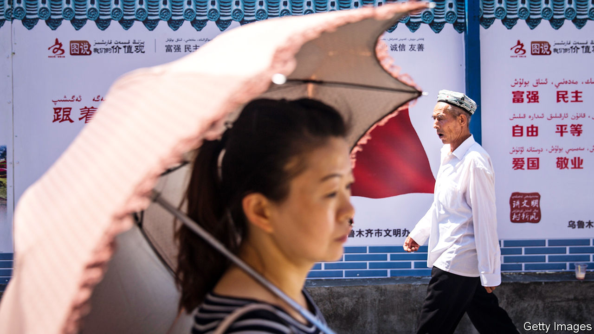
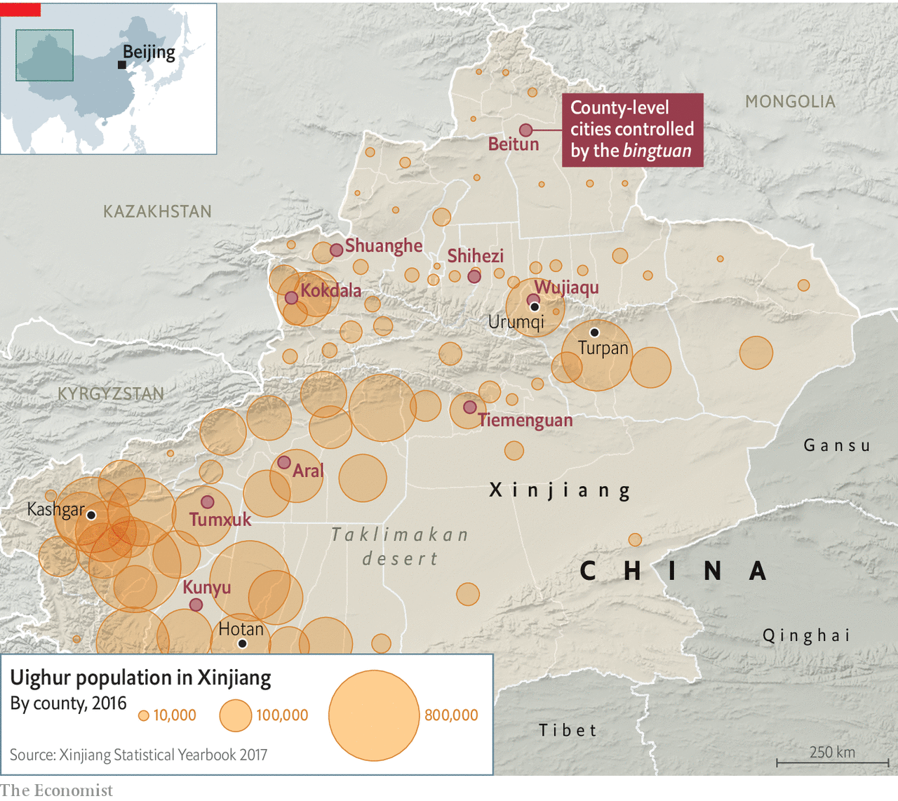
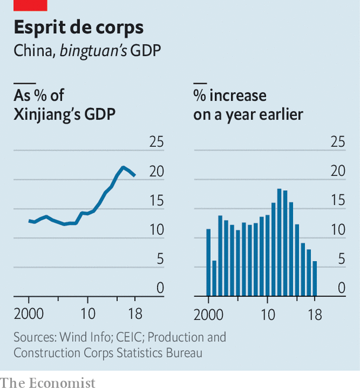

## A report from Xinjiang

# Many Han Chinese don’t mind the gulag for their Uighur neighbours

> Yet it will aggravate ethnic strife for years to come

> Jan 9th 2020URUMQI

THE DISTRICT of Erdaoqiao in Urumqi, the capital of the far western region of Xinjiang, looks very similar to many urban areas of China. Its streets are filled with luxury cars competing for space with frantic food-delivery scooters. Many buildings are new, built with steel, glass and cookie-cutter uniformity.

No visible evidence remains of the riots here in July 2009, the country’s bloodiest ethnic clashes in decades. They involved battles between Uighurs, the Turkic-speaking, predominantly Muslim group indigenous to Xinjiang, and ethnic-Han Chinese who make up more than 90% of China’s population. The spark was a protest by Uighurs against the killing of two Uighur factory-workers by a mob in southern China. Of more than 200 people who were killed on the first day of the violence in Erdaoqiao and other areas of Urumqi, many were Han. Later, Han crowds gathered in the streets, hungry for revenge. The city stewed for days in a miasma of anger and fear.

Urumqi today is calm, but its ethnic contours remain distinct. Erdaoqiao is still known as a Uighur area. Its Uighur-run shops sell steaming bowls of noodles and stewed lamb, circular flatbreads, colourful bolts of fabric and religious articles. In other parts of the city, the residents are mainly Han people, who make up three-quarters of Urumqi’s population and dominate its economy. The city’s tallest building is a 229-metre office tower that belongs to a state bank based 2,000km to the east, in Beijing—a city that seems a world away from Xinjiang’s Uighur culture.

Urumqi is a Han bastion, but in Xinjiang as a whole there are about 10m Uighurs and around 9m Han people. They are divided not only by culture but also by geography. Han people mainly live in the north where Urumqi is located. Uighurs are concentrated in the much poorer south, in ancient oasis towns such as Kashgar and Hotan. Between north and south is the vast Taklimakan desert (see map).

To understand why officials in Xinjiang began building a gulag in 2016 in which they have incarcerated an estimated 1m people, mostly Uighurs, it is important to understand the nature of this ethnic divide. The riots in 2009 made Han people more suspicious of Uighurs. The government’s draconian reaction has made Uighurs more resentful. The prison camps, euphemistically known as vocational training centres, are evidence that this divide has become even more institutionalised. That suggests that the Uighurs’ suffering will last a very long time.

Uighurs are put in camps for such things as being overtly pious Muslims or too fond of their Uighur traditions. The authorities say this has helped curb terrorism. They say there were thousands of terrorist attacks in Xinjiang in the 15 years before the facilities were built, and none since. But the mass internment of Uighurs is certain to have increased their bitterness towards Xinjiang’s Han rulers.

Assessing the camps’ impact on public opinion in Xinjiang is difficult. Foreign journalists who visit the region are closely watched, often by several plainclothes agents who follow them by car and on foot. There are small “convenience police stations” at many intersections. In between are endless arrays of surveillance cameras, many capable of facial recognition. Access to most buildings and businesses—ranging from large hotels and shopping centres to bookshops and hole-in-the-wall restaurants—is controlled with X-ray scanners and metal detectors. When buying petrol, customers must submit to a vehicle search, facial scan and identity check.

It is clear that this blanket security is mainly aimed at monitoring Uighurs and deterring any attempt by them to protest or stage attacks. Travellers on the region’s highways are frequently stopped at checkpoints where armed officers with truncheons, helmets and body armour search their vehicles. Uighurs are sometimes subjected to further questioning and checks. Han motorists are often waved through.

The clampdown of recent years targets the Uighurs’ faith. Some mosques have been shut or bulldozed. At others, domes, crescents and other Islamic features have been removed to make them look more “sinified”. Officials have stepped up controls over places of worship, for example by barring the teaching of children. They have banned many forms of observance, such as women’s full-head coverings and big beards on men. Officials and students have been banned from observing the Muslim holy month of Ramadan.

Many Han people in Xinjiang say they are not bothered by the intrusive security. “We’re all used to it, and in fact we like it because we know it keeps us safe,” says a woman surnamed Chen, who seven years ago moved from China’s interior to Turpan, a city close to Urumqi, where she runs an electronics shop.

Some Han people in Xinjiang have roots in the region going back much further than Ms Chen’s—to the 1950s, soon after the Communists seized power in Beijing. At that time Mao sent about 175,000 demobilised Han soldiers to settle in the then overwhelmingly Uighur area, build farms and help guard the region’s borders with Soviet-controlled Central Asia. They became members of what was named the Xinjiang Production and Construction Corps (the bingtuan, in Chinese). This sprawling organisation, part state-run firm and part paramilitary force, has since emerged to dominate Xinjiang’s agriculture, leaving little room for Uighurs to compete. It controls vast tracts of land, on which it produces a large share of China’s cotton and tomatoes, often using migrant Han workers brought in from other parts of China. It is also involved in construction, property dealing and the oil industry (other large, Han-dominated, state-owned firms control most of this). In recent years its share of Xinjiang’s GDP has risen (see chart).

The bingtuan resembles a state-within-a-state. Nine of Xinjiang’s 28 cities are directly under its control. They have bingtuan-run police forces, hospitals, television stations and newspapers. Their populations are mainly Han people who often have little interaction with Uighurs and do not know their language (most Uighurs in cities speak Mandarin). It amounts to an informal apartheid system.

Many of Xinjiang’s Han residents resent being seen, at least by some Uighurs, as interlopers. A bank worker in Turpan, who gives his surname as Zhao, says his grandfather came in 1958 from Hebei, a province surrounding Beijing, and endured harsh conditions to help develop the region and establish his family there. “We are Xinjiang people, my whole family, and this place is our place, too,” he says. Mr Zhao admits that he regards Uighurs as “backward”, “untrustworthy” and “violent”. Such views are commonly and frankly expressed by Han people in Xinjiang.

When Chen Quanguo, an ethnic Han who took over as Xinjiang’s Communist Party’s chief in 2016 (that post is, in effect, reserved for Han Chinese), he would have heard such opinions, too. The Han people who marched through the streets of Urumqi in 2009, armed with axes, crowbars and meat cleavers, were not only angry about the Uighurs’ violence. They were also furious at the government for failing to do enough to protect them. Among such people, Mr Chen may have enjoyed some support for his gulag-building project, although official documents leaked to the New York Times last year suggested that some local officials resented his clampdown. The documents revealed that thousands of officials in Xinjiang, both Uighur and Han, were punished for resisting, including the Han leader of one southern county who was jailed for trying to slow the detentions and shield Uighur officials.

Mr Chen’s critics are right. Far from reducing the mutual animosities between the groups, the harsh and dehumanising treatment of the Uighurs seems more likely to fuel even greater resentment of Han rule. If that results in more violent protests, Han people in turn will become more hostile towards the Uighurs. With his gulag, Mr Chen has ensured that ethnic conflict in Xinjiang will haunt China long into the future. ■