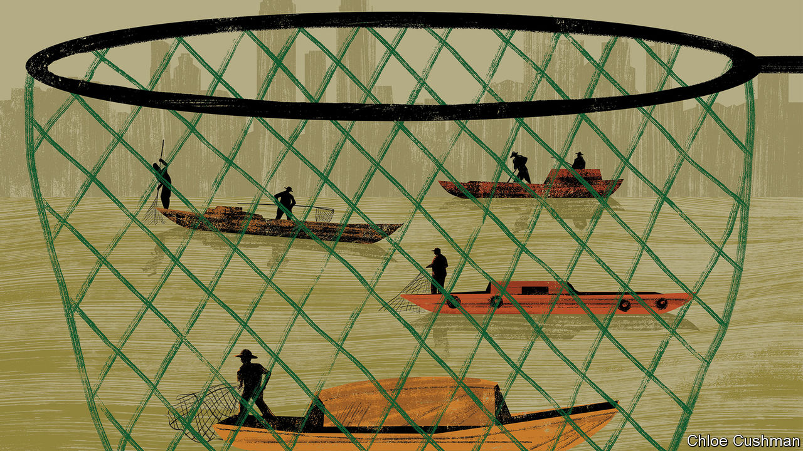

## Chaguan

# To preserve the Yangzi’s fish, officials are using a blunt method

> They prefer to blame fishermen than their cherished mega-dams

> Jan 9th 2020

FOR TWO thousand years the fishermen of China’s great rivers have served the literati as symbols of hardships patiently endured. One of the country’s best-known poems ponders an old man fishing alone on a boat, protected from the snow by a straw hat. Another describes a fisherman on an island in the Yangzi, indifferent to the vagaries of fate. Political suffering was not forgotten by the poets of old. A fictional fisherman tells a celebrated official, Qu Yuan, who is feeling suicidal because of state corruption, that a sage should adapt to worldly changes. Clear waters can wash an official’s hat tassels, he sings mockingly as he rows away. Muddy waters can still serve for washing feet.

This cherished poetic heritage is not enough to save the fishermen of the Yangzi. There have been years of grim data about stocks being wiped out from the country’s main rivers. A new report by government scientists has declared one of the Yangzi’s rarest species, the giant Chinese paddlefish, functionally extinct. Officials this month unveiled their remarkable solution. By the end of this year all fishing on the Yangzi and its major tributaries will be banned for ten years. This will cast 280,000 registered fishermen out of a job. More than 300 areas were closed on January 1st, shortly after local officials brought in mechanical diggers to smash boats and haul them away.

The need to tackle overfishing is undeniably urgent. As fish have become harder to find, the Yangzi fishing fleet of 110,000 boats, most of them small and family-owned, has grown notorious for using small-mesh nets and even illegal electro-shock devices that kill adult and juvenile fish indiscriminately. When Chaguan this week visited Da Zhong Ba, an island in the upper Yangzi near the riverside city of Chongqing, he found newly redundant fishing families unhappily resigned to their plight.

Their island home is encircled closely by the modern world. Reached by a battered, orange-painted ferry, it is passed by an unending stream of cargo ships. The horns of unseen trains sound from one bank. The low, muddy island is known for market gardens as well as fish. On this weekday a crowd of mostly elderly farmers had taken the ferry to the shore to sell ivory-coloured cauliflowers and great bunches of coriander (or cilantro, as it is often known in America). The air is filled with the herb’s fragrance and the sound of splashing, as the islanders wash the bunches in the Yangzi’s brown waters before bringing them to be weighed by a merchant from Chongqing, who pays them two yuan (30 cents) a kilo. Yet in a thick, cold winter fog, the outside world also feels strikingly distant, even unreal: a place from which life-changing decisions arrive with little warning. Perhaps 20 families fished on Da Zhong Ba, locals say. They could make over 100,000 yuan a year from catching carp, loach and other fish, even during a season that is limited to four months each year.

News of the outright ban was delivered a few months ago, startling locals who had hoped to fish until 2021. County officials gave one-off compensation of 200,000 yuan to households that surrendered a boat. One ex-fisherman shows a bright red motor-tricycle bought with some of that cash, in which he plans to haul vegetables along the island’s cement paths, too narrow for any car. There is greater gloom in a neighbouring household where three boats supported numerous brothers, cousins and grandchildren. The family owns little land—less than 270 square metres per adult. On a steep slope by their cement-built home, muddy chickens and ducks peck at vegetable scraps in a pen made from an old fishing net, still bearing its floats. “Vegetables are cheap this year,” says the 50-year-old wife of one of the brothers, blaming the merchant from Chongqing for miserly prices. “But if we don’t sell vegetables to him, how can we sell them retail?” she asks.

Down a slope her husband and other men mournfully construct a gravel road, on a contract organised by village officials. They recall how fish prices rose so high in recent years that a good living could be made even as daily catches fell to between five and ten kilos—down from hauls of 20-30kg that were common three decades ago. Their 74-year-old father concedes that some on the river have resorted to illegal fishing, but also blames pollution and the construction of hydro-electric barrages farther down the Yangzi, including the Gezhouba and Three Gorges dams. A son blames those structures for the disappearance of such migratory fish as the Chinese sturgeon, which upstream of the dams no longer breeds in the wild.

Science backs him up. Ivan Jaric of the Czech Academy of Sciences who co-wrote the report about the extinction of the Chinese paddlefish, calls dam-building “the major cause” of the giant fish’s loss, even if overfishing “definitely contributed”. A Chinese fish expert at the UN’s Food and Agriculture Organisation, Miao Weimin, argues that China carefully weighs the benefits of dams, including power generation and flood control, against their environmental costs. He says valuable migratory species like sturgeon can be kept alive by artificial breeding. Chinese officials tout strict new pollution controls and modern fish-farming as additional solutions to rescue the Yangzi, alongside the outright fishing ban.

In vain, some Chinese and foreign scientists have argued for less severe approaches, including the creation of tradable fishing rights that would give fisherfolk an incentive to preserve stocks. Dams and other mega-projects are dear to China’s leaders. Laying off 280,000 fishermen seems less risky to officials than debating the benefit of these schemes. (Consider how it is in the West: just 120,000 people are employed catching fish in the European Union, yet they enjoy outsize political clout.) “If your country tells you to stop fishing, you have to stop,” says a patriarch on Da Zhong Ba, adding a proverb: “An arm isn’t strong enough to fight a thigh.” It is not a literary phrase, but ancient poets would understand. ■