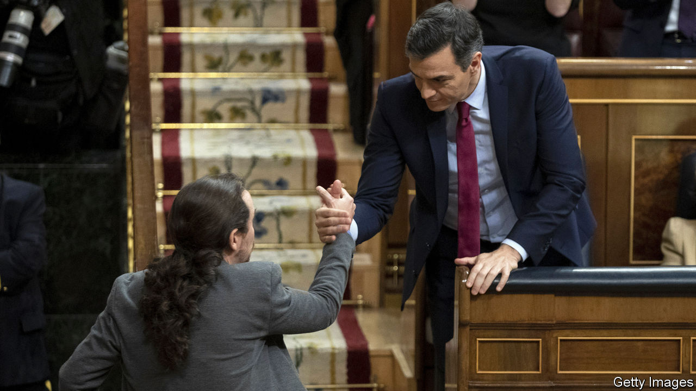

## Sánchez agonistes

# At last, a new government for Spain

> It comes at a price

> Jan 9th 2020MADRID

IT TOOK ALMOST a year, two general elections and multiple political contortions. But at last on January 7th Pedro Sánchez, the Socialist caretaker prime minister, won a parliamentary vote to form a new government. It was by the narrowest of margins—167 votes to 165 with 18 abstentions—and it came at a price. The Socialists will govern in a potentially uneasy coalition with Podemos, a hard-left party, and will rely for their slender majority on Basque nationalists and four tiny regional parties. Mr Sánchez required, too, the abstention of Esquerra, the largest Catalan separatist party, granted in return for open-ended talks on the Catalan conflict, and also that of Bildu, the outfit of the Basque former terrorists of ETA.

Mainly for these reasons, the investiture debate was the most ill-tempered since democracy was restored in 1978. “This is a nightmare government, the most radical of our democratic history,” said Pablo Casado, the leader of the mainstream conservative People’s Party (PP). It will face relentless opposition, presaging continued political turbulence.

Spain’s first coalition government since before the civil war is a sign of changed political times. The strains left by an economic slump in 2008-13 and by Catalan separatism have fractured a two-party system into five. But Mr Sánchez’s travails are partly of his own making. The shine that once attached to him as a fresh face has tarnished. He came to office with a minority government in 2018 by toppling Mariano Rajoy, Mr Casado’s predecessor, in a censure motion. He squandered a victory in an election last April that saw the Socialists win 123 of the 350 seats in Congress. Spurning possible alliances, he called a repeat election for November saying he did not want to depend on separatists and that a coalition with Podemos would cause him and Spaniards to lose sleep. But the Socialists lost three seats (and Podemos seven) and the big winner was Vox, a hard-right party.

Unperturbed, Mr Sánchez struck a deal, sealed with a hug, with Pablo Iglesias, Podemos’s clever but slippery leader. Their 49-page agreement promises a rise in income tax on high earners and in corporate taxes; also, increases in many benefits especially for the poor. After years of austerity followed by recovery, there is both some scope, as well as popular demand, for such policies.

But Mr Sánchez has also caved in to Podemos with a promise to repeal Mr Rajoy’s labour reform which gave priority to company-level bargaining over sectoral agreements and which has helped generate more than 3m jobs. The new government takes office with public debt of 98% of GDP, unemployment at 14% and the economy and jobs growing much more slowly than in 2014-18. Some business leaders fear that further regulation (Spain already has too much of it) will snuff out the recovery.

Much of the alarm on the right, though, is both hypocritical and overblown. The PP and Ciudadanos, a once centrist party that has veered right, after all, refused to help to free Mr Sánchez from what they consider to be his dangerous liaisons. And far from presaging the break-up of Spain, Mr Sánchez’s agreement with Esquerra is a study in ambiguity. It allows the separatists to propose a referendum on self-determination for Catalonia and for the government to reject this as contrary to the constitution. The talks may actually take some of the sting out of the Catalan conflict.

Coalitions of the left are rare in Europe. The prime minister is not an ideological radical. But he is on potentially treacherous ground. Some in his party are worried. Perhaps for that reason, he postponed his first cabinet meeting to give himself more time to organise the government. His next job is to get parliamentary approval for a budget with the coalition’s programme.

Provided he does so, his hold on office may be more durable than it looks. The opposition is divided. His hardest task may to be to restore his credibility with the public. “With his sudden and cynical coalition [he] has alienated for a long time millions of Spaniards without conquering a single new one,” wrote Javier Marías, a novelist, in El País, a newspaper. Winning them back will require not just Mr Sánchez’s characteristic resilience, but good government. ■