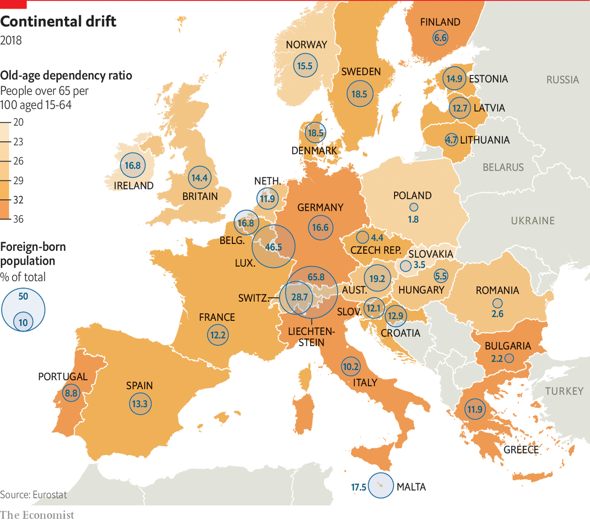

## Old, rich and divided

# Demography could be yet another force for divergence within the EU

> It could worsen north-south and east-west divides

> Jan 11th 2020

FOR BULGARIAN bosses, recruitment is becoming a bit of a nightmare. Finding a lathe operator—competent or otherwise— takes more than six months, and may require forking out cash to a recruitment agency. Older, savvier machine operators are retiring, complains Julian Stephanov, who runs a manufacturing firm near Sofia, and too few young people have the right skills. One problem is a lack of training. Another is that Bulgaria’s workforce has shrunk by 6% since 2008. Continued high emigration and low birth rates mean it is expected to fall by another third by 2050.

All across Europe, people are living longer and having fewer children. The same trends are, of course, seen in other rich countries, and many developing ones—but coping with them will be harder in Europe, because of its half-formed union where workers can move freely and many countries share a currency, but where there is no common fiscal policy or strategy to deal with ageing.

Investors are well aware of some of Europe’s shortcomings. The sovereign-debt crisis showed that converging inflation and interest rates did not, by themselves, ensure a sustainable currency union or integrated banking system. Wage bargaining, regulation and so on need to converge to stop imbalances between countries building up. Less well understood is that demography could also tear the union apart.

Even though Europe receives more migrants than it loses, the UN projects that its population will fall by around 5% by 2050. By then the median European will be 47 years old, nine years older than at the turn of the century, and four years older than the median American. In 2015 there was about one person older than 65 for every four people of working age (ie, an old-age dependency ratio of around 25%). By 2050 the ratio will be one to two; in America it will be one to three.

Some countries will suffer even more. Spain and Italy are expected to lose more than a quarter of their workforce by 2050. Populations in the south and east are forecast to shrink by a tenth on average. With fewer workers, those countries risk seeing growth stagnate, even as rising spending on pensions and health services pushes up public debt.

The 28 members of the European Union fall into three broad groups. Women in northern and western countries tend to have more children than the EU average (Germany is an exception). Though their fertility rates are below the 2.1 needed to sustain a population, high immigration means their populations have still grown.

Those in southern Europe, the second group, have stagnated or shrunk. Fertility rates are lower; in some countries, emigrants have outnumbered immigrants since 2010. Italy is emblematic. Older Italians drift away from work well before they reach pensionable age, and a shortage of child care means many women never return to work after giving birth. By the age of 50, just over half are in work. If those low employment rates persist as Italy ages further, in 2050 there will be more Italians over the age of 50 who are out of the labour force than there are workers of all ages, points out Stefano Scarpetta of the OECD, a Paris-based think-tank.

Populations in central and eastern Europe, the third group, have been falling fast because of emigration. Around 2.5m Romanian nationals of working age, equivalent to a fifth of the population, live elsewhere in the EU. These countries also have relatively low older and female participation rates (the Baltic states, which take inspiration from the Nordics, are an exception). Poland and Hungary offer financial incentives for child-bearing. But research suggests that these rarely work.

These demographic disparities worsen economic divides. Southerners start in a poor position. Productivity is low and as the number of people in work falls, growth will weaken. Their gross public debt is already high—in Italy, over 130% of GDP—and risks rising further. The euro-zone’s one-size-fits-all monetary policy may seem less appropriate as growth prospects diverge.

Most central and eastern countries are outside the currency union. But here too there are strains. EU membership promised speedy catch-up towards western European levels of income. But the IMF reckons that the annual growth rate of GDP per person will be up to a percentage point lower because of demographic decline, slowing convergence. Many of these newish members were initially keen on free movement. But after losing working-age people to Europe’s north and west, they are cooling on it. Croatia, which lost 5% of its population in the three years after it joined in 2013, wants the union to discuss tackling the effects of demographic decline.

Migration within the EU, as in America, has seen workers move to more dynamic cities and regions. Research by the Centre for European Reform suggests that less successful places tend to be older and less productive. The EU has a pot of money to ensure “cohesion”, but it is small and less equipped than national budgets to redistribute from winners to losers.

Europe needs coherent policies if it is to hold together as it ages. Older people and women—who tend to have lower employment rates—should be encouraged into work. If Italian women were as likely to work as German ones, Italy’s workforce would be 14% bigger. Matching older workers’ employment rates would add 5%.

Judging by France, providing cheap child care both encourages women into work and supports fertility rates, says Mr Scarpetta. Existing workers can be better trained; automation can supplement them. Improving education and investing in infrastructure could increase productivity. Governments can ensure that retirement ages keep pace with lifespans. All these policies would have the added benefits of attracting immigrants and convincing would-be emigrants to stay.

To date, northern countries have done the most. Germany acted decisively in the 2000s, says Axel Börsch-Supan of the Munich Centre for the Economics of Ageing. Reforms to state pensions linked contributions and payouts to the old-age dependency ratio. Partly thanks to rises in the pensionable age, employment rates for older people, especially women, shot up. In 2000 the share of older people in the workforce was only slightly above that in Spain and Greece. Now it is the EU’s third highest.

But enacting and sustaining reforms has proved tricky. Past reforms have been rolled back. Higher pensionable ages introduced in Italy in 2011 were partially reversed last year; so too were measures in Poland and even Germany. Strikes in France against a pensions overhaul are in their second month (see [article](https://www.economist.com//europe/2020/01/09/big-protests-in-paris-are-emmanuel-macrons-severest-test-yet)). Changes to pensions are so unpopular in the south because whole families often live off them, says Cinzia Alcidi of the Centre for European Policy Studies, a think-tank in Brussels. Spending more on working-age benefits would help.

The necessary reforms go far beyond those obviously connected to population ageing. Analysis by the European Bank of Reconstruction and Development, for instance, finds that cutting corruption and strengthening institutions in less well-run countries could convince potential emigrants to stay home. Marshalling a decisive response to the continent’s changing demography will not be easy. But the EU’s very survival may depend on it. ■