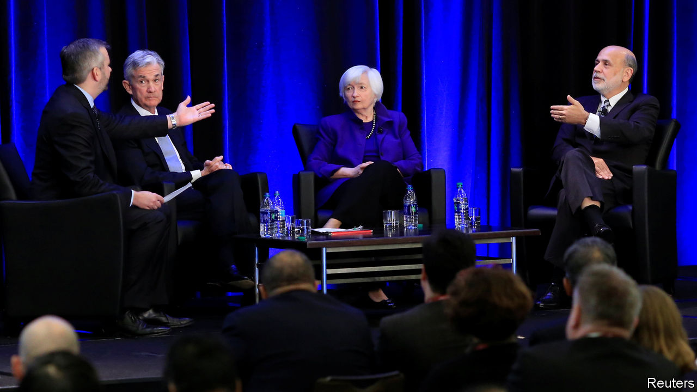

## Beams and motes

# Economists are discussing their lack of diversity

> But efforts to improve have stalled before

> Jan 9th 2020SAN DIEGO

ECONOMISTS, WHO extol the virtues of healthy labour markets, like to think that they practise what they preach. Not so. At this year’s conference of the American Economic Association (AEA) in San Diego, the profession’s lack of diversity was high on the agenda. In a session titled “How Can Economics Solve its Race Problem?” Janet Yellen, now the AEA’s president, summarised the situation as wasting talent and “deeply unfair”.

It was the second year that barriers to entry into economics were so prominent at economists’ biggest annual gathering. Early results of the pressure to improve were evident. As part of an effort led by Ben Bernanke, Ms Yellen’s predecessor, a lawyer contracted by the AEA was present to hear any complaints about professional misconduct. Hotel suites were reserved for those conducting job interviews, avoiding any need for candidates to sit on beds.

To advocates for greater diversity, the attention was welcome. Anna Gifty Opoku-Agyeman, a co-founder of the Sadie Collective, an initiative to boost the representation of black women within economics, said she “loved how leadership was in the room and it wasn’t just an echo chamber”. However history suggests that momentum may be hard to sustain. Many participants pointed out that the problems were not new. The 1970s and 1980s saw a flurry of activity intended to promote diversity, said Cecilia Conrad of Pomona College—“and then it stopped.”

A paper presented by Cleo Chassonnery-Zaïgouche of Cambridge University, written with Beatrice Cherrier of the University of Cergy-Pontoise and John Singleton of the University of Rochester, discussed efforts to lower barriers to entry in the 1970s by implementing new recruitment practices. These included publishing job openings. But once the pressure eased, so did the activity.

Part of the issue was a split over how to think about the problem. Some economists saw the profession’s lack of diversity as indicating imperfect information or perhaps underinvestment in human capital; others diagnosed a deeper flaw in its intellectual framework. In the early 1990s those calling for measures to encourage women into economics split into two groups, with one gathering data and organising mentoring, and the other developing the field of feminist economics.

Today’s calls for greater diversity similarly include criticisms of the discipline itself. Ms Yellen quoted one response to the AEA’s survey of its membership, from an African-American who accused textbooks of ignoring race as a contributor to structural unemployment “because economics is dominated by people who have little concern about the consequences of racism”. Ebonya Washington of Yale University asked whether economics should have a subdiscipline considering race issues, as other social sciences do. Although economists are used to accounting for race in their statistical investigations, said Trevon Logan of Ohio State University, they lacked solid theoretical approaches towards it. At the start of their careers economists are schooled to think of people as atomised individuals. They thus struggle to cope with issues considered in the subfield of “stratification economics”, in which people are studied as members of groups.

Some of the criticisms amount to the claim that excluding people of certain backgrounds limits what the elite of the profession regard as good ideas. Randall Akee of the University of California, Los Angeles, spoke of postponing the research he wanted to do on indigenous people and working instead on other subjects, in order to be taken seriously. Diversity, said Ms Conrad, would mean “new questions and new ways of seeing the world”.

Senior economists may be willing to tinker with recruitment practices. But it is unclear whether they are ready to re-evaluate their intellectual frameworks, or indeed overturn hierarchies in which they are at the top. “We need to motivate change throughout the profession,” said Ms Yellen. “That will take time.” ■

## URL

https://www.economist.com/finance-and-economics/2020/01/09/economists-are-discussing-their-lack-of-diversity
