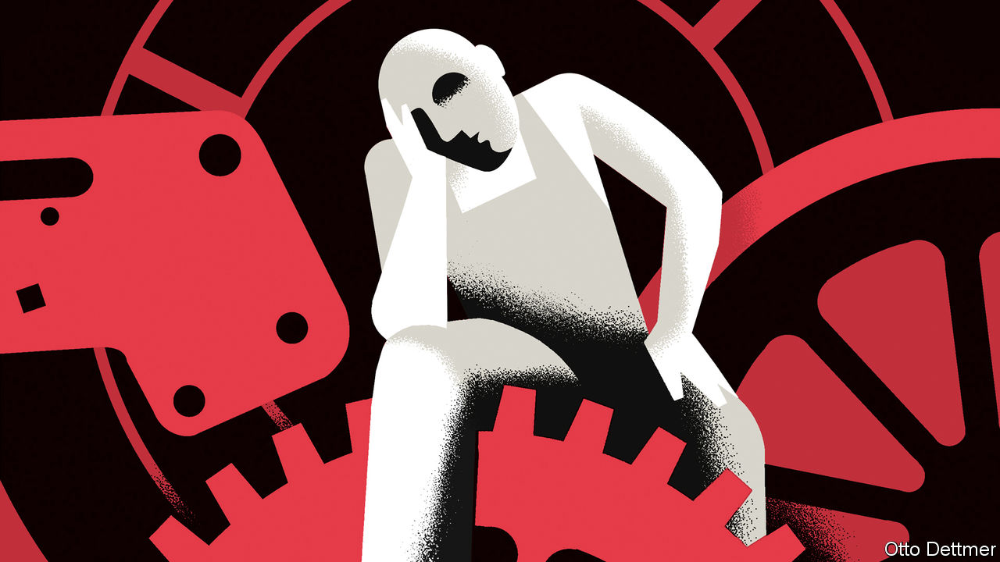

## Free exchange

# Economists grapple with rising American mortality

> Understanding “deaths of despair” will require fresh thinking

> Jan 9th 2020

FIVE YEARS ago Anne Case and Angus Deaton of Princeton University introduced the world to the phenomenon of “deaths of despair”. A growing share of middle-aged white Americans, especially those without college degrees, are dying from suicide and drug and alcohol use. At first it seemed possible to hope that the troubling rise in death rates would reverse as the economy recovered from the financial crisis. Instead, mortality has risen further—a standing indictment of American society. Several books on the subject, and discussions at the meeting of the American Economic Association (AEA) earlier this month in San Diego, do not quite provide an explanation. But they make significant contributions, while posing a substantial challenge to economics.

America’s mortality crisis actually predates the financial crisis: mortality rates for white Americans without a degree have been rising since at least the early 1990s. But it seems to be worsening. Life expectancy in America fell for three consecutive years between 2014 and 2017 (the most recent year for which data are available). That has not happened since the 1910s, when Americans were brought low by war and Spanish flu. Rising death rates are caused in large part by the opioid epidemic, which began with prescription painkillers and expanded to street drugs such as heroin and fentanyl. But suicide and alcohol-related mortality have also risen precipitously. Opioids, reckon Ms Case and Mr Deaton, were fuel on a fire already burning.

The crisis resists simple explanations. There is no simple causal link between rising unemployment or inequality, for instance, and rising mortality. In a forthcoming book Ms Case and Mr Deaton offer a more nuanced argument. They reckon that a fundamental unfairness in the American economy contributes to indicators of economic dysfunction, such as high inequality, and also creates the conditions for the mortality crisis. They point to a health-care system that, enabled by dysfunctional markets and pliant regulators, plied Americans with prescription painkillers.

The health-care industry has also redistributed income upwards. Doctors represent 16% of the top 1%, and 6% of the top 0.1%, of the American income distribution. Costs are much higher than in other countries, and outcomes are worse. Employer-provided health benefits soak up an ever-greater share of worker compensation, which might otherwise be paid as higher wages. The burden of benefits encourages firms to outsource jobs, leading to more insecure, dead-end sorts of employment. Not all of the American economy functions this way. But enough of it does to leave many less-skilled Americans stuck in jobs of low quality and potential, even as the rich and well-educated prosper mightily.

Left unidentified are the reasons why American capitalism was able to become more predatory. The roots of the problem could be intellectual. Raghuram Rajan, an economist at the University of Chicago who participated in the AEA discussions, suggests that troubles in America’s left-behind places were enabled by economic misunderstandings. His book, “The Third Pillar”, develops the point. Economists and policymakers, he argues, have focused excessively on the respective roles of the market and the state, while ignoring policies’ effects on cities and neighbourhoods. But these provide practical and social support to their members, helping them manage setbacks and shaping their identities. As economists failed to take seriously the localised harms caused by trade and technological change, weakened communities fell into a cycle of economic and social regression, and became vulnerable to pathologies such as addiction and suicide.

It is possible, though, that the answer to the mortality question lies beyond the normal scope of economics. Ms Case and Mr Deaton note that rising mortality among white Americans has occurred alongside other, potentially related trends. These include not only worsening economic prospects, but also falling rates of marriage, church attendance and membership in community organisations. In citing these factors they take a leaf from Robert Putnam’s book, “Bowling Alone”, published in 2000, which argued that America was undergoing a long, steady decline in “social capital”—the strength of civic and community connections.

Mr Putnam, a political scientist at Harvard University, updates and extends this argument in a forthcoming book, the thesis of which he outlined at the AEA meeting. Zoom out, he said, and deaths of despair fit into a longer American cultural narrative. For a range of variables, including income equality, cross-party political collaboration, labour-union membership, community involvement and marriage rates, there was a rise from the beginning of the 20th century into the 1960s, followed by a plateau and decline. (The same arc is found for the use of the word “we” relative to “I” in books published in American English.) It seems possible, Mr Putnam said, that the challenges of the first half of the century, from the power of industrial monopolies to depression and war, prompted a cultural response in which Americans thought and acted more as a group. Over the past half-century, however, they seem to have reverted to a more atomised condition.

Mr Putnam’s analysis is suggestive rather than conclusive. Although some social pathologies, such as a turn toward nationalism and xenophobia, have spread globally, nothing like America’s mortality crisis can be found in other rich countries. If he is right, they must not have experienced the same weakening of collective institutions and sentiments.

But if culture is a vague and as-yet-unsatisfying answer to the question posed by deaths of despair, it serves as a proxy for forces that social scientists desperately need to understand. America’s mortality crisis is a sign of serious institutional weakness. To grapple with it, economists will need to venture beyond their field’s traditional boundaries. ■

## URL

https://www.economist.com/finance-and-economics/2020/01/09/economists-grapple-with-rising-american-mortality
