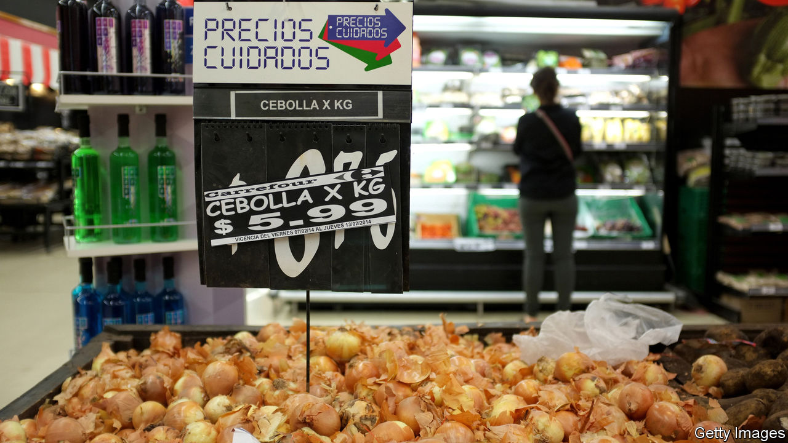

## In a fix

# Why price controls are so uncontrollably persistent

> New data from the World Bank show how much governments meddle in price-setting

> Jan 9th 2020

PRICES, ACCORDING to economists, are determined by supply and demand, acting like the twin blades of a pair of scissors. But that is not the whole story. In many times and places, prices have instead been set by the blunter blades of political pressure and government response.

One of the oldest surviving texts, the Hammurabi code, includes elaborate price and wage controls: 2.5 grains of silver per day for a rowing boat, six for a labourer. At the other end of history, on January 7th Argentina’s government updated its list of precios cuidados (managed prices), setting guidelines for over 300 supermarket products, including lettuce, ultra-thin condoms and mate, a traditional tea-like drink. Via a mobile-phone app, consumers can report any products that are missing from the shelves or any prices that are managed less tightly than the government would like. According to new data collected by the World Bank, 89% of developing economies meddle with the price of energy, 76% with the price of foodstuffs (bread in Benin, sugar in Congo, rice in Haiti) and 13% with the price of construction materials. Burkina Faso, for example, controls the prices of cement, sheet metal and reinforcing bars.

Governments generally impose price controls for one of three reasons: to redistribute, stabilise or deflate. Price caps help the poor afford necessities of life; price floors prop up the livelihoods of farmers. Buffer stocks try to stabilise volatile commodity prices, especially if it is costly for farmers to switch back and forth between crops that fall in and out of market favour. Controls have also been deployed to fight inflation. Argentina’s previous president, Mauricio Macri, had hoped to downplay the precios cuidados introduced by his predecessor, Cristina Fernández de Kirchner, but unstoppable inflation prompted him instead to go further, freezing prices in 2019 for over 60 essential goods.

The ubiquity of price controls shows that economists have less influence than many people think. Few measures are as unpopular with the profession, which sees prices as both a signal of scarcity and a spur to overcome it. Controlling them scrambles the signal and blunts the spur. Price floors result in food rotting in warehouses. Ceilings lead to underinvestment, hoarding and black markets.

Efforts to stabilise prices at home can increase volatility abroad. Export bans, for example, force farmers to sell domestically, worsening global shortages. The World Bank reckons that governments’ attempts to insulate their countries from higher food prices accounted for 40% of the increase in world wheat prices in 2010-11.

One reason not to impose price controls is that they are so hard to remove. “We struggled to find an example where it has gone very smoothly,” says Franziska Ohnsorge, a lead author of the bank’s “Global Economic Prospects” report. A fare increase last year on Santiago’s metro of 30 pesos ($0.04) was the trigger for widespread unrest that brought Chile’s army onto the streets and resulted in 29 deaths.

When removing price controls, it helps to get the timing right. With ceilings, it is best to act when market prices are low. Ivory Coast, Mexico and Rwanda took advantage of the oil-price slump after 2014 to reduce their fuel subsidies. The bank also recommends linking the removal of price controls with offsetting measures to help the needy. Egypt, for example, increased spending on health and education after raising prices for gas, petrol and electricity. But not everyone was appeased. Many people who know that higher prices will hurt them doubt that higher social spending will ever help them.

In 2010 Iran tried to overcome such scepticism by giving money to households to compensate them for a reduction in fuel subsidies. In an ingenious twist, it paid the transfers first, depositing the money in accounts that were locked until prices were lifted. It is a lesson other countries should heed, argues Shanta Devarajan, a former World Bank economist. Unfortunately, Iran itself seems to have forgotten it. In November it raised fuel prices sharply and suddenly. Protesters poured onto the streets. “It’s very difficult to remove these controls,” says Ms Ohnsorge. “It’s better not to have them in the first place.”■