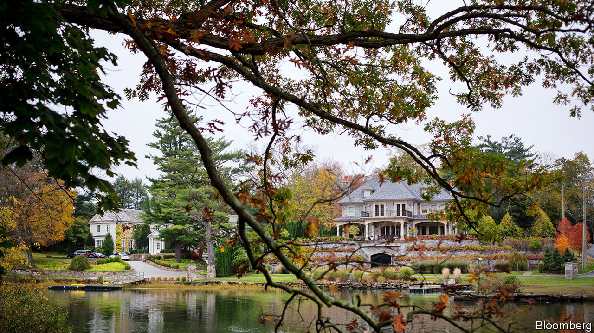

## The country home of capital

# Why so many of America’s financial elite have left Greenwich

> Higher state taxes and hedge funds’ fading fortunes have taken their toll

> Jan 9th 2020GREENWICH, CONNECTICUT

IT IS A small town with a big reputation. Greenwich, Connecticut, with a population of 60,000, has long been home to titans of finance and industry. A century ago Edmund C. Converse, the first president of Bankers Trust, Zalmon Gilbert Simmons, a mattress magnate, and two Rockefellers lived there. Among today’s residents are Ray Dalio of Bridgewater, the world’s most successful hedge fund, and Indra Nooyi, the former boss of Pepsi. It has one of America’s greatest concentrations of wealth. As measured by the income of the top 1% of residents, Connecticut is America’s richest state. The metro area (Bridgeport-Stamford-Norwalk) and county (Fairfield) containing Greenwich come second and fourth on the same measure.

You might think a decade in which rich Americans became richer would have been kind to Greenwich. Not so. The 2007-08 financial crisis and hedge funds’ fading fortunes depleted the state’s coffers. In response it raised taxes, triggering an exodus that has lessons for the rest of America about the risks of relying on low taxes to lure wealthy residents. And as Americans cool on small-town living, Greenwich is a reminder that even the most privileged enclave is not immune to national trends.

A century ago Greenwich’s selling points included the absence of mosquitoes and malaria. It has always been beautiful, too, with a white-sand beach and verdant surrounding hills—and convenient for New York. The super-rich drawn by such delights built homes to match. In the early 1900s a Rockefeller built a 64-room mansion in the Georgian style. Other residents built replicas of Warwick Castle and the Petit Trianon at Versailles. One had a Tudor cottage dismantled, shipped from Britain and put together again.

But Greenwich would never have become a powerhouse of 20th-century finance without low taxes. Until 1991 Connecticut levied no tax on personal incomes at all. The hedge-fund types attracted to Greenwich propelled its property market to even greater excess. Paul Tudor Jones II, who founded a hedge fund in the town in 1980, modelled his mansion on Thomas Jefferson’s Monticello estate—with the addition of a 25-car garage. In 1998 Steven Cohen, the founder of SAC Capital Advisors, bought a house for an unheard-of $14.8m in cash. In 1999 Eddie Lampert of ESL Investments bought a $21m beachfront estate, only to tear it down and rebuild it.

Some financiers decided to skip the commute and make Greenwich their business base as well. It was the home of Long-Term Capital Management from its founding in 1994 to its implosion in 1998. By the early 2000s a third of its commercial property was occupied by hedge funds, and rents on Greenwich Avenue rivalled those on Park Avenue.

Then came the crash, which wiped out many fund managers. To plug the hole in state finances, Connecticut increased income taxes three times. It then discovered the truth of the adage “easy come, easy go”. In 2017 Mr Tudor Jones sold his hedge fund’s Greenwich campus, trimmed staff and moved to nearby Stamford. Others moved to Florida, which still has no income tax—and no estate tax. Mr Lampert moved his fund and family to Miami in 2012. Most of Wexford Capital’s staff moved to Palm Beach in 2014. Mr Tudor Jones now lives in Palm Beach and has an office there.

In the past decade Greenwich has also been at the sharp end of a national trend: as cities have become safer and nicer, Americans have become less keen on midsized towns. Its housing mix exacerbates the problem. Today’s homebuyers prefer walkable neighbourhoods and are willing to trade space for location. Even the richest have cooled on vast back-country estates.

Leaving Greenwich has therefore often meant accepting a low offer. Thomas Peterffy, the founder of Interactive Brokers, saw his 80-acre estate languish unsold for years after he left for Florida in 2015. Initially priced at $65m, it eventually sold for $21m. “You can’t give away a house in Greenwich,” Barry Sternlicht of Starwood Capital complained—somewhat hyperbolically—when he moved to Florida in 2016.

Between 2015 and 2016 Connecticut lost more than 20,000 residents—including 2,050 earning more than $200,000 per year. The state’s taxable-income base shrank by 1.6% as a result, according to Marc Fitch at the Yankee Institute for Public Policy, a conservative think-tank. Its higher income taxes have bitten harder since 2018, when President Donald Trump limited state and local tax deductions from income taxable at the federal level to $10,000 a year.

Greenwich offers two lessons for policymakers to ponder. The first is that low taxes can help create a business hub that, once established, survives when they are raised. It is still home to enough hedge funds that their clients visit frequently—a good enough reason for hedge funds to be in town. Of the $3.6trn-worth of capital managed by hedge funds globally, $340bn is managed in and around Greenwich.

The town’s industry grandees are trying to amplify these network effects. Bruce McGuire, the president of the Connecticut Hedge Fund Association, helped launch the Greenwich Economic Forum in 2018. Among the speakers were Mr Dalio, Mr Tudor Jones and Mohamed El Erian, a former chief executive of PIMCO. Last year’s event drew investors representing more than $5trn-worth of capital.

Indeed, Greenwich has become a commuter destination in its own right. In 2018 the number of inward commuters started to exceed those commuting out. AQR Capital Management, which manages $185bn in assets, employs many of them. Take the Metro-North from Grand Central and you cannot miss its offices—a vast black glass box that looms over the tracks.

But the second policy lesson is that low taxes cut both ways. Some of those who found it easy to move in will also find it easy to move on. If Florida ever needs to raise taxes, it may find the same.

Meanwhile, Greenwich’s non-fiscal charms remain. “It is a wonderful place to live and raise a family,” says Mr Dalio. In 2018 house prices stabilised in many neighbourhoods, and transactions started to pick up. Last November Tom Brady, an American footballer, and his wife, Gisele Bündchen, a Brazilian supermodel, bought a house there. Hedge funds’ heyday may be over, but their country home lives on. ■