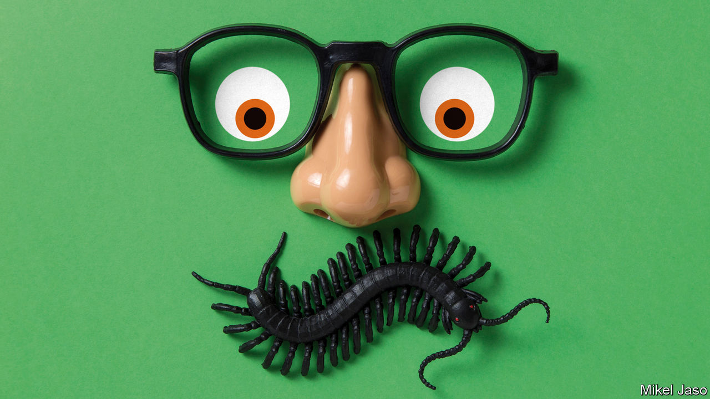
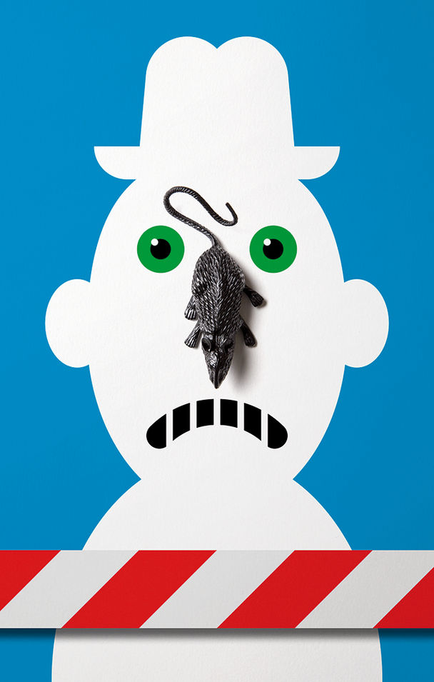

## In good taste

# What a museum of disgusting food reveals about human nature

> Visitors receive a sick bag in lieu of a ticket

> Jan 9th 2020MALMÖ

IT IS A hands-on, tongues-out experience. At the Museum of Disgusting Food in Malmö, in Sweden, all the world’s great cuisines are represented. Each exhibit is considered a delicacy somewhere, but strikes many unaccustomed palates as revolting. Visitors are invited to handle a raw bull’s penis and sip liquor with dead mice in it.

Nordic cuisine is well represented. The meat of the Greenland shark has toxically high levels of urea. It will make you woozy unless first left to rot and then hung to dry. Icelanders eat small cubes of hakarl, as they call it, from toothpicks. The late Anthony Bourdain, a globetrotting chef, called it “the single worst, most disgusting and terrible-tasting thing” he had ever eaten. Others have likened it to “chewing on a urine-soaked mattress”.

At the entrance, everyone is issued with a sick bag in lieu of a ticket. “5 days since the last vomit” reads a blackboard nearby. At the bottom is a running total of how many chundering incidents have occurred since the museum opened in 2018. The most sensitive visitor was a Belgian journalist who threw up ten times. Onlookers were impressed. “I would have given up after maybe vomiting three times,” says Andreas Ahrens, the museum’s director.

A serious message lurks behind the grossness. Disgust is a necessary emotion. Without it, our ancestors would have eaten rotten food and died. But more than any other feeling, it is culturally conditioned. Everyone experiences disgust; but what disgusts you depends in large measure on what you are used to and what the people around you deem repellent.

Many East Asians, for example, find any strong cheese horrid, let alone Stinking Bishop, a British delicacy they are invited to sniff at the museum’s “altar of cheese”. A Chinese tourist tasted a Danish cheese called Gamle Oles Farfar (Old Ole’s Grandfather) “and couldn’t speak for several minutes”, recalls Mr Ahrens.

Sometimes the idea of a dish is more repellent than the reality. Many foreigners recoil from balut, a snack from the Philippines that consists of a duck egg with a partly grown embryo inside. It is not that they dislike the taste of egg or unhatched duck—they just hate the thought of it. The same is true of san-nakji: a Korean delicacy of live octopus, chopped up and eaten while still moving, with sesame oil and chilli sauce. Westerners are not used to food that squirms. (It is also perilous: the writhing tentacles choke to death several people each year.)

Alcohol can make anything easier to swallow. A Chinese rice spirit with seal, deer and dog penis tastes simply of booze. So does Bavergall, a schnapps flavoured with beavers’ anal glands. Connoisseurs, however, insist that it matters which beaver you use. “It has to be the northern European beaver. The American beaver’s anal gland is no good,” deadpans Mr Ahrens.

Visitors usually see at least one exhibit they regard as a comfort food. Americans wonder why Pop-Tarts and Twinkies are included. A Maasai tourist, seeing a film of his fellow Maasai puncturing a cow’s neck, tapping the warm blood and drinking bowls of it mixed with raw milk, harrumphed that this was not disgusting at all, but what he had grown up with.

That, says Mr Ahrens, is the point. When people recognise that disgust depends in part on upbringing, they can learn to overcome it, at least some of the time. They can open themselves to new experiences. And maybe, just maybe, they might learn to be more tolerant of people from unfamiliar cultures. “Our aim is to open people’s minds,” he says.

Disgust is influenced by genes. Women are more prone to it than men, especially when pregnant and therefore endangering two lives if they eat something poisonous. Partly for genetic reasons, East Asians and Europeans are more likely than Middle Easterners to think coriander (cilantro) tastes soapy rather than heavenly. Some people detest cucumbers, a trait which seems to run in families. A Korean-language Facebook page for cucumber-haters has 100,000 followers.

It would be wrong to assume, however, that disgust is genetically programmed and therefore immutable. It is more complex than that. Val Curtis, the author of “Don’t Look, Don’t Touch, Don’t Eat: the Science behind Revulsion”, argues that it is part of the “behavioural immune system”. People learn from family and friends not to eat certain things. Babies learn from their mothers’ facial expressions whether a snack is considered nasty or nice. Taboos are thus passed from generation to generation. Any prohibition that helps a group avoid sickness is likely to spread—don’t eat unfamiliar foods, always wash your hands after defecating, and so on.

Such customs can morph into rituals (many religions include ritual washing), and then into moral injunctions. Outsiders who fail to observe local customs can then be seen not only as dirty but also as morally suspect. Many cultures have long tagged outsiders as “unclean” or “impure”.

In English the word “disgust” (from the Latin gustare, “to taste”) has two meanings. It can signify visceral revulsion, of the sort provoked by a rotting corpse. Or it can denote moral abhorrence, of the sort one might feel for incest or crucifixion.

As Carolyn Korsmeyer writes in “Savouring Disgust: the Foul and the Fair in Aesthetics”, the two categories “are not always easy to separate”. Many people feel physically sick when contemplating something they find morally repugnant. Several exhibits in the museum might provoke this reaction: the video of farmers force-feeding geese to make their livers expand will strike many as cruel, and therefore disgusting; as will the Chinese table with a vice to hold a live monkey still while diners scoop out its brains. The conflation of disgusting and immoral extends beyond food. Most obviously, traditionalists who consider gay sex sinful often deem it repulsive, too.

Not only do “immoral” things disgust people; sometimes, disgust can affect their moral judgments. In one experiment, Thalia Wheatley of the National Institutes of Health and Jonathan Haidt of the University of Virginia took a group of people who were susceptible to hypnosis. They were hypnotised to feel a brief pang of disgust when they read an everyday word, either “take” or “often”. Then they read accounts of theft, bribery or incest, and were asked how morally outrageous they thought each incident was. When an account of an offence included one of the words that triggered disgust, the participants condemned it more severely. Other experiments have shown that people who are easily disgusted make harsher moral judgments when subjected to disgusting stimuli, such as a sticky desk or foul smells.

Another finding is that people who are more easily disgusted are more likely to be socially conservative. A study by Xiaowen Xu of the College of William and Mary in Virginia and others found evidence that “disgust-sensitive people extend their preference for order in the physical environment (eg, tidying up one’s room) to the sociopolitical environment (eg, strengthening traditional norms).” Woo-Young Ahn of Virginia Tech and others found that by scanning brain responses to a single disgusting image (such as a mutilated body), they could make accurate predictions about a subject’s political ideology.

People who are highly sensitive to disgust are especially likely to oppose immigration. This is true even after controlling for education, income and political ideology. A possible explanation, suggest Lene Aarøe and Michael Bang Petersen of Aarhus University and Kevin Arceneaux of Temple University, is that because disgust evolved as a defence mechanism against sickness, it prompts people to shun unfamiliar stimuli and unfamiliar people. “Those who are prone to experience disgust unconsciously tag immigrants as bearers of pathogens and experience strong motivations to avoid them,” they argue.

There is a logic to this. Foreigners have in the past been a source of germs to which the locals lack resistance—just ask Native Americans. But these days a vague feeling that foreigners are yucky is, to put it mildly, a less reliable guide to whether they are carrying pathogens than, say, testing them. Modern medicine allows people to interact with strangers with minimal risk of death. When Donald Trump, a germophobe who uses hand sanitiser after touching others, talks of “tremendous infectious disease...pouring across the border”, he is making an emotionally powerful case for immigration restrictions, but not a rational one.

The squeamishness that evolved in more hazardous times is ill suited to the present. It makes people shun experiences that might enrich their lives, such as trying outlandish dishes, learning from other cultures or dating people with different skin colours. Mr Ahrens is alarmed at the spread of xenophobia in his native country. The Sweden Democrats, a party that says mass immigration has created “a Sweden where women are gang-raped and girls are mutilated”, came first in a national opinion poll in November, with 24% support, against the ruling party’s 22%.

The Museum of Disgusting Food will probably not change how people vote. And there is no cure for a heightened sense of disgust. But people can learn to overcome their revulsion for specific things, especially if they see other members of their group doing so. This is true for trivial things like food—the British have largely overcome their traditional horror of garlic; the Japanese, their horror of mild cheese. It is also true of more consequential things. The proportion of people in rich countries who think that homosexuality is disgusting has collapsed in the past two decades, for example. So has the proportion who object to inter-racial marriage. People can learn to love—or at least tolerate—things they once found revolting. But they have to make an effort to be open-minded.

In this spirit, your correspondent approached the museum’s tasting bar. Thirteen disgusting foods were laid out for sampling. He tried them all and liked more than half, especially the fermented mini-shrimps and the sauerkraut juice. Some dishes, such as weevils and dung beetles, were inoffensive but dull. Only one food made him choke: Icelandic “devil” salted liquorice. The sensation was like what one imagines a slug might feel being force-fed salt by a vindictive gardener. It was awful and overwhelming. Your correspondent took a bag home for his children. They have not yet forgiven him.■