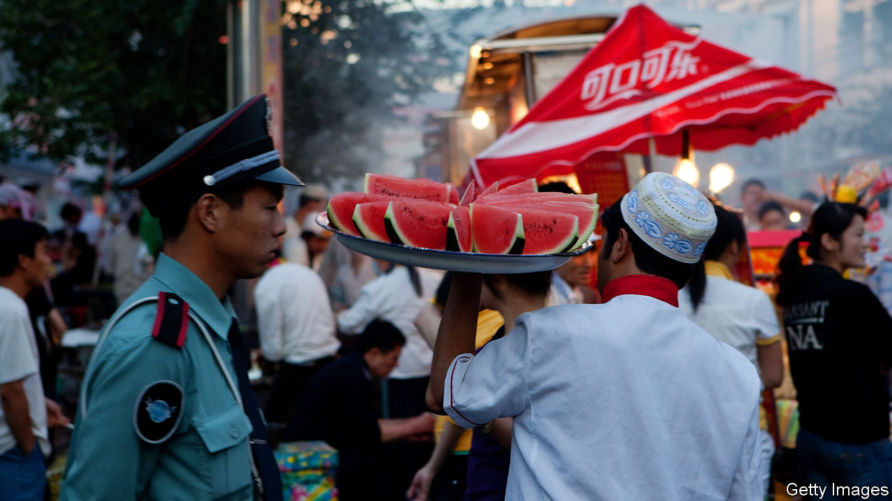
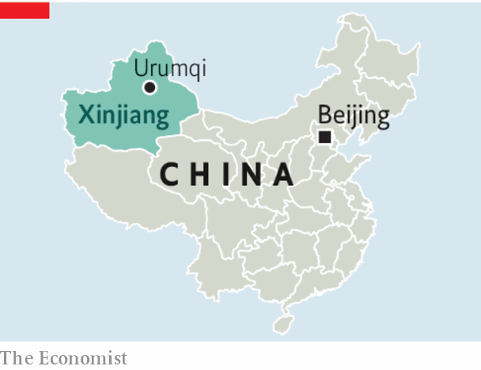

## Apartheid, Chinese style

# Dismantling China’s Muslim gulag in Xinjiang is not enough

> The Communist Party must undo decades of sowing ethnic division

> Jan 9th 2020

IMAGINE A PLACE with nearly seven times more land than Britain, oil reserves as big as Iraq’s and more coal than Germany. It produces one-fifth of the world’s cotton. Yet this place is poor. Its income per person is about the same as Botswana’s. And it is a time bomb. Its people mostly belong to two ethnic groups of similar size. One group has all the power and most of the wealth. Many of the other rot in a gulag, enduring compulsory “re-education” in how to think and speak like the richer lot.

Such is the far-western region of Xinjiang (see [article](https://www.economist.com//china/2020/01/09/many-han-chinese-dont-mind-the-gulag-for-their-uighur-neighbours)). The dominant ethnic group are the Han Chinese, who are more than 90% of China’s population and about 40% of Xinjiang’s. The Communist Party has never trusted a Uighur to run Xinjiang. Han people dominate its economy, too, through massive state-owned industrial and agricultural firms which answer to the government in Beijing, 2,000km (1,200 miles) to the east.

Many of the 10m Uighurs in Xinjiang object to this state of affairs. Some have been so bold as to say so publicly. A tiny minority have made their displeasure known violently. China has reacted by building a vast network of prison camps and tossing perhaps 1m Uighurs into it for “vocational training” (ie, indoctrination). All it takes to get hauled away is to show too much interest in Islam or Uighur traditions.

To understand Xinjiang’s tragedy, look at how the Chinese government has aggravated its ethnic divide. China says it wants to curb the “three evils” of separatism, terrorism and religious extremism. It exaggerates the scale of these problems and obfuscates their cause. Uighurs are restive largely because their Han neighbours often treat them with contempt.

Many Han people behave like colonial overlords. Few bother to learn the local language, even if their families settled in Xinjiang in the 1950s, shortly after the Communists seized power and snuffed out a brief period of independence for part of the region. Many have almost no interaction with Uighurs. About one in six people in Xinjiang, most of them Han Chinese, live in separate communities run by a colossal state-owned-enterprise-cum-paramilitary-outfit. It is called the Xinjiang Production and Construction Corps, or bingtuan (Chinese for a military regiment). It has its own police, hospitals, newspapers and television stations. It dominates Xinjiang’s agriculture. This includes the production of tomatoes and cotton, for the harvesting of which the bingtuan uses casual Han labour brought in from other parts of China. The (Han) party chief of the corps wields power in the region second only to that of the leader of Xinjiang itself.

Such a system is bound to foster resentment. Geography compounds the problem. The bingtuan’s biggest settlements are in the north. An immense desert separates them from the oasis towns of the south, where the Uighurs, mostly poor farmers who struggle to compete with the bingtuan’s huge agricultural schemes, are mainly concentrated.

The Chinese government insists it is not oppressing anyone. Uighurs learn useful skills in the camps, officials say, spuriously claiming that all volunteer for the strictly disciplined factory jobs that—according to leaked papers—are later assigned to many. They say the camps are needed because of Xinjiang’s record, unmatched elsewhere in China, of terrorist attacks. They say there were thousands of such attacks in the decade and a half before the camps were built, and that these resulted in a large number of people being killed, including hundreds of security personnel. Since then, they claim, there have been no terrorist incidents at all in Xinjiang.

It is hard to assess such claims in a region where foreign reporters are kept under surveillance and ordinary people are afraid to talk to strangers. But there are reasons to be sceptical. Xinjiang is not awash with guns or extremists. It is a place where members of an ethnic and religious minority have been made to feel like third-class citizens in their ancestral homeland. By locking up so many innocents for growing beards or praying too loudly, China is stoking anger among Uighurs that could indeed lead to violence. Their Han neighbours will no doubt become even more suspicious and frightened of them. Xinjiang will become more divided, and in the long run less stable.

The camps must be dismantled. So, too, must Xinjiang’s apartheid-like system, epitomised by the bingtuan and its mainly Han enclaves. Alas, those who suggest this are brutally silenced. In time, the Chinese government may discover what a terrible mistake it is making. ■

## URL

https://www.economist.com/leaders/2020/01/09/dismantling-chinas-muslim-gulag-in-xinjiang-is-not-enough
