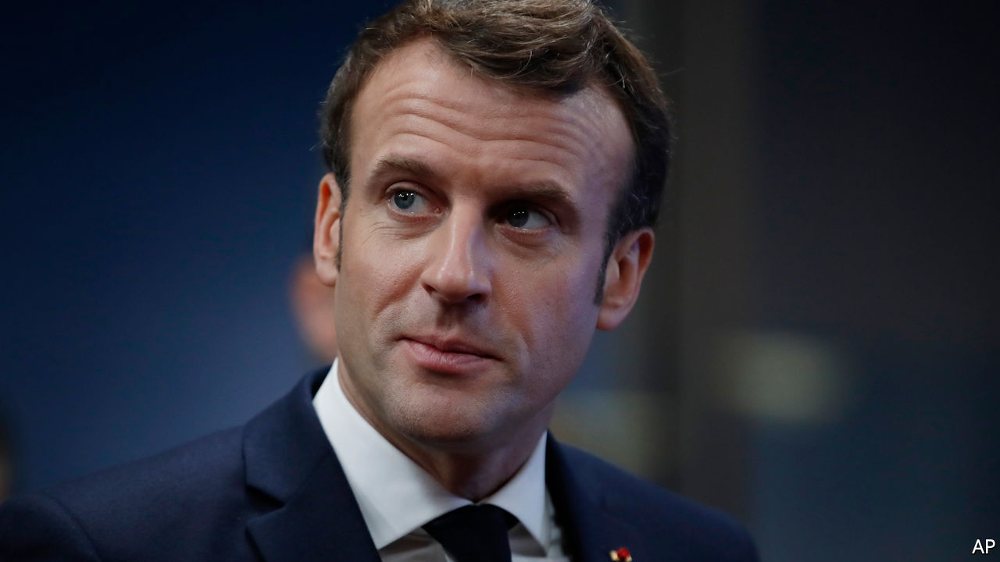
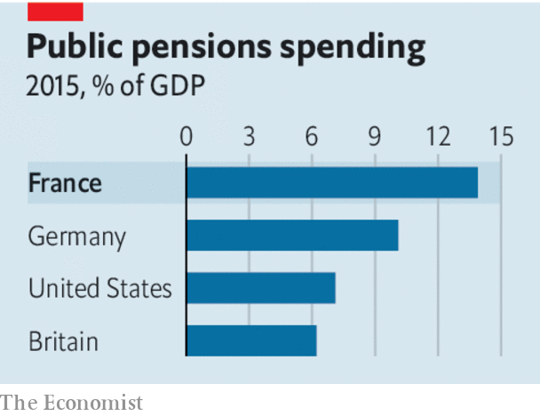

## No surrender

# Emmanuel Macron should not give in to the strikers paralysing Paris

> Governments should answer to voters, not shouters

> Jan 9th 2020

TO HOLIDAYMAKERS, Paris seems pleasantly uncrowded at the moment, so long as they have stout boots to walk around in. The French capital is quiet because strikers have virtually shut it down. Few commuter trains are running and the Metro is mostly out of commission outside peak hours—except for the automated No 1 and No 14 lines. Commuters are staying at home, as are shoppers. A stoppage called by transport workers is entering its second month. It has now lasted longer than the strike in 1995 that scuppered pension reforms proposed by the then prime minister, Alain Juppé. As the holiday season ends and Parisians desperately need to get to work, the strikers are hoping that President Emmanuel Macron will surrender, like his predecessors. He should not.

This round of strikes is aimed at the third and final plank in Mr Macron’s ambitious overhaul of his country. The first plank was labour-market reform. This was also met by a wave of strikes, but they quickly fizzled out. The second plank, reforms to the systems for education and training, was less controversial, and not seriously opposed. Both of these changes will stand France in good stead. The employment reforms put a cap on previously unlimited awards for unfair dismissal, make it easier to shed unneeded workers and also easier to set up new businesses. They already seem to be bearing fruit, with job- and enterprise-creation both on the increase. The education reforms will take longer to prove themselves. The third plank is pension reform, and it is proving by far the most tricky (see [article](https://www.economist.com//europe/2020/01/09/big-protests-in-paris-are-emmanuel-macrons-severest-test-yet)).

It is natural that people are unhappy. They counted on receiving lavish pensions. Mr Macron now plans to trim them for many, so of course they object. But the current system is unsustainable. Workers expect to retire at 62 and live for perhaps another 20 years. Some especially privileged ones, for instance on the state-owned railway, get to retire at 50 on two-thirds of their final salary. The system is wildly complex, with no fewer than 42 different pension regimes in operation. All are run by the state—private pensions are rare. The cost of paying current pensions is a whopping 14% of GDP, double the OECD average. And the burden will only increase as the population ages.

Mr Macron’s changes are actually fairly modest. Workers will still be able to retire at 62. The current proposal, however, is that to get full benefits they should toil for another two years. This will not affect anyone born before 1975 (and perhaps even later for some of the “special regimes”; the proposals are still being negotiated). The reform would create a single scheme out of the existing 42. This will hurt those on the most generous schemes, but it will also become much more straightforward for workers to move between jobs and transfer benefits. The new rules will not save any money in the short run.

Still, France’s trade unions see any diminution of benefits as the thin end of the wedge. That is why all the big ones have come out against the reform, and are disrupting the transport system and some schools. It is also why huge demonstrations periodically erupt on the streets of Paris (another was under way as The Economist went to press). Large numbers of French people still support the strikers, though perhaps now less than a majority.

Nonetheless, Mr Macron should face down the strikes and press ahead with his programme. His pension reforms are fair: there is no reason why young taxpayers should subsidise their elders who are so much better-off. They are necessary: ridiculously early retirement makes France poorer than it would otherwise be and its public finances more precarious. And they are democratic: Mr Macron’s ideas were clearly set out in his manifesto before he won thumping victories in presidential and legislative elections in 2017. The idea that people on the streets should determine policy had some justification in the absolutist days of Louis XVI, but the Revolution was 231 years ago. Intimidating feeble governments into backing down by mass protest, economic disruption and even violence (though this round of action has been mostly peaceful) is a national tradition that has lasted longer in France than in other European democracies. Mr Macron should not be intimidated. ■

## URL

https://www.economist.com/leaders/2020/01/09/emmanuel-macron-should-not-give-in-to-the-strikers-paralysing-paris
