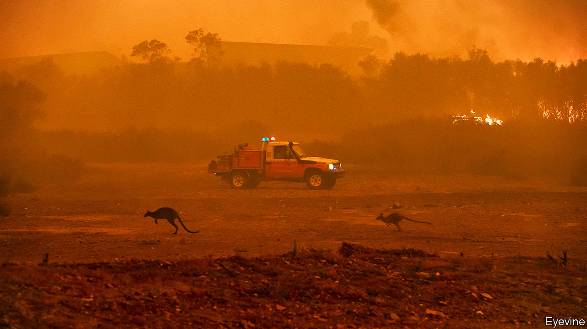

## How to block blazes

# The lessons from Australia’s fires

> Other countries are vulnerable

> Jan 11th 2020

ONE WAY of capturing the scale of the devastation that forest fires have inflicted on Australia is through figures. Some 11m hectares of the Lucky Country have gone up in smoke since September, almost the same area as Bulgaria. So far at least 26 people are known to have lost their lives, over 2,300 homes have been destroyed and over half a billion animals have been burned alive or choked to death. But numbers tell only part of the story (see [article](https://www.economist.com//asia/2020/01/11/why-was-australias-government-so-ill-prepared-for-the-bushfires)). A plume of smoke has drifted across the South Pacific ocean, reaching Buenos Aires. Australia’s normally phlegmatic society has been shaken. Shane Warne, the most celebrated sportsman in a sports-mad nation, has gone so far as to raise money for the relief effort by auctioning off the baggy cap he wore as part of Australia’s all-conquering cricket team.

You might think that Australia is particularly vulnerable to forest fires. But that would be a mistake. Many other countries share the same conditions that have set Australia ablaze, physically and politically, including similar terrain and a leadership that has yet to wake up fully to the new reality that climate change is creating. Worldwide, fire seasons are getting longer and more damaging. The areas at risk include America’s west coast, the Mediterranean, southern Africa and swathes of Central Asia. If that sounds alarmist, remember that in 2018 California had the deadliest forest fires in its history, killing over 80 people and causing parts of Los Angeles to be evacuated, while over 100 people died in wildfires in Greece.

As a result, the lessons from Australia’s tragedy are important. One is that climate change is making infernos more likely. It is true that forest fires are a long-standing part of some territories’ ecology. But as the world gets hotter and drier, their incidence and severity are rising. In 2019 Australia’s mean temperature was the highest since records began in 1910, 1.5°C above the long-run average. The amount of rainfall, meanwhile, was 40% below the long-term average and at the lowest level since 1900. For at least a decade climate models, sometimes derided by sceptics, have accurately predicted worsening droughts and infernos in Australia.

Another lesson is that as fires get worse the old ways of assessing and containing them have become obsolete. Unlikely as it may seem, Australia’s fire-planning is ahead of most of the world’s—it carries out preventive burns, for example, and its planning codes seek to limit fire risks. Nonetheless this system, and a heroic voluntary firefighting force, has been overwhelmed. Attention must now turn to how to live with fires. In some places, that will mean building structures that can resist the flames. Other regions may no longer be suitable for human habitation. If governments and residents do not act, financial markets will. In California insurance firms have lost $24bn from recent fires, and the cost of bundling and reinsuring these risks is soaring as investors become unwilling to underwrite homes in dangerous places.

The last lesson is that, as the costs of climate change stop being just about abstract temperature forecasts and start being something you can smell in your nostrils, the politics surrounding it will change, too. Australia’s conservative politicians have long downplayed climate risks, in part because some 70% of the country’s exports come from natural-resource extraction, most notably coal and iron ore shipped to China.

Scott Morrison, the prime minister, won an election in 2019 in stunning fashion, partly on a climate-sceptical platform that appealed in Queensland, a swing state with a big coal industry. He is now being pilloried for his government’s laggardly climate policies and stuttering response to the fires. His position may be secure for now, but 61% of Australians think climate change is a pressing problem. Sooner or later, in hot, dry places all over the world, politicians who fail to deal with climate disasters may find their credibility going up in smoke.■

Sign up to our new fortnightly climate-change newsletter [here](https://www.economist.com//theclimateissue/)

## URL

https://www.economist.com/leaders/2020/01/11/the-lessons-from-australias-fires
