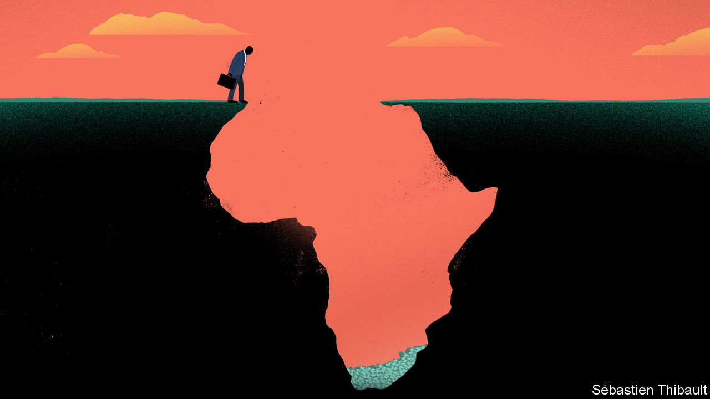
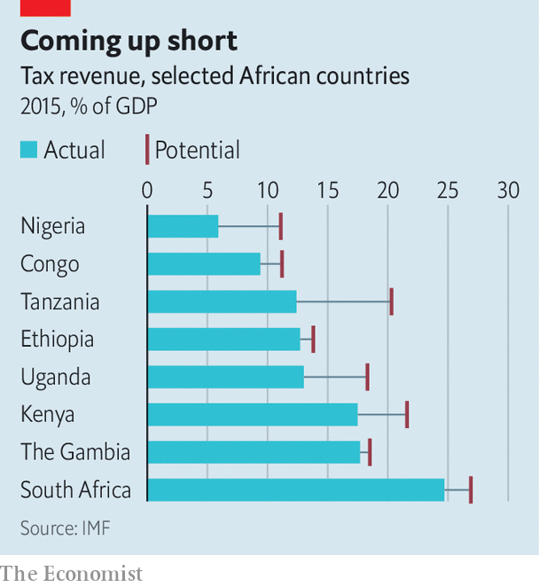

## Taxing times

# African governments are trying to collect more tax

> They can no longer rely on aid or natural resources

> Jan 11th 2020KAMPALA

WHAT IS IT like being a taxman in Africa? “A lot of sleepless nights,” says Yankuba Darboe, the Gambia’s top revenue official, describing the pressure to meet targets. Politicians across Africa are asking ever more of their tax collectors, with good reason. The biggest hole in public coffers is not money squandered or stolen, but that which is never collected in the first place.

Government revenues average about 17% of GDP in sub-Saharan Africa, according to the IMF. Nigeria has more than 300 times as many people as Luxembourg, but collects less tax. If Ethiopia shared out its tax revenues equally, each citizen would get around $80 a year. The government of the Democratic Republic of Congo is so penurious that its annual health spending per person could not buy a copy of this newspaper.

Governments once turned to aid and natural resources to stay afloat. Historically “we relied on oil,” says Babatunde Fowler, until last month the head of Nigeria’s Federal Inland Revenue Service. “Nobody took taxation seriously.” Lower oil prices are now forcing a rethink, he explains. So too are shifts in foreign aid. As a proportion of Africa’s income, aid flows have halved since the 1990s. Measured as dollars per person, they peaked in 2011 and then fell. Public debt has risen sharply.

Since the 1980s governments have followed an IMF-inspired recipe: slashing trade taxes, reducing top rates on personal and corporate income, and embracing value-added tax. Data from the OECD for 26 African countries show that over half of their tax revenues come from taxes on goods and services. Only a quarter comes from personal income tax and social-security contributions (about the same as in Latin America, but much less than in the rich world). From 2008 to 2017 the ratio of tax receipts to GDP rose by 1.5 percentage points, but in many countries this was offset by falls in non-tax revenues, such as fines, rents and royalties from resource extraction.

Large firms grumble that they are footing the bill. Just 6% of tax-paying firms generate 78% of receipts, according to the African Tax Administration Forum (ATAF), a club of taxmen. But that statistic gives only a partial picture. Analysis of corporate tax returns in Ethiopia by Giulia Mascagni of the International Centre for Tax and Development and Andualem Mengistu of the Ethiopian Development Research Institute reveals that small firms pay the highest effective rate, perhaps because they lack accountants to find gaps in the tax code. In many countries firms which are considered “informal”—because they are not registered, or do not pay income tax—still cough up for licence fees and market dues.

Ordinary Africans complain the system is rigged. Some 56% of those surveyed by Afrobarometer, a pollster, considered it “very likely” that a rich person could pay a bribe or use personal connections to dodge taxes. They are probably right. When Ugandan tax collectors examined records for 71 government officials in 2013/14, they found that just one had paid any personal income tax. Only 5% of directors at leading companies were paying income tax themselves.

Authorities try to manage such tax-dodging through dedicated units that focus on, say, wealthy individuals or large corporations. In Uganda officials built on their earlier research by drawing up a list of 117 rich folk, then meeting them personally. At the time only 13% were filing tax returns; a year later 78% were. One pastor on the list even started preaching about paying taxes. The taxmen also chased government agencies. “It’s a tax morale issue if you ask people to pay their tax and then the government is not paying its taxes,” says Doris Akol, the country’s top revenue official.

Technocratic tax talk often centres on such administrative reforms, which also include things like strengthening IT systems or adopting taxpayer identification numbers. Yet this package only goes so far. “It says build a good tax register, go to electronic filing, and so on,” says Logan Wort, the executive secretary of ATAF. “Those are all right. But you know what the problem in Africa is? It has signed away its tax base.”

One example is bilateral tax treaties. Originally intended to eliminate double taxation, and later to attract investment, their practical effect is to limit taxation of cross-border income, such as royalties or service fees. The IMF estimates that signing treaties with so-called “investment hubs”, like Mauritius, costs African countries an average of 15% of their corporate tax revenue without increasing investment. Some governments, such as Rwanda’s, have wisely renegotiated terms.

Governments also erode the tax base by dishing out generous exemptions. Estimates of “tax expenditures”, or deviations from usual tax rates, put the cost at up to 40% of revenues that African governments collect. Those figures include some sensible allowances, like tax relief on medicines, as well as questionable ones, such as tax holidays for investors. Most businesses say that tax breaks do not affect their decision to invest; in surveys, they tend to put greater weight on things like stability and roads, which a little extra tax might fund.

How much more could African governments collect? The best estimates are that they lose revenues worth 2% of GDP through corporate-tax avoidance, of all kinds, and perhaps another 1-2% through individual wealth stashed offshore. The revenue forgone through tax expenditures is roughly 5% of GDP. It is neither feasible nor desirable to close all those gaps, so the realistic gains are smaller. Other measures, such as increasing compliance or expanding property taxes, could also add a few percentage points.

The IMF models the “tax capacity” of a country using variables such as average incomes, trade openness, and governance. On that basis it thinks that African governments could increase their revenues by 3-5% of GDP, which is more than they receive in aid (see chart). But in the past few years “there has been little progress,” says Papa N’Diaye of the IMF. The challenge is not starting tax reform, he adds, but sustaining it. Africa’s taxmen are in for a few more sleepless nights. ■

## URL

https://www.economist.com/middle-east-and-africa/2020/01/11/african-governments-are-trying-to-collect-more-tax
