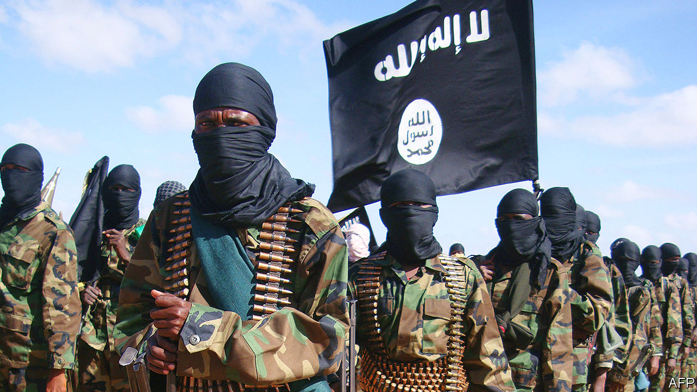
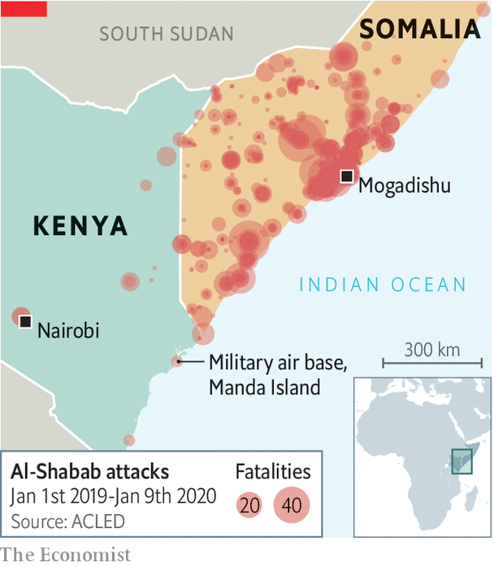

## Al-Shabab and Iran

# An attack on American forces in Kenya raises questions and concerns

> But talk of an alliance between al-Shabab and Iran is probably just that

> Jan 11th 2020NAIROBI

TOURISTS VISITING Kenya’s lovely Lamu archipelago are normally stirred from their slumber by pleasant sounds, such as gently lapping waves or the call to prayer drifting across the water. But on January 5th some were woken by the less melodious rattle and crump of distant battle. Across Manda Bay, on the mainland, fighters from al-Shabab, a Somali jihadist group, were engaged in an unusually daring assault on American forces stationed at a Kenyan airbase.

The attack, which lasted several hours, was startlingly effective. The lightly armed jihadists—probably no more than 15 of them—managed to kill three Americans (one soldier and two security contractors) and wreck six aircraft, some used by America’s armed forces for snooping missions across the Somali border. Never before had al-Shabab targeted a facility housing American troops outside Somalia.

The incident represents a worrying lapse in security. The last time so many Americans were killed in combat in Africa—in Niger in 2017—it led to investigations and recriminations. In a week in which America had not just killed Iran’s most prominent general, Qassem Suleimani, the attack in Kenya might have too. As it is, America may be looking to respond. Additional troops have been sent to the base. Air strikes against al-Shabab targets in Somalia have been reported.

As news of the attack came down, some Kenyans worried that they had been caught up in Iran’s tiff with America over the killing of General Suleimani. American officials quickly denied that al-Shabab had acted on Iranian orders. Al-Shabab concurred. As an al-Qaeda franchise, it takes the Sunni fundamentalist view that Shia Iran is almost as worthless as the infidel West.

Al-Shabab may not have been doing Iran’s dirty work this time. But some analysts believe the assassination of General Suleimani has so profoundly changed the geopolitical landscape that some kind of future co-operation is possible. Rashid Abdi, an independent expert, reckons the attack in Kenya may have been a signal to Iran that al-Shabab is interested in a covert tactical alliance.

Under this theory, the two would set aside their differences for the sake of expediency. Both are more pragmatic than is often assumed. Iran has made common cause with groups that do not share its theology, such as Hamas in Gaza. Al-Shabab’s younger leaders are flexible. “They would make a deal with the devil,” says Mr Abdi.

There are potential attractions for both sides in a deal. Al-Shabab could gain access to sophisticated weaponry that other Iranian proxies enjoy. In return, Iran might persuade al-Shabab to strike at international shipping in the Red Sea. American and Kenyan security types say Iran has been trying to increase its influence in the Horn of Africa for some time. It may now have reason to redouble its efforts.

Others are sceptical. Even a covert relationship with Iran carries risks for al-Shabab. Its credibility rests, in part, on its anti-Shia credo. Moreover, it remains loyal to al-Qaeda. The latter has occasionally co-operated with Iran, but it would probably oppose one of its franchises doing so.

Al-Shabab, anyway, is doing well enough, by its bloody standards, without fancy Iranian weapons. It killed more people in 2019 than in any year since 2010. And it is rich enough to buy its own arms.

The attack in Kenya was probably driven by other motives. Al-Shabab had been itching to retaliate against a surge in American air strikes on its leaders. (It failed to breach an American base in Somalia last September.) By killing Americans, the group has also burnished its credentials as arguably the foremost al-Qaeda franchise, says Harun Maruf, author of a book on al-Shabab.

Some in the Trump administration want to draw down American troops fighting Islamist militants in Africa. Whether the attack in Kenya marks a big escalation or was merely a bit of one-off opportunism, one thing is clear: more than a decade of American intervention and air strikes has done little to blunt al-Shabab. ■