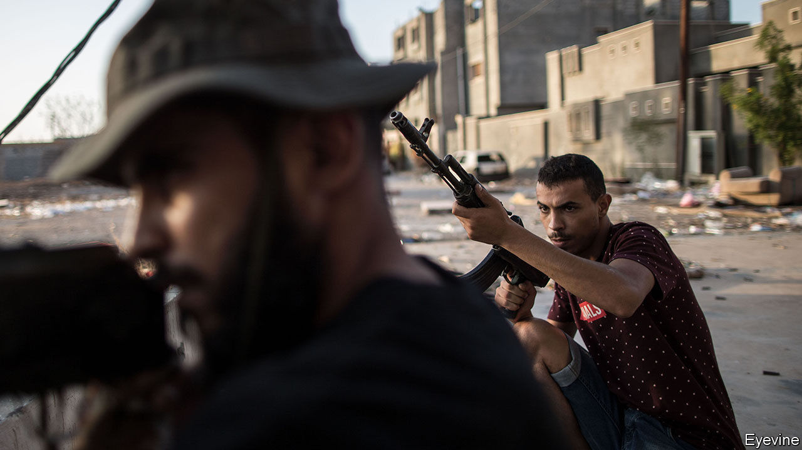
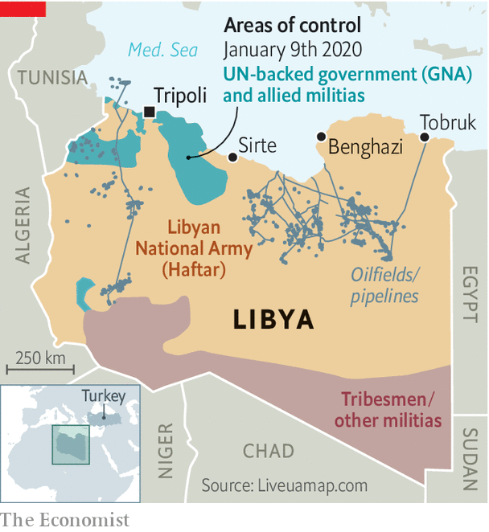

## Back to the Ottomans?

# Turkey is set to send troops to Libya

> But it will need to cut deals with Russia, as well as regional players

> Jan 11th 2020ISTANBUL

FROM WEAPONS purchases to energy deals to Syria, the presidents of Russia and Turkey, Vladimir Putin and Recep Tayyip Erdogan, have had no shortage of things to ponder in the past couple of years. At a meeting in Istanbul on January 8th, they added another to the menu, chewing over the war in Libya, into which Turkey had just waded. When they emerged, the two strongmen called for a ceasefire starting on January 13th.

Days before Mr Putin’s arrival, Mr Erdogan announced that Turkey had begun to send troops to Libya to shore up the country’s government, which has faced an insurgency led by forces loyal to General Khalifa Haftar and backed by Egypt, the United Arab Emirates (UAE) and Russia. Mr Erdogan said Turkish soldiers would steer clear of combat and focus on co-ordination and training. Turkey’s aim, he said, was “not to fight” but “to support the legitimate government and avoid a humanitarian tragedy”. Turkish officials have not specified the scale of the mission. The best guess is that Turkey will send at least a few warships and fighter jets, plus some ground forces.

Turkey has already provided Libya’s embattled UN-backed Government of National Accord (GNA) with weapons, including armed drones. Syrian mercenaries, poised to become the bulk of Mr Erdogan’s fighting force, have also begun operating in Libya. Nevertheless, on January 6th General Haftar’s forces announced they had captured Sirte. As he advances on Tripoli, Libya’s capital, Turkey hopes its deployment will tilt the balance in the GNA’s favour.

Turkey has plenty at stake in Libya. The GNA’s survival and a return to relative stability would offer Turkish companies a chance to resume work on construction projects worth around $20bn that have been frozen since the fall of Libya’s dictator, Muammar Qaddafi, in 2011. Turkey would also be poised to help rebuild Libya’s institutions and its army, says Mustafa el-Sagezli, the head of a government programme to reintegrate militiamen into society. If the GNA wins, “the doors of Libya are open to them,” he says.

Saving the GNA would also beef up Turkey’s position in the energy-rich eastern Mediterranean, where Mr Erdogan’s government has been isolated by Cyprus, Egypt, Greece and Israel. In November Turkey and the GNA struck a maritime border deal that could frustrate plans by those four countries to export gas to Europe through an undersea pipeline. Turkish officials say the deal gives their country a decisive say in exploration in the eastern Mediterranean. Turkey previously raised the stakes by sending ships to drill for gas off the divided island of Cyprus, despite the EU’s threat of sanctions. The new maritime deal may be the price the desperate GNA had to pay to enlist Turkey’s help. “Turkey would not be in Libya without it,” says Sinan Ulgen of EDAM, a think-tank in Istanbul.

This means the cost of failure for Turkey would be painfully high. A victorious General Haftar would almost certainly rip up the maritime deal and ban Turkish contractors from Libya. But a big Turkish deployment could turn the tide. Much depends on how big that might be. From a distance of over 1,500km (932 miles) Turkey’s air force cannot make a crucial difference. Turkey’s first aircraft-carrier is not yet ready for combat.

Then there are the political obstacles. Like Mr Erdogan, many Turks would like to see their country play a bigger part in Libya, a former Ottoman realm. But few want to put Turkish lives on the line. According to a poll by Istanbul Economics Research, a consultancy, only 34% of Turks back sending troops to Libya, against 58% opposed. Turkey’s recent offensive in Syria, which most Turks supported, gave Mr Erdogan a badly needed lift in the polls. Libya could easily do the opposite.

A Turkish deployment could also provoke the UAE and Egypt, which provide Mr Haftar with weapons and air support, and which have antagonised Turkey for years. Escalation by either side could turn the conflict into a prolonged, bloody regional war. Turkey must also contend with Russia, whose own mercenaries have been embedded with Mr Haftar’s forces. Turkey has already lost one proxy war against Russia in neighbouring Syria. It does not want to end up fighting another.

The best outcome Turkey can expect may be a stalemate that leads to new peace talks. (Though Turkey and Russia seem to be working apart from European peace efforts.) Turkey’s higher hope is that General Haftar’s coalition unravels. Getting Russia’s agreement is crucial, says Tarek Megerisi of the European Council on Foreign Relations, a think-tank in London. Mr Haftar has wooed Russia with promises of infrastructure and energy contracts. If Turkey can persuade the GNA to make Mr Putin a similar offer and frustrate Mr Haftar’s advance, Russia may be tempted to switch sides or stand down.

Russia entered the fray in Libya much later than Egypt or the UAE, but it is the only side with which Turkey can hammer out a solution, says Emadeddin Badi, a Libyan scholar at the Washington-based Middle East Institute. “Whether Turkey’s gambit in Libya works out,” he says, “depends on how it deals with the Russians.” ■

## URL

https://www.economist.com/middle-east-and-africa/2020/01/11/turkey-is-set-to-send-troops-to-libya
