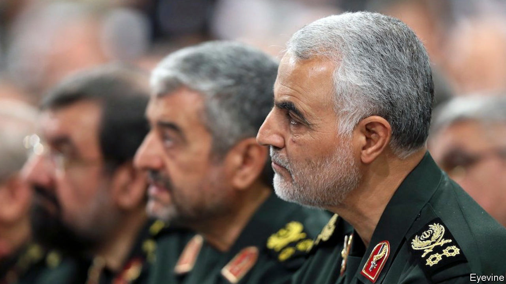

## Nowhere and everywhere

# Obituary: Qassem Suleimani was assassinated on January 3rd

> The mastermind of Iranian expansion, destruction and killing was 62

> Jan 9th 2020

FOR A MAN whose reputation was shadowy and clandestine, Qassem Suleimani sometimes made himself startlingly visible. He climbed up on the flatbeds of army trucks in Syria, exhorting crowds of weary fighters. He posed smiling beside rocket-launchers in Iraq, finger on the trigger. He responded to Donald Trump’s Twitter threats against Iran by calling him a gambler and a bartender, urging him to come on and find out, the hard way, who the real men were in this showdown. His Instagram account showed him ordering a missile strike against the White House with the slogan, in English: “We will crush the USA under our feet.”

He had earned his shadow reputation in other ways. His habit of glancing downward, carefully, his eyes slightly hooded under thick brows, which could set his interlocutors trembling. His wish to sit alone at meetings, his silences in conversations, and his simple words, as if he was ordinary. That befitted him as a peasant’s son from the mountains near Afghanistan, whose most vivid childhood memory was straining his puny body on a building site to earn enough money to clear his father’s debts. And it befitted him, too, as the head after 1998 of the Quds Force, the elite arm of the Islamic Revolutionary Guard Corps, where he masterminded Iran’s ever-widening circle of influence, destruction and killing.

To him the job was still soldiering. That was his calling, even if he did most of it in black shirt and jacket from his desk. His eight-year service in the Iran-Iraq war, the Sacred Defence, in which he was wounded and near-choked by chemical weapons, did more than battle-harden him. It taught him to slide between local militias, crossing borders, making alliances, that proved invaluable later. It taught him that neighbouring countries had to be controlled to keep Iran strong. Most of all he learned that the trenches and attrition of the Sacred Defence, the million deaths, were not a good way to wage war. He would deal out death by other means.

That weapon was his Quds Force: up to 20,000 men whose first purpose was to protect Iran’s Islamic revolution of 1979, and whose second was to reclaim Quds, Jerusalem. His passion for the revolution, which he had raced to serve in his 20s, grew into a determination to forge an Axis of Resistance—a Shia Crescent, as its detractors called it—against dominant Sunni powers, from the Mediterranean to the Arabian Sea. His men could be sent out to fight or to train fighters, to spy, to bribe, to negotiate contracts and to sow terror, all over the region and beyond. Thus, covertly, he could present the enemies all around with “many Irans”.

He could slip in himself, unseen, whenever needed. In Syria, where he was tilting the civil war in Bashar al-Assad’s favour, he worked out of an unremarkable building in Damascus. In Iraq, where he ensured that pro-Iran Shia loyalists filled the rickety governments, he might suddenly appear in a minister’s office, negotiate the use of airspace for weapons flights, kiss the minister’s forehead, and disappear. After visits in 2006 to Lebanon, where he directed and properly weaponised Hizbullah’s campaign of roadside bombs and targeted murders, he exulted to the Americans that he had been “busy in Beirut”. He was nowhere and everywhere, smoothly declaring his innocence of killings, committing—like any good spymaster—absolutely nothing to paper.

The Quds Force, besides, was only part of his network. Most of it was composed of militant allies and proxies, Shia militias recruited the world over whose ties to Iran were sometimes obvious, as with Hizbullah, but could often be denied. Such militias were quick to set up, quick to train, if the men were motivated enough. He had done it himself, joining up for the Sacred Defence as commander of a unit he had put together from his local gym in Kerman. Far better to work with such a citizen unit, he thought, than with a useless regular army, such as Syria’s. Even where the Shia militias were multiple and unruly, as in Iraq, they gave him the flexibility and the manpower to strew along the roads enough sophisticated explosive devices, made in Iran, to kill hundreds of Americans.

He could be flexible himself, if it suited his ends. He happily worked with Hamas, though it was Sunni, to target Israel. After 9/11 he even offered the Americans intelligence on the Taliban. He felt pleased to co-operate, though that evaporated in a minute when George W. Bush declared Iran to be part of the “Axis of Evil”. During the war against Islamic State in Syria and Iraq, his forces worked in concert with American bombing raids. As long as the enemy were useful to him, he suspended his wish to drive them out.

His critics in Tehran—for he had many, not least in the rival ministry of intelligence—claimed that his ruthless methods did not always serve Iran well. They also thought his reverent closeness to Ayatollah Ali Khamenei, easing the supreme leader’s relations with the army, was a bid for presidential power. No, he insisted. He was just a soldier. The most beautiful place he knew was the battlefield, and martyrdom the highest calling. He would sometimes take veterans’ groups out to places, such as the Faw Peninsula, where he had been part of a desperate fight with no ground gained. But many who fought there had found paradise. He would read their names and weep that he was not among them. He would embrace their children, just to smell martyrdom on them.

So when he made himself blatantly visible—strolling in Baghdad without bodyguards, visiting battlefields without a flak jacket—it was not out of character. He could thus draw the bullet, or the drone, that might kill him. No true victory without that. ■