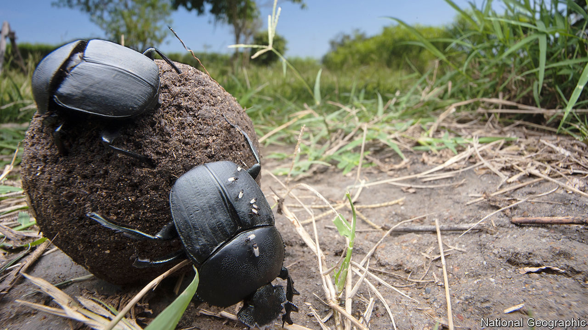

## Scientific methods

# Dung beetles prefer human faeces to those of wild animals

> A long-established experimental procedure turns out to be biased

> Jan 9th 2020

ECOSYSTEMS ARE complex things, and monitoring their health is hard. To track every species would be impossible, so ecologists commonly focus on those that, like canaries in coal mines, are thought to indicate when the system as a whole is beginning to suffer. Dung beetles are one such group, and have been relied on heavily for years to monitor the effects of things like logging, grazing and road-building.

When there are lots of species of dung beetles around, and faeces vanish quickly, an ecosystem is assumed to be in good shape. When their diversity drops and faeces hang about unconsumed, it suggests something is wrong. However, as Elizabeth Raine, a zoologist at Oxford University, has realised, the value of this assumption depends on how you go about sampling the beetles. That is done by attracting them with their preferred foodstuff, faeces. And she thinks it is being done badly.

Until now, researchers have assumed that dung beetles will happily tuck into any old pile of dung. As such, they have a cherished tradition of using their own excreta as bait. This makes sense, since a supply is always available. But Dr Raine realised that no one had ever tested how attractive human faeces are compared with those of wild animals.

She and her colleagues therefore set up experiments at three lowland tropical-forest sites in Paraná, Brazil. They created pit traps around areas in which they had placed faecal lures. Rather than use human waste, they employed droppings collected from the enclosures of animals in a local zoo. These included lesser grisons (members of the weasel family), jaguars, ocelots (a species of small wild cat), crab-eating raccoons, domestic pigs and black capuchin monkeys—all species that inhabit the forests in question. For the sake of comparison, Dr Raine also used her own faeces in some sites, as a control.

The results, published in Biotropica, suggest that—in lowland Brazilian forests, at least—dung beetles of all sorts are particularly fond of human waste, and much less interested in the dung of the animals native to their ecosystems. After 48 hours an average of 20 beetles were found in the pit traps next to human waste, whereas jaguar faeces lured an average of just ten and the dung of other species even fewer. Diversity of beetle species was also far higher in traps near human excrement than it was near the other samples.

This is both encouraging and problematic. It suggests that using human faeces as a lure is a good way to get a general sense of which types of dung beetle are present in an area. The drawback is that human faeces are so alluring to these insects that using them may be creating an illusion that they are present in greater numbers than is actually true, and consuming more wild-animal dung than they actually are.

Clearly, Dr Raine’s experiment needs to be replicated in other habitats, to check that she has discovered a general phenomenon rather than one specific to a particular area. But if it turns out that most dung beetles do indeed prefer human faeces to their normal meals, it means that a lot of previous ecological studies may need to be reinterpreted.

Why Dr Raine’s dung beetles prefer human faeces is a mystery, though she suspects that the varied diets enjoyed by modern human beings may have something to so with it. But her experiment does illustrate a wider point. This is that scientific discoveries are only as good as the experiments used to make them. It therefore behoves people to check even well-established procedures from time to time, to make sure they are not falsely assuming that what is sanctioned by familiarity actually works.

## URL

https://www.economist.com/science-and-technology/2020/01/09/dung-beetles-prefer-human-faeces-to-those-of-wild-animals
