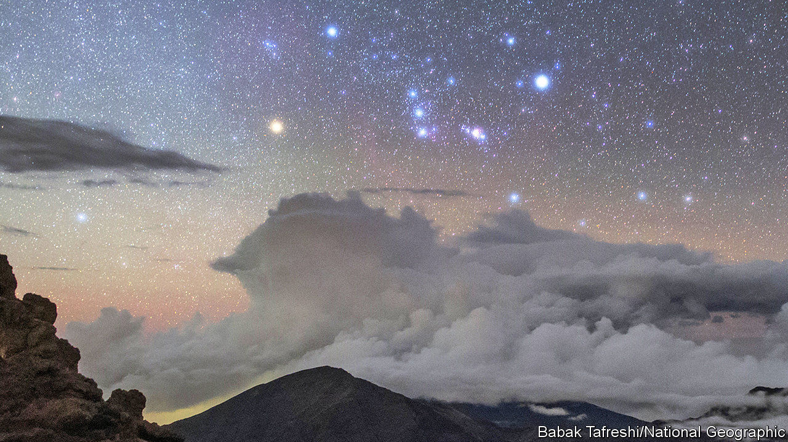

## Stellar evolution

# Might there soon be a supernova near Earth?

> A giant star called Betelgeuse is behaving strangely

> Jan 11th 2020

THE GREAT Collapsing Hrung Disaster of the Year 03758 is shrouded in mystery. All that is known about this event, mentioned in a footnote to “The Hitchhiker’s Guide to the Galaxy”, by Douglas Adams, is that the only survivor was the father of one of the story’s main characters, Ford Prefect—and that it took place on one of the planets orbiting Betelgeuse.

Betelgeuse is a red supergiant star in Orion, a prominent constellation that spans the celestial equator. It is one of the brightest objects in the night sky, easily visible to the naked eye. It has around ten times the mass of the sun, and if it were at the centre of the solar system its outer edge would stretch beyond the orbit of Mars.

Betelgeuse shines more brightly than the sun partly because it is bigger and thus has more fuel, but also because it is burning through that fuel faster. As a result, it will die much sooner. The sun is around halfway through its 10bn-year lifespan. Betelgeuse’s span will be about 10m years, and it is close to the end of that period—perhaps very close. For, in the past few weeks, astronomers have watched it getting precipitously dimmer and that has made them wonder: could this be a signal that Betelgeuse’s time has come?

When a star such as Betelgeuse runs out of fuel the nuclear reactions in its core which keep it shining stop—and with them the heat and outward radiation pressure needed to balance the force of gravity trying to pull everything inward. At that point, gravity wins. The core collapses. And the resulting shock wave destroys the star in an explosion called a supernova that is temporarily brighter than the rest of Earth’s home galaxy, the Milky Way, put together.

From Earth, a mere 600 light-years away, a Betelgeuse supernova would be spectacular. It would be visible in the daytime for weeks, as bright as the full Moon at night, and able to cast shadows. The last supernova thought to have had such brightness occurred a millennium ago. For astronomers, it would be an unprecedented opportunity to use their armoury of observatories—electromagnetic, gravitational and neutrino—to study the final moments of a star, close-up, as it collapses.

So far, the closest supernova seen since the telescope was invented is SN1987A, spotted more than three decades ago in the Large Magellanic Cloud, a galaxy 160,000 light-years from the Milky Way. But astronomers detected SN1987A only after it had already happened. They have never been able to bring modern instruments to bear on a supernova in the Milky Way itself, and never watched a star in the moments before and during its final explosion.

Betelgeuse is destined to become a supernova soon, that much is certain. But “soon” in astronomical terms could mean anything from today to 100,000 years’ time. If the recent dip in the star’s brightness is not a signal of imminent catastrophe, it could have a number of other explanations. Because the material inside it is always churning as it is heated, Betelgeuse has hotspots on its surface. Sometimes these hotspots are ejected into space, leaving relatively cooler and dimmer areas behind on the star’s surface, and reducing the magnitude of its output of light.

On top of these random events, Betelgeuse is also known to be a semi-regular variable star. This means its brightness changes as it pulses up and down in size. As that happens, its surface area increases or decreases proportionally. Since the brightness per square kilometre of a star tends to remain the same during these pulses, a larger surface area means the star will emit more light overall, and a smaller one, less. Various cycles like this operate within Betelgeuse, with periods ranging from a few hundred Earth days to several thousand.

Astronomers will continue watching the star over the coming weeks. Most, realistically, expect it to brighten up again as the internal cycles continue. But even if there is no supernova this time around, that merely postpones the day when Betelgeuse will undergo a real-world equivalent of the Great Collapsing Hrung Disaster.■