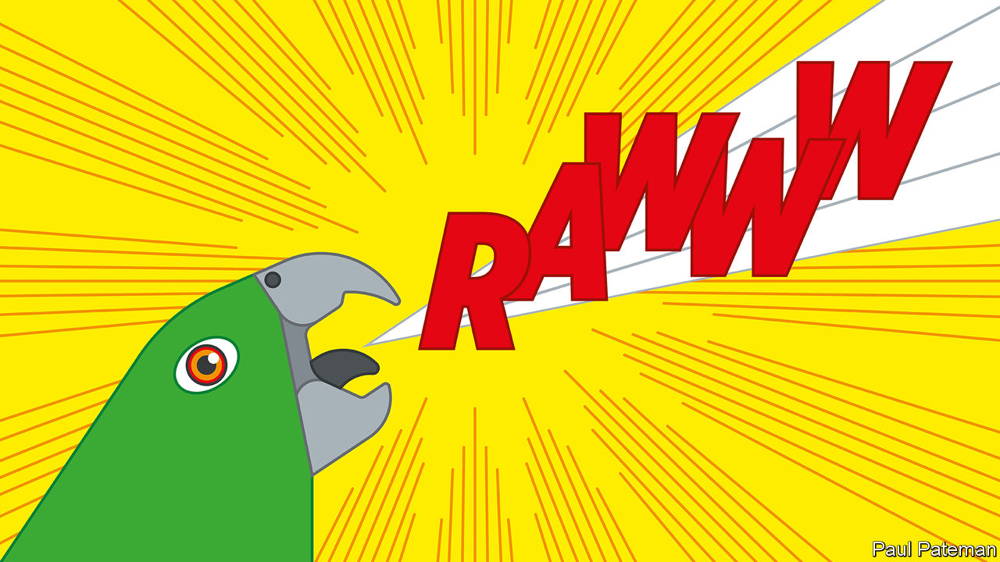
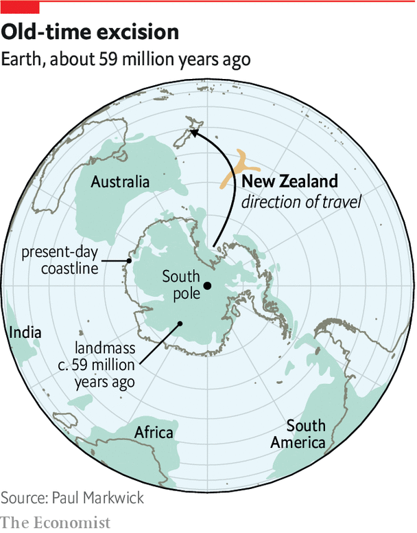

## Palaeontology

# New Zealand was once a land of giants

> Monster parrots and penguins roamed the islands

> Jan 9th 2020CHRISTCHURCH

SQUAWKZILLA, AS HE (or possibly she) has come to be known, is not the sort of parrot that would sit on your shoulder while you cooed “pretty polly”. Instead, this huge flightless bird (weighing around 7kg and about a metre tall) would probably have pecked a chunk out of you with its massive beak. Although, as do most parrots, Squawkzilla would have fed on fruit and other vegetation, it is likely to have supplemented its diet with a bit of carnivory.

That much, at least, can be interpreted from its fossilised leg bone, which was found a decade ago in 19m-year-old sediment laid down in an ancient lake near St Bathans on New Zealand’s South Island. Squawkzilla has been formally named Heracles inexpectatus, after a re-examination of the bone last year concluded it was not, as previously thought, from a huge eagle.

A model of Squawkzilla, along with remains and re-creations of other giant creatures discovered over the past 20 years, has gone on show at a new exhibition in the Canterbury Museum, in Christchurch. Among them is a formidable penguin you would also not like to meet. As big as an adult human and weighing some 70-80kg, Crossvallia waiparensis would have towered over a modern emperor penguin.

All these discoveries help confirm that the unique flora and fauna found in New Zealand not only had an exotic origin, but that the country was indeed also once a land of giants. How those giants came about is still being revealed as more fossils are found.

Animals adapt to their environments in different ways and those living on islands often shrink compared with their mainland relatives. Being smaller allows them to cope better within a reduced territory and to hide more easily from predators. Yet animals on some islands take a different path, with dwarfism replaced by gigantism. New Zealand went that way with gusto, perhaps because it consists of a pair of fairly big islands devoid of large mammalian predators.

This was a land for birds, which grew large and in some cases lost the use of their wings. These enormous avians included the giant moa, a flightless species 2½ metres tall. It was hunted by the enormous Haast’s eagle, which had a wingspan of up to three metres. Then, some 800 years ago, human beings began to arrive, at first from Polynesia and later from Europe. New Zealand’s wildlife was soon depleted through hunting, land clearance and the introduction of alien predators, such as rats, stoats and possums.

According to one estimate, along with the moa and Haast’s eagle, over 50 other native species of animals and plants were driven to extinction. Some cling on, including the kiwi, which is nocturnal and so harder for people to hunt, and the kakapo, a flightless parrot whose population fell to around 50 in the 1990s but which the efforts of conservationists have now quadrupled. Until the discovery of Squawkzilla, kakapos were thought to be the world’s largest parrots, living or extinct.

The ancestors of New Zealand’s wildlife evolved when the place was rather different from today, explains Paul Scofield, the Canterbury Museum’s curator for natural history. The story begins around 80m years ago, when a mass of Earth’s crust split away from Australia and Antarctica. This was followed by the mass extinction that wiped out non-avian dinosaurs and many other species 66m years ago, at the end of the Cretaceous period. As most of what became New Zealand had been below sea level when it split with Australia and Antarctica, the land that subsequently emerged from the ocean was something of a blank canvas for evolutionary biology. Life was good, especially for birds. The terrain rapidly became covered with lush forests, providing plenty of food, and there was a balmy tropical climate with a warm sea full of corals, fish and giant turtles. In such an environment, Dr Scofield says, diversity exploded.

That diversity included the giants. The monster penguin, C. waiparensis, lived about 59m years ago. Its remains were discovered by Leigh Love and Al Mannering, a pair of amateur palaeontologists who have been working with a team from the Canterbury Museum at a site near Waipara, 60km north of Christchurch. This previously unknown species is one of the world’s oldest penguins and it shows that these birds grew large early in their evolution. Its closest known relative is a similarly large species that lived at about the same time in Antarctica. Though Antarctica is now an icy continent, it too once had a warm climate like New Zealand’s. Fossils from Antarctica suggest that birds in both places were closely related, says Dr Scofield.

Other fossils found at Waipara include the remains of a “toothed” bird. This creature has been classified as a member of the Pelagornithidae, an ancient family of huge seafaring birds that had bony outgrowths which looked like teeth along their beaks. These pseudo-teeth (real teeth having disappeared from birds many millions of years previously) are thought to have helped them catch prey.

The Pelagornithidae include the largest birds known to have existed—some had wingspans of more than five metres. The specimen from Waipara is small by comparison, being about the size of an average gull. Because previous Pelagornithidae fossils come from the northern hemisphere it was assumed that this was where the group had evolved. But Protodontopteryx ruthae, which Mr Love named after his wife Ruth for tolerating his decades of fossil hunting, is of a greater age. It was soaring above New Zealand 62m years ago, soon after terrestrial dinosaurs died out. This suggests that the Pelagornithidae actually evolved in the southern hemisphere before spreading their wings across the rest of the world.

As P. ruthae shows, the great diversity of life in ancient New Zealand was not confined to gigantism. Many unusual fossils of small animals are also being discovered—some so tiny that they need to be handled with tweezers, says Vanesa De Pietri, research curator at the museum.

One example is the waddling mouse. A small piece of jaw and a fragment of limb found near St Bathans were identified in 2006 as coming from a mouse-size mammal that walked, its remains suggest, with a peculiar waddle. Although some scientists reckon the creature might have washed ashore on flotsam, others see it as evidence that native land mammals did in fact exist in ancient New Zealand, and that the archipelago’s unique wildlife evolved in their presence. As fossils continue to be unearthed, even more unusual species will no doubt be discovered, and more questions raised about the origins of the creatures in the land of the long white cloud.■

## URL

https://www.economist.com/science-and-technology/2020/01/09/new-zealand-was-once-a-land-of-giants
