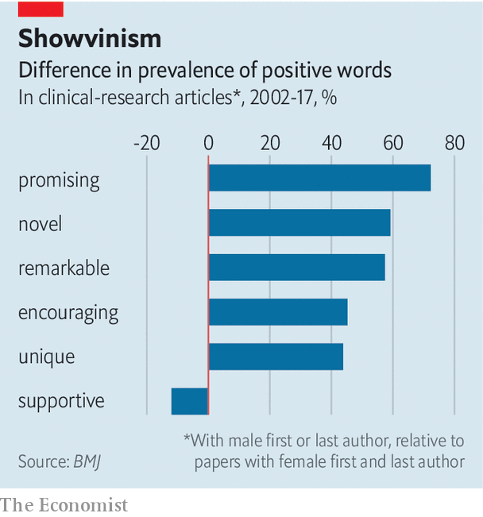

## Scientific publishing

# The sex of researchers affects the language of research papers

> Male-authored articles are more self-promoting

> Jan 9th 2020

“LEAN IN,” advises Sheryl Sandberg, Facebook’s chief operating officer, in a book of that name. Her advice to women—be more assertive to grab influence at work, rather than waiting for it to be offered—was met with scorn by some feminists. They say that women are not shying away from the higher rungs of the career ladder. Rather, they are being pushed off by unfair forces in the job market, or running into structural barriers as they climb.

A paper just out in the BMJ, a medical-research journal, however, offers some support for the idea that men promote themselves more, and that this helps their careers. Marc Lerchenmueller and Olav Sorenson, affiliated with Yale Business School, and Anupam Jena, of Harvard Medical School, examined the language in the titles and abstracts of over 100,000 clinical-research articles. They separated those in which both the first and the last named authors were women from ones in which one or both were men. (The first name is often a more junior researcher who led the work, while the last name is usually a senior scholar who helped guide it.) Sure enough, articles with either a first or a last male author were more likely to describe their work in positive terms.

“Novel” was the most common self-applied positive term, and those papers with a male first or last author used the word 59.2% more than women-women papers did. But “promising” was even more skewed: papers with a male first or last author used this word 72.3% more than those with women first and last authors (see chart). The researchers further found that such self-promotion was associated with a greater number of subsequent citations. And both effects were bigger in prestigious journals.

One possibility to be tested is that men really do do more “novel” and “promising” research than women, and thus merit their self-praise. The paper’s authors tried to make that test. They looked at the prestige rankings of the journals involved, and compared similar papers in particular research areas as carefully as possible. Although it is hard to exclude the possibility entirely, other research suggests that men are simply more into self-puffery than women are. They are, for example, more likely to cite themselves, according to an article published in 2017 in Socius, a sociology journal.

So should women blow their own trumpets harder? One recent paper rebuts that easy conclusion. In a study of economics research, women were subject to more comments from reviewers, and made to revise their submissions more. Women’s “readability scores” (a measure rewarding short words and sentences) increased over subsequent drafts, and over subsequent papers across their careers. In trying to please stubborn reviewers, they seem to be making their abstracts simpler and more straightforward, and so perhaps also cutting extra words—like “promising”.

## URL

https://www.economist.com/science-and-technology/2020/01/09/the-sex-of-researchers-affects-the-language-of-research-papers
