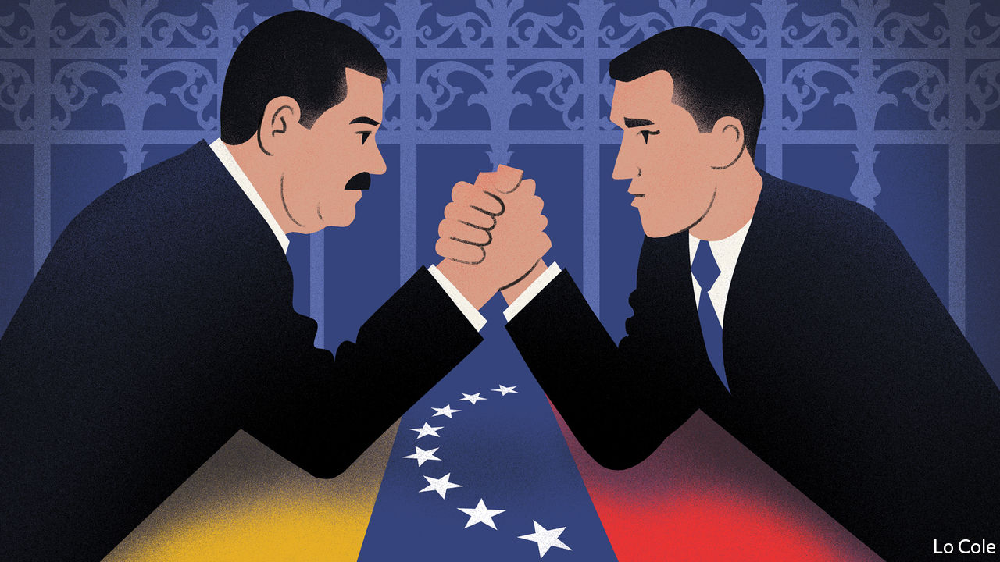

## Bello

# A crude attempt to stifle what’s left of Venezuela’s democracy

> Nicolás Maduro’s thugs block MPs from parliament

> Jan 9th 2020

ON SUNDAY JANUARY 5TH Juan Guaidó found himself perched unsteadily atop the ornate wrought-iron railings outside Venezuela’s national assembly, being pushed back by the riot shields of the National Guard. Since Mr Guaidó is the speaker of the assembly and was due to be re-elected to the post that day, the image said everything about the assault on the last vestiges of Venezuela’s democracy by the regime of Nicolás Maduro, who rules as a dictator. It underlined that a year after Mr Guaidó proclaimed himself “interim president” of the country, on the grounds that Mr Maduro’s election for a second term was fraudulent, he has legitimacy but no power. And it suggested that Mr Maduro has no interest in negotiating a solution for Venezuela’s long agony.

In December 2015 the opposition triumphed in a legislative election, the last fair contest the country has seen. It won 112 of the 167 seats in the assembly, a two-thirds majority and thus enough to change the constitution and appoint new judicial and electoral authorities. Mr Maduro’s regime went into action. The puppet supreme court barred three opposition legislators from taking their seats. In 2017 the regime set up a parallel “constituent assembly” of loyalists, which rubber-stamps its actions. The courts have stripped 29 opposition parliamentarians of their immunity. Two are in jail. Most of the rest are in exile, either abroad or in foreign embassies.

In recent weeks opposition members complained of government offers of bribes to switch sides. In December the opposition suspended ten of its legislators who had lobbied prosecutors in the United States, Colombia and Belgium on behalf of Colombian businessmen who are cronies of Mr Maduro and are alleged to have profited corruptly from contracts to import food for government handouts.

Yet the threats and bribes didn’t produce enough defections. On January 5th only 12 turncoats joined pro-government legislators in proclaiming Luis Parra as the new speaker, but with no vote count. Mr Parra, previously little known, was among the ten legislators suspended by the opposition. The 63 members present were fewer than the quorum of 84. Hours later Mr Guaidó was re-elected by 100 members at a session held at the offices of El Nacional, an opposition newspaper (those voting included legislators in exile). On January 7th Mr Guaidó and his supporters managed to brush aside the police and entered the parliament building. With the electricity cut off, they repeated the swearing in, claiming a symbolic victory.

The United States, the European Union and the Lima group of Latin American democracies (plus Canada) have reiterated their support for Mr Guaidó. More surprisingly, left-wing governments in Argentina and Mexico which recognise Mr Maduro condemned his regime’s action.

Many analysts in Caracas had expected Mr Maduro to wait for the parliamentary election due this year to take control of the legislature through a rigged contest. So why did he try to force matters, at a cost in propaganda terms? One hypothesis is that the government, which is subject to sweeping American sanctions, is desperate to change the law to allow Russian and Chinese companies to run the flagging oil industry (Russia recognised Mr Parra as the speaker). But this is already happening de facto, and any such legal change would be questionable.

The motive may be to drive Mr Guaidó into exile. The more radical figures in the opposition (most of whom are safely abroad) want this, too, because they fear that the only way to survive inside Venezuela is to make deals. According to Datanálisis, a pollster, Mr Guaidó’s popularity has fallen from 61% in February to 43%, because of frustration that he has failed to oust Mr Maduro. But he remains Venezuela’s most popular politician. Leave, and he risks irrelevance.

Mr Maduro has weathered the sanctions and Mr Guaidó’s efforts to peel the army away from his regime. Some 5m Venezuelans have fled the country and millions more are poor and hungry. The economy has contracted by an astounding 70% since Mr Maduro took office in 2013. But helped by Cuba and Russia, creeping dollarisation and the lifting of socialist price and exchange controls, he is achieving a precarious semi-stability. “It’s survival rather than recovery,” says Phil Gunson, who works in Caracas for Crisis Group, an NGO. “Survival is absolutely everything for them.” Mr Guaidó has also survived his latest bout with the regime. Venezuela’s recovery will come only if outside pressure forces the regime to negotiate the terms of its retreat.