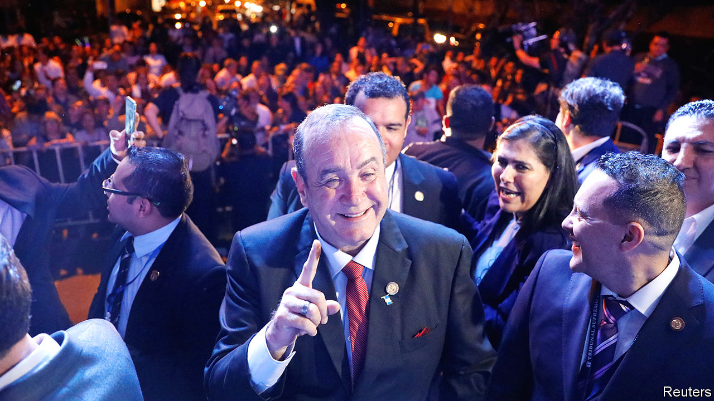

## New man, old problems

# Guatemala’s new president, Alejandro Giammattei, outlines his plans

> He cares more about promoting growth than fighting corruption

> Jan 9th 2020GUATEMALA CITY

ALEJANDRO GIAMMATTEI, who will become Guatemala’s president on January 14th, did not have an easy ride to the top. The 63-year-old developed multiple sclerosis in his youth and walks with forearm crutches. His only previous government job was a brief stint a dozen years ago as head of the country’s prisons, which ended in his own incarceration. He spent ten months in jail during the investigation of the killing of seven inmates. Charges were dropped. He has a 20-year record of losing elections to be president and mayor of Guatemala City, the capital. This time, more popular rivals were disqualified.

The country he is about to lead is also bruised. Crime is high, corruption is unchecked and hundreds of thousands of Guatemalans a year seek better lives in the United States. Mr Giammattei’s answer, etched in English on a Guatemala-blue bracelet that he wears, is “hope”.

His predecessor, Jimmy Morales, failed to provide it. A former comedian and political outsider, he won the presidency in 2015 in a protest vote against corruption. But he sent home a UN-backed anti-graft agency, the International Commission against Impunity (CICIG), which had investigated allegations that he had violated campaign-finance laws (which he denies). After handing power to Mr Giammattei, Mr Morales will scurry across town for a same-day swearing-in as a member of the Central American Parliament, a position that may confer immunity. Mr Giammattei says that one of his first tasks as president will be to “rebuild the pieces of government that they are leaving behind”.

That does not seem to mean waging war on corruption. Mr Giammattei shares Mr Morales’s scepticism of CICIG, which launched the investigation that led to his imprisonment. He contends that on CICIG’s watch corruption worsened. He plans to replace it with a “national” anti-corruption commission, whose powers are still uncertain. Activists doubt that the government can be trusted to police itself.

Mr Giammattei cares more about violent crime. His rhetoric and record promise a militaristic approach. He is keenest to promote growth. Optimists compare him to such pro-business presidents as Álvaro Arzú in the 1990s and Óscar Berger in the 2000s. Unless economic growth rises from 3% to 5-6%, “we won’t get people out of poverty,” says Tony Malouf, the incoming economy minister, who was the boss of Guatemala’s main business chamber. Mr Malouf aims to achieve that in part by doubling exports. Since Mr Giammattei’s election victory in August he has visited nearly a dozen countries to drum up investment. By teaming up with the “entrepreneurial right”, his administration may achieve a level of competence not seen in recent governments, says Juan Luis Font, a journalist.

Mr Giammattei rejects the widely held view that his conservative, pro-business politics goes along with indifference towards poor indigenous Guatemalans. Asked what his government will do for the rural poor, he shows a photo on his phone of a malnourished child. “This is the reality of a million children in Guatemala,” he says, promising a “crusade for nutrition”.

By building roads in the western highlands, the source of many migrants, and attracting investment to the region Mr Giammattei hopes to erect a “wall of prosperity” that will curb the exodus. That will also require investment by Guatemala’s government, which is horribly low. Tax revenue is 10% of GDP, the lowest share in Latin America. Mr Giammattei’s Vamos Party, which has a tenth of congressional seats, cannot raise taxes on its own.

He has little to say about how Guatemala will handle America-bound migrants from other countries. He has not seen the details of an unpopular “safe-third country agreement” struck behind closed doors by Mr Morales and President Donald Trump, under which the United States can deport back to Guatemala asylum-seekers who passed through the country. “I have not said I am against it. I have not said I am in favour,” says Mr Giammattei. “I have said: give me the papers.”

He cannot back out of the agreement without angering Mr Trump. So his hope will be that few of the deported migrants will stay in Guatemala. There seems little danger of that. Among the 33 Hondurans and Salvadoreans who arrived at a shelter in Guatemala City on January 6th, just one plans to seek asylum in the country, Mauro Verzeletti, the priest in charge, told local media. Most will return home. If Mr Giammattei succeeds in restoring hope to Guatemala, migrants’ plans might change. ■

## URL

https://www.economist.com/the-americas/2020/01/09/guatemalas-new-president-alejandro-giammattei-outlines-his-plans
