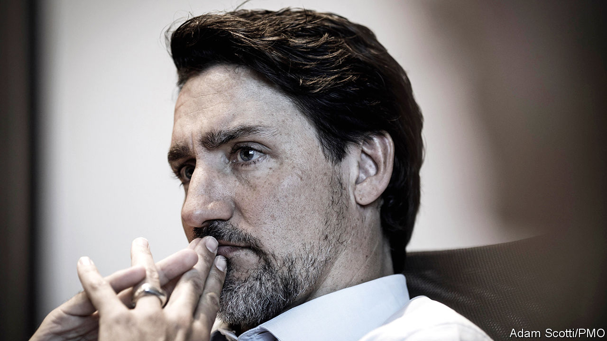

## A modest makeover

# Justin Trudeau’s less ambitious second term as Canada’s prime minister

> Chastened and cash-strapped, but still in power

> Jan 9th 2020OTTAWA

JUSTIN TRUDEAU returned from his Christmas break in Costa Rica with a new look. Canada’s prime minister has sprouted a salt-and-pepper stubble, making him look slightly less youthful. His makeover hints that he intends to govern differently in his second term, which began late last year. He has plenty of reasons to change his approach. The election on October 21st was a close shave. Mr Trudeau’s Liberal Party won 1m fewer votes than it had four years before and lost its majority in Parliament. He now leads a minority government dependent for support on other parties, especially the left-wing New Democrats (NDP) and the Bloc Québécois, which advocates independence for Quebec. The Liberals won no seats in the western prairie provinces of Alberta and Saskatchewan.

Mr Trudeau interprets this setback as a rebuff to his governing style rather than to his policies. He was a global cheerleader for every progressive cause, from welcoming refugees to expanding transgender rights. This grated on some voters. Ethical lapses, especially demoting the justice minister after she refused to help a big engineering firm avoid prosecution for bribery, compounded the damage.

Mr Trudeau’s first-term policies are easier to defend. They included legalising cannabis; a new child benefit, which cut poverty and lifted middle-class incomes; a national price on carbon; and a renegotiation of the North American Free Trade Agreement (NAFTA) with the United States and Mexico. In a recent interview with the Canadian Press, a news agency, Mr Trudeau asserted that voters “agree with the general direction” of his government but acknowledged that they want a change of tone.

Change in his second term is likely to go beyond that. Mr Trudeau will need policies to placate those he has angered. He faces new constraints. Money will be a bigger one than his lack of a parliamentary majority. Although public finances are healthy, Mr Trudeau cannot spend as freely as he did in his first term.

The newly modest prime minister is consulting Liberal eminences whom he had formerly ignored. They have advised him to be more of a team player and to give ministers more autonomy. That “should result in better outcomes”, says John Manley, who was a deputy prime minister in the Liberal government led by Jean Chrétien in 1993-2003. Mr Trudeau now has a deputy prime minister of his own (a job invented by his father, Pierre Trudeau, a Canadian prime minister of the 1960s, 1970s and 1980s). He gave the post to Chrystia Freeland, who as foreign minister in his first term led the renegotiation of NAFTA.

Mr Trudeau’s biggest second-term priority is the same as it was in his first: boosting the middle class. His new cabinet includes Canada’s first “minister of middle-class prosperity”, Mona Fortier, who has a mandate to incorporate quality-of-life measurements into the government’s decision-making. The new Parliament has already enacted a tax cut for the middle class. That accounts for nearly a third of the C$57bn ($44bn) of extra spending and revenue cuts that Mr Trudeau plans over the next four years. Other expensive promises are to extend subsidised child-care to 250,000 more children and to increase grants for university students. Mr Trudeau wants to introduce “pharmacare”, an extension of publicly financed health care to prescription drugs.

Placating alienated westerners, one of Ms Freeland’s main jobs, will also cost money. Alberta and Saskatchewan are suffering from lower global oil prices that have prevailed since 2014. Although the national unemployment rate of 5.9% is low by historical standards, in Alberta nearly a fifth of men younger than 25 are jobless. The two provinces oppose Mr Trudeau’s carbon price (as does Ontario, the most populous province) and the environmental regulations that he brought in.

The government will not retreat from its plan to raise the floor for the price of carbon from C$30 per tonne of CO2-equivalent emissions to C$50 by 2022. Indeed, it is likely to keep rising. It will have to be C$100 if Canada is to meet its goal of reducing emissions from 2005 levels by 30% by 2030, according to the Parliamentary Budget Office. But the government may find other ways to mollify energy-producing provinces. Bill Morneau, the finance minister, touts as a model a “clean resource innovation network” of companies, NGOs and academic institutions that seeks to reduce environmental damage caused by the oil and gas industry. There is talk of giving direct relief to jobless westerners.

Money will be tight. While campaigning in 2015 Mr Trudeau said he would end the austerity policies of his Conservative predecessor, Stephen Harper, but promised to ensure that debt did not rise as a share of GDP and to balance the budget by 2019. Mr Trudeau kept the first promise but broke the second. The deficit this fiscal year is expected to be C$27bn, 1.2% of GDP.

Now the debt cap is at risk. The finance ministry predicts that the ratio of debt to GDP will rise from 30.8% to 31.0% this fiscal year and expects the same ratio next year. That does not take into account the cost of promises beyond the tax cut. If the economy weakens, the debt burden could increase sharply from that modest level. Perhaps for that reason Mr Trudeau is leaning against a proposal by an advisory panel for a universal, single-payer pharmacare plan, which would cost C$15bn a year. He has allocated just C$6bn over the next four years for a “down-payment” on pharmacare. Pre-makeover, he might have chosen the more expensive option.

Though more sober, Mr Trudeau has no reason to be despondent. The finance ministry expects economic growth to remain modest, a little below 2%, but not to stall over the next two years. Business investment, which dropped by 10% during Mr Trudeau’s first term, will recover because the United States has agreed to a revision of NAFTA, Mr Morneau believes.

Mr Trudeau has political breathing room. The opposition Conservative Party has dropped its leader, Andrew Scheer, and will not replace him until June. The NDP is unlikely to challenge the government strongly; it will not want to provoke a new election while its coffers are empty. The Bloc Québécois downplayed its separatism during the election and is expected to support the government on most votes. If Mr Trudeau celebrates, he will do it quietly.■

## URL

https://www.economist.com/the-americas/2020/01/09/justin-trudeaus-less-ambitious-second-term-as-canadas-prime-minister
