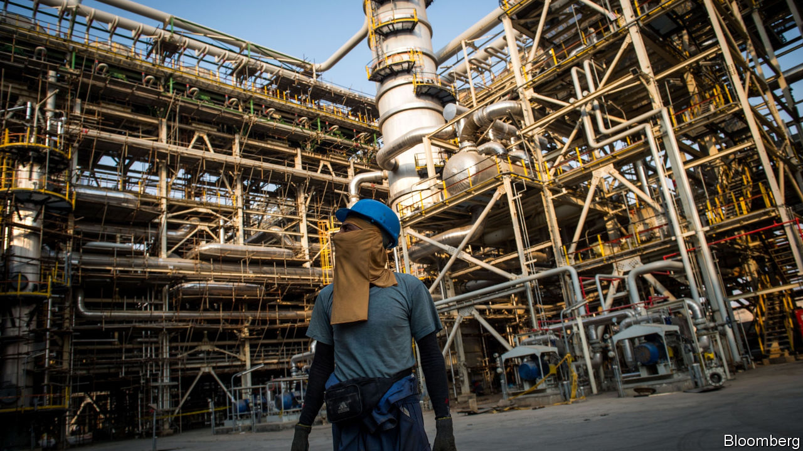
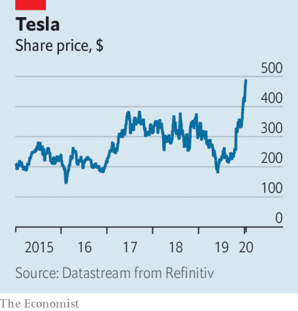

# Business this week

> Jan 9th 2020

Increased tension in the Gulf region after America’s killing of an Iranian general caused oil markets to gyrate. Brent crude spiked above $70 a barrel, a level it last reached in September, when Iran attacked Saudi oil installations, before falling back. Saudi Arabia’s state-backed oil-tanker firm reportedly suspended shipments through the Strait of Hormuz. The price of gold, a trusted haven for investors in times of uncertainty, leapt to its highest level in seven years, but also retreated as the crisis abated. See [article](https://www.economist.com//business/2020/01/09/western-firms-have-little-to-lose-from-a-middle-eastern-war).

The hostilities were a factor behind a drop in Saudi Aramco’s stock. The state-controlled oil company’s share price is now 10% lower than the peak it reached in mid-December, soon after its IPO on the Riyadh stock exchange. That has knocked around $200bn off Aramco’s value, giving it a market capitalisation of $1.8trn.

In his first press conference since skipping bail in Tokyo and fleeing to Beirut, Carlos Ghosn claimed that his ousting as Nissan’s chairman in 2018 had been plotted to reduce the influence of Renault, Nissan’s partner, which Mr Ghosn also led as the head of a formal alliance. He also alleged collusion between Nissan and Japanese prosecutors related to the charges of financial misconduct levelled against him. Interpol has issued a red notice for the arrest of Mr Ghosn, but Lebanon has no extradition treaty with Japan. See [article](https://www.economist.com//business/2020/01/08/carlos-ghosn-lambasts-the-japanese-justice-system-he-has-fled).

The euro zone’s annual inflation rate reached a six-month high of 1.3% in December. That should ease pressure on the European Central Bank to make another cut to interest rates in the coming months.

Bruno Le Maire, the French finance minister, said that he was working closely with Steven Mnuchin, his American counterpart, to reach a deal within the next two weeks that would avoid America imposing tariffs on French products in retaliation for a digital sales tax that the Trump administration says is aimed solely at American tech giants. The pair are expected to meet at the Davos forum in late January.

Cyrus Mistry said he would no longer seek his reinstatement as chairman of Tata Sons, despite winning a legal challenge in December, but does intend to seek a seat on its board. Mr Mistry was sacked by the Indian conglomerate in 2016 after a power struggle. Tata is to ask India’s Supreme Court to overturn last month’s ruling favouring Mr Mistry.

Tesla’s market capitalisation soared to $89bn, more than the combined value of General Motors and Ford. The electric-carmaker’s usually volatile share price was boosted by the fact it delivered 367,500 vehicles last year, up by 50% from 2018. It is also delivering the first vehicles made at its Shanghai factory to customers this month, and has announced plans to expand production by building its new Model Y compact SUV there. It is a better start to the year for Tesla than 2019, when its share price fell by half in six months because of a series of mishaps.

While Tesla trumpeted its business in China, General Motors revealed that it had sold 3.1m cars in the country last year, a 15% drop from 2018 (GM’s sales in the United States fell by 2.3%, to 2.9m vehicles). China’s car market used to be a sure source of growth for Detroit, but sales there have fallen sharply since 2018, when the Chinese government withdrew a tax break.

Aston Martin issued a profit warning for 2019, describing the year as “very disappointing”. The British carmaker’s share price is now some 80% below the £19 ($25) that was set at its IPO in October 2018.

Facebook decided to ban deepfake videos, sophisticated manipulations of a person’s imagery that use AI tools to make them hard to detect as not real. The policy does not extend to satire or parody. The social network has a more pressing problem with shallowfake or cheapfake content, which selectively edits a person’s comments or takes them out of context.

America’s Food and Drug Administration outlawed the manufacture and sale of fruit- and mint-flavoured e-cigarette cartridges, amid “epidemic levels” of use among young people. Health groups said they were perplexed by why tobacco and menthol cartridges were still allowed, and why the restrictions do not apply to vaping tanks.

One of America’s biggest milk producers filed for bankruptcy protection. Borden Dairy traces its roots to 1856, when its founder patented the process for condensing milk. The business expanded by supplying Union troops during the civil war and in 1936 adopted the “Elsie” cartoon advertising brand. But along with other milk producers, Borden faces a cow of a market. Dairy-milk consumption has dropped by 40% per person since 1975, as consumers switch to milk alternatives, such as soy, and other beverages. Not everybody has got milk in their fridge these days.