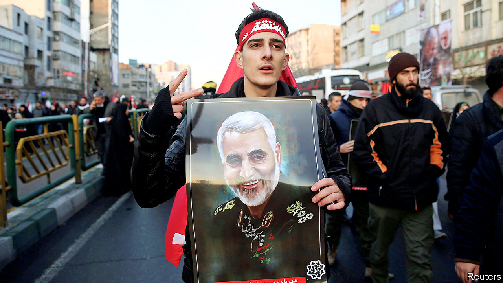
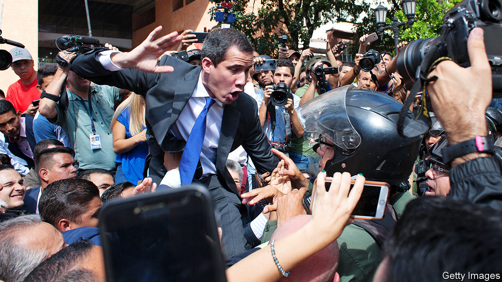

# Politics this week

> Jan 11th 2020

America’s assassination of Qassem Suleimani, Iran’s most prominent general, in a drone strike at Baghdad’s international airport threw the Middle East into crisis. Iran responded by firing more than 20 ballistic missiles at Iraqi military bases housing American troops. No deaths were reported. “Iran took and concluded proportionate measures in self-defence,” tweeted Muhammad Javad Zarif, Iran’s foreign minister. “We do not seek escalation or war.” But analysts think Iran might covertly retaliate against America in the future. See [article](https://www.economist.com//leaders/2020/01/09/donald-trump-wants-to-curb-iran-has-he-gone-about-it-the-right-way).

Millions of mourners took to the streets across Iran to mark General Suleimani’s funeral. Before the burial in his home town of Kerman 50 people were killed in a stampede. See [article](https://www.economist.com//obituary/2020/01/09/obituary-qassem-suleimani-was-assassinated-on-january-3rd).

Minutes after taking off from Tehran airport, and shortly after Iran fired its missiles, a Ukrainian airliner crashed killing all 176 people on board. It was not immediately clear what had brought down the plane, a Boeing 737.

Turkey’s parliament voted to send troops to Libya to protect the UN-backed Government of National Accord, which has been fighting an insurgency led by Khalifa Haftar. General Haftar is backed by Egypt, Russia and the United Arab Emirates. The Turkish and Russian presidents, Recep Tayyip Erdogan and Vladimir Putin, called for a ceasefire. See [article](https://www.economist.com//middle-east-and-africa/2020/01/11/turkey-is-set-to-send-troops-to-libya).

Al-Shabab, a Somali jihadist group, attacked an air base in Kenya, killing three Americans. It was the first time al-Shabab had attacked a facility housing American troops outside Somalia. See [article](https://www.economist.com//middle-east-and-africa/2020/01/11/an-attack-on-american-forces-in-kenya-raises-questions-and-concerns).

Jury selection began for the criminal trial of Harvey Weinstein in Manhattan. The former movie mogul is pleading not guilty to charges, including rape, brought by two women, one of whom is unnamed. Mr Weinstein has reached a settlement with around 30 women that ends their civil lawsuits.

John Bolton, a former national security adviser to Donald Trump, said he would be willing to testify at the impeachment trial of the president. The House has delayed presenting the formal articles of impeachment to the Senate amid a dispute over procedure, including whether to call any witnesses at all. See [article](https://www.economist.com//united-states/2020/01/07/republicans-agree-on-rules-for-the-senate-trial-of-donald-trump).

Most of Puerto Rico was left without power after an earthquake of magnitude 6.4 hit the American territory.

In India a 24-hour general strike to highlight stagnating living conditions disrupted much of the country. This came amid demonstrations against the government’s new citizenship law for persecuted minorities, which excludes Muslims. Students across India also took to the streets in protest at the attack by a mob of masked men, said to be Hindu nationalists, on Jawaharlal Nehru University in Delhi. See [article](https://www.economist.com//asia/2020/01/09/an-assault-on-students-brings-trouble-for-narendra-modi).

China’s central government replaced its most senior representative in Hong Kong, Wang Zhimin. His successor is Luo Huining, a senior but little known official with no direct experience of the territory. It is believed that Mr Wang was blamed for filing overly optimistic reports that downplayed anti-Communist Party sentiment among Hong Kongers.

Almost 60 cases of pneumonia in the Chinese city of Wuhan were thought to be linked to a new strain of the virus that caused the  sars epidemic in 2002-03. Unlike then, no one has yet died from the disease. The World Health Organisation is investigating.

Indonesia’s president, Joko Widodo, visited Natuna Besar, an Indonesian island in the South China Sea. Last month Chinese fishing vessels supported by coast guard ships entered waters near the island, which are within Indonesia’s exclusive economic zone but where China also claims rights. In the ensuing diplomatic spat Indonesia sent boats to patrol the area.

The death toll from flooding in Jakarta rose to 67. The Indonesian capital has been hit by the most powerful monsoon rains in years. See [article](https://www.economist.com//asia/2020/01/11/flooding-in-jakarta-is-the-worst-for-over-a-decade).

Juan Guaidó, the president of Venezuela’s national assembly, was barred from entering parliament by security forces at the time it was due to decide whether to re-elect him to that post. Mr Guaidó is recognised as Venezuela’s interim president by nearly 60 countries. The few parliamentarians whom the regime allowed to enter the building chose Luis Parra as the assembly’s new president, but a larger group convened elsewhere and re-elected Mr Guaidó. See [article](https://www.economist.com//the-americas/2020/01/09/a-crude-attempt-to-stifle-whats-left-of-venezuelas-democracy).

More than 61,000 Mexicans have been “disappeared” since 2006, when the country began a war on drug gangs, according to a report by the government.

A Brazilian judge issued a provisional ruling for Netflix to take down a satirical film, called “The First Temptation of Christ”, that portrays Jesus as gay. A group angered by the film had firebombed the offices of the YouTube comedy channel that created it.

In Austria the Green party entered national government for the first time, as the junior partner in a new coalition headed by Sebastian Kurz, the leader of the right-of-centre Austrian People’s Party. The Greens won 14% of the vote at a general election in September. See [article](https://www.economist.com//europe/2020/01/09/a-new-right-wing-green-coalition-takes-office-in-austria).

There was a new government in Spain, too, as Pedro Sánchez, who has been leading an interim administration since the first of two inconclusive elections last year, at last won a vote of confidence. But the new coalition, between his Socialists and the left-wing Podemos party, is short of a majority. See [article](https://www.economist.com//europe/2020/01/09/at-last-a-new-government-for-spain).

In Croatia Zoran Milanovic, a centre-left politician, unseated the incumbent conservative president in a second-round election run-off, a few days after the country assumed the rotating presidency of the EU.

Boris Johnson, Britain’s prime minister, held his first meeting with Ursula von der Leyen, the new president of the European Commission, on Brexit. Mr Johnson’s hopes of a positive start to talks were dashed when Ms von der Leyen said it would not be possible to deliver the trade deal Britain wanted without extending the transition period. Mr Johnson won a recent election on a manifesto that pledged (in bold) not to extend talks beyond December 2020, and amended the Brexit bill to make this pledge law. See [article](https://www.economist.com//britain/2020/01/11/britain-is-almost-out-of-the-eu-but-what-next).

Prince Harry and Meghan Markle stunned Buckingham Palace when they announced that they would step back from royal duties and divide their time between Britain and North America while seeking to become financially independent. Married couples often break away to set up their own nest, but the queen was not consulted and said to be “hurt” (translate: furious). See [article](https://www.economist.com//britain/2020/01/09/harry-and-meghan-go-private).

Correction (January 12th 2020): A previous version of this article said that both of Harvey Weinstein’s accusers in court were unnamed. Only one was. 