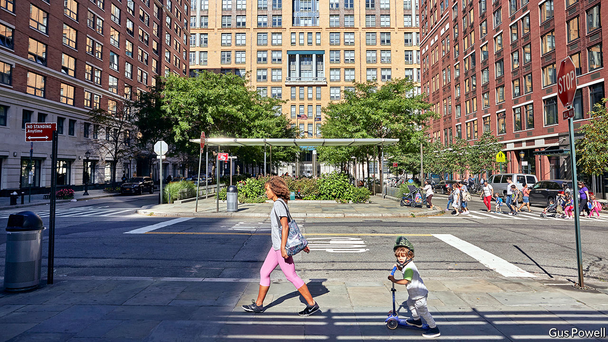
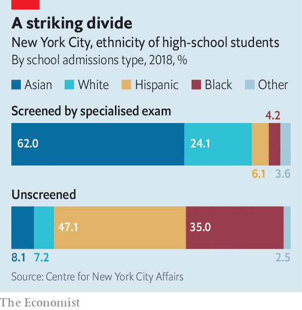

## The dignity of all the talents

# A battle over gifted education is brewing in America

> The front line is the country’s biggest school district

> Jan 9th 2020NEW YORK

STUYVESANT HIGH SCHOOL is considered the crown jewel of the public schools in New York City. The magnet school is one of America’s biggest feeders to Harvard; a list of alumni includes four Nobel laureates. It is also one of New York’s most competitive schools, admitting pupils on the basis of a single, high-stakes exam and little else. To some, that seems the meritocratic ideal. To others, it yields alarming results. Of the 895 places available last year, only seven (or 0.8%) were offered to black pupils (in a district where 25% of pupils are black). Asian-Americans do far better in the entrance exam and are 73% of the school population—or four times their share of the pupil population in the district.

“You have to believe either that there are only seven black kids capable of doing the work of Stuyvesant or that there is something horribly wrong,” says Richard Buery, a graduate of Stuyvesant who is now chief of policy and public affairs for KIPP, a network of charter schools.

The debate over whether education of gifted children segregates them on the basis of pre-existing privilege rather than cognitive ability is neither new nor uniquely American. The number of selective, state-run grammar schools in Britain reached its zenith in 1965, before the Labour government of Harold Wilson embarked on a largely successful effort “to eliminate separatism in secondary education”. The three-tiered German education system—which sorts children on the basis of ability at the age of ten into either university-preparatory schools or vocational ones—has always been criticised for fostering social segregation. The fact that the children of Turkish migrants are now disproportionately sorted into lower-tier secondary schools instead of selective Gymnasien adds a disquieting racial divide.

In America the debate is kicking up anew. The issue is national: the most recent statistics show that whites are 80% more likely than black students to take part in programmes for the gifted, and Asians are three times as likely. But the principal battleground has been New York City.

Much of that is due to Bill de Blasio, the city’s left-wing mayor, who has staked his administration (and recently imploded presidential run) on the promise of reducing inequality. In August a panel he convened, called the School Diversity Advisory Group, proposed a sweeping reform to “move away from unjust gifted and talented programmes and school screens”—eliminating them entirely. Though the policy has not yet been implemented, it triggered a furore among parents, particularly Asian-Americans, fearful that their children’s chance of a fine education was to be sacrificed on the altar of diversity.

Emotions run high because the quality of education in New York City, as with most other aspects of life there, is so uneven. There are schools with perfect graduation rates and some where more than 30% of pupils drop out. An astonishing 40% of high schools in the city do not teach chemistry, physics or upper-level algebra, notes Clara Hemphill, the founding editor of InsideSchools, an education-policy website. “The problem is not learning linear algebra in schools, but not knowing arithmetic.”

Choice beyond a possibly poor neighbourhood public school is constrained both by geography and by financing. New York has exceptionally good private schools, available at exceptionally high prices. Horace Mann School in the Bronx costs $53,200 a year, from pre-kindergarten to 12th grade. Charter schools, publicly funded but privately run, provide choices for the masses. Often they draw poorer pupils from local schools. Some of the city’s highest-performing charter schools, such as Success Academy, draw bids from the ranks of middle-class parents as well.

Anxiety and resentment are rife. The programmes for gifted children offered by the city foster extreme competition both because they give some reassurance of a free, high-quality education and because space is extremely limited. Only 6% of high-school pupils attend one of the eight sought-after specialised high schools. Because admissions are based on high-stakes tests, concerned families spend big sums on test preparation—which then makes the process less egalitarian than intended. Tutoring centres in the city sell one-on-one preparation for $200 an hour or more.

Some advocates yearn for an egalitarian model like Finland’s—where comprehensive schools and a focus on special education (or disabilities) rather than giftedness coincide with high rankings on international measures such as PISA scores. But even in Finland, more than 10% of upper-secondary schools (those before university) are specialised. Other attributes, such as high education spending and extreme selectivity of applicants to become teachers (only 10% make it), are probably also critical to the education system’s success. Removing programmes for the gifted will not suddenly turn New York into Finland.

No doubt the system in America could be improved. It seems unlikely that gifted children can reliably be spotted at the age of four on the basis of a standardised test (as is now the norm). More places would help de-escalate the test-prep arms race. So too would giving the screening test to all pupils, rather than just to those who opt in. Implementation of such a policy in Broward County, Florida—the sixth-largest public-school system in the country—doubled the number of Hispanic and black children in programmes for the gifted.

Mr de Blasio floated the idea of scrapping the entrance test and admitting the top 7% of students from each middle school (roughly, for pupils aged 11 to 14) to specialised schools. One problem is that at some middle schools this would include students who had not passed the state maths exam. This infuriated many Asian parents, who do not see why their children should be punished for studying hard.

Children from poor homes have problems that need to be tackled long before they reach high school. A good education system should be as capable of delivering remedial instruction as education for the gifted—and herein lies the problem. Segregating pupils in schools of high poverty, with few additional resources, is a recipe for stagnation. The aim of integration should be to eliminate such schools, but perhaps not to dismantle upper-tier courses. The fear that this might trigger white or middle-class flight from public schools may be overblown. Parents in Park Slope, a mostly well-to-do neighbourhood in Brooklyn, proposed an integration plan for middle schools which went into effect last year. The share of white children in the schools did not drop at all.■

## URL

https://www.economist.com/united-states/2020/01/09/a-battle-over-gifted-education-is-brewing-in-america
