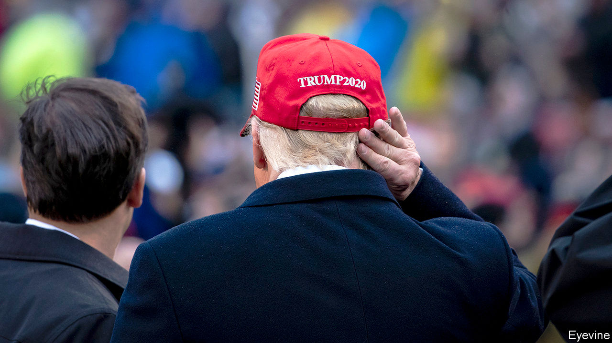
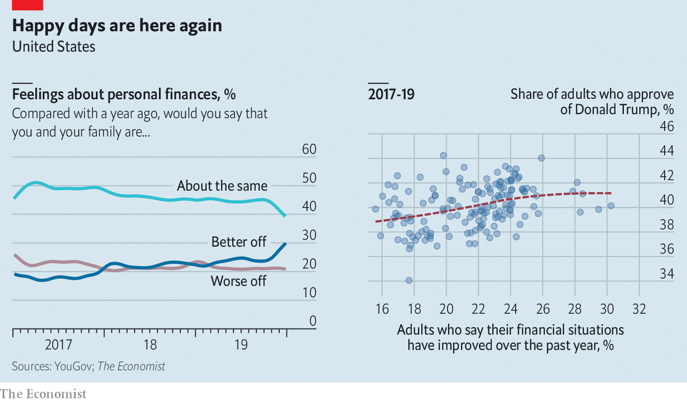

## Voting behaviour

# Consumer confidence no longer translates into presidential popularity

> That may not bode well for Donald Trump’s re-election chances

> Jan 11th 2020

THE ECONOMY is giving Americans plenty of reasons for cheer. The stockmarket has reached record highs. Job growth is strong. Despite fears of a recession in mid-2019, growth in GDP has held up. History suggests that incumbent presidents running when voters are happy about the economy almost always get re-elected. But new polling has confirmed that consumer sentiment has become less important to how voters evaluate recent presidents. This could spell trouble for Donald Trump at the ballot box in November.

Consumers are certainly confident about the economy. According to data collected for The Economist by YouGov, a pollster, nearly 30% of adults say their households are “better off financially than they were a year ago”, compared with about 40% who say their family is faring as it was, and 20% who say they are doing worse than they were a year ago. The past five months have seen a sharp rise in the share of adults reporting an improvement in their family’s financial condition. Americans are more optimistic than they have been for at least the past three years (see chart).

No one has been a bigger cheerleader for America’s economic strength than the president. But good feelings about short-term economic trends, if they last, will not be enough on their own to secure him victory. Over the past 12 years the link between Americans’ economic sentiments and the president’s job-approval rating has been severed. Between 1960 and 2008, a one-percentage-point increase in the University of Michigan’s index of consumer sentiment predicted a half-percentage-point increase in the president’s approval rating. That link broke after Barack Obama’s election. Throughout Mr Obama’s and Mr Trump’s presidencies, there has been no relationship between the two factors. And in YouGov’s polling over the past three years, the relationship between Mr Trump’s approval rating and the public’s assessment of their financial position has been weak.

All this suggests that perceptions about a healthy economy will not necessarily offer Mr Trump much more than a marginal boost. This is already evident: voters are feeling better than they have for a long time about the economy, but this has not translated into improved approval ratings for him. According to YouGov, Mr Trump’s approval rating sagged from 43% to 40% between October and December 2019, even as families’ financial situations improved.

Voters seem to have other preoccupations. On the left, health care and impeachment are the most important issues of the day, according to polling from the University of California, Los Angeles and the Democracy Fund Voter Study Group. Independents are exercised by the detention of children on the Mexican border. Republican voters remain focused on illegal immigration, even though the number of undocumented migrants appears low, at least compared with the past 40 years.

The new disconnect between economic sentiment and approval ratings has prompted social scientists to rethink their models of voting behaviour. Since the 1970s, their models have relied on the so-called “fundamentals” of the economy—GDP, in particular—and the president’s popularity to forecast election outcomes. In 2016 these models did a slightly better job of predicting the winner than models based on polls, but that may have been owing to larger-than-usual errors in horse-race polls. In 2020 methods that focus too closely on the economy may not see that the president otherwise suffers from low approval ratings. The well-informed have long known that the president alone cannot determine the health of the economy. Now it looks as if the health of the economy may not determine the president, either.■

[Sign up to receive Checks and Balance](https://www.economist.com//checksandbalance/), our new weekly newsletter on American politics