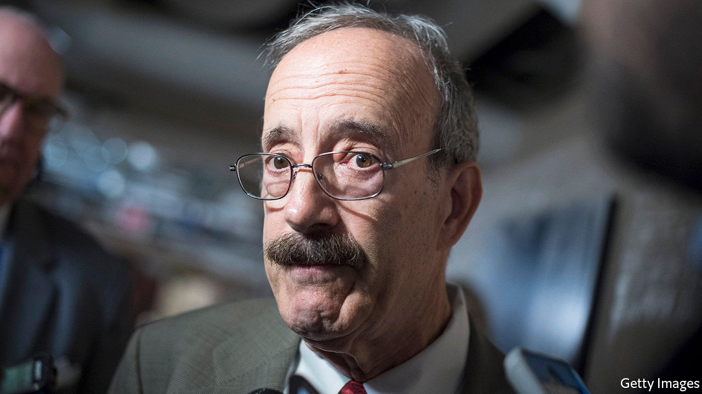

## From AOC to shining sea

# Justice Democrats want to be the left’s Tea Party

> They have some way to go

> Jan 11th 2020MOUNT VERNON, NEW YORK

ELIOT ENGEL has unobtrusively represented southern Westchester County in the House of Representatives for 30 years, reliably voting with his fellow Democrats, ascending to a committee chairmanship (Foreign Affairs), making few waves and ruffling few feathers. Outside his district, he is probably best known for his pushbroom moustache and his shaking of every president’s hand at the State of the Union, except for Donald Trump’s. His constituents seem to like him: he was unopposed in 2018, and has not won less than 60% of the general-election vote since 2002. A consultant with his campaign says that Mr Engel “has a long and distinguished record of progressive achievement”.

Justice Democrats (JD) disagree. Founded by alumni of Bernie Sanders’s 2016 presidential campaign, JD finds and helps primary challengers to incumbents it deems insufficiently progressive. Against Mr Engel—whom it dislikes for voting for the Iraq war, financial deregulation and the 1994 crime bill, as well as excessive hawkishness on foreign policy—JD is backing Jamaal Bowman, a thoughtful and charismatic school principal who supports a standard list of progressive initiatives, including the Green New Deal and Medicare for All. JD members see their organisation as a left-wing version of the Tea Party: a vanguard of activists keeping the Democratic Party true to its values. Not everyone has such a favourable view.

JD notched two impressive victories in 2018, backing Alexandria Ocasio-Cortez and Ayanna Pressley, who beat Joe Crowley and Michael Capuano, respectively, in the primaries. In this cycle it is backing challengers to six other Democratic House incumbents, as well as candidates for two seats held by Republicans—Susan Collins’s Senate seat in Maine and Nebraska’s second congressional district—both of whom will face more centrist Democrats in their upcoming primaries.

Finding the right candidate, says Waleed Shahid, JD’s spokesman, is “50% science and 50% art.” Finding a weak incumbent is no good without also finding a compelling candidate, and vice versa. Few politicians have the grit and talent of Ms Pressley and Ms Ocasio-Cortez, and Messrs Capuano and Crowley both represented districts that had grown more diverse during their time in office. Mr Engel’s district resembles theirs. Though historically dubbed “the Riverdale seat,” after a relatively white and wealthy Bronx neighbourhood, his district is majority non-white and economically diverse. JD hopes to mobilise infrequent voters in the less-white and less-rich parts of the district to vote in the June 23rd primary.

Mr Bowman, a political novice, says that JD was “sent from God…They had the experience, the infrastructure, the people and the coaching.” Morgan Harper, challenging Joyce Beatty, a four-term incumbent in Ohio, credits the group with boosting her fundraising. She has attracted donations from all 50 states, which would not have happened, she says, without JD. Though she and Mr Bowman have, unsurprisingly, raised less money than their incumbent rivals, both have raised more than eight times as much from people giving less than $200.

For that success, credit the new model of fundraising, which prizes online popularity and digital donations rather than a reliance on political parties, PACs and corporate giving. The strength of JD candidates with small-dollar donors is not necessarily a harbinger of victory. In 2016 the most prolific such fundraisers were Mr Sanders and Ben Carson. And whether Ms Harper can turn cash raised in Alabama and Wyoming into votes in Columbus remains unclear. Still, such fundraising has come to be taken as a sign of strength, and is particularly important for candidates who eschew corporate donations.

Together with what Lee Drutman, a political scientist with the New American Foundation, calls “the emotional quality of social media as a way of exciting voters to take on a stronger, purer stance”, these sorts of intraparty insurgencies are increasingly easy to wage. As the gatekeeping power of American political parties has declined, so has the cost of challenging them, though mainstream Democrats are trying their best to exact one. Last year the party’s congressional campaign arm announced that it “will not conduct business with, nor recommend” any vendors or consultants who work with a challenger to an incumbent Democrat.

But unlike the Tea Party, JD has not yet “put the fear of God into incumbents”, says Matt Bennett of Third Way, a centrist Democrat think-tank. Partly that is because Democrats are a more heterogenous party than Republicans. The 2018 wave put Ms Ocasio-Cortez and Ms Pressley in office, but the freshmen representatives who gave the House its Democratic majority were mostly moderates from swing districts. Nancy Pelosi, the House Speaker, understands that keeping her majority means protecting them. At its peak, says Mr Bennett, “the Tea Party was knocking off senators [and] causing havoc. Justice Democrats are nowhere near that level.”■

[Sign up to receive Checks and Balance](https://www.economist.com//checksandbalance/), our new weekly newsletter on American politics