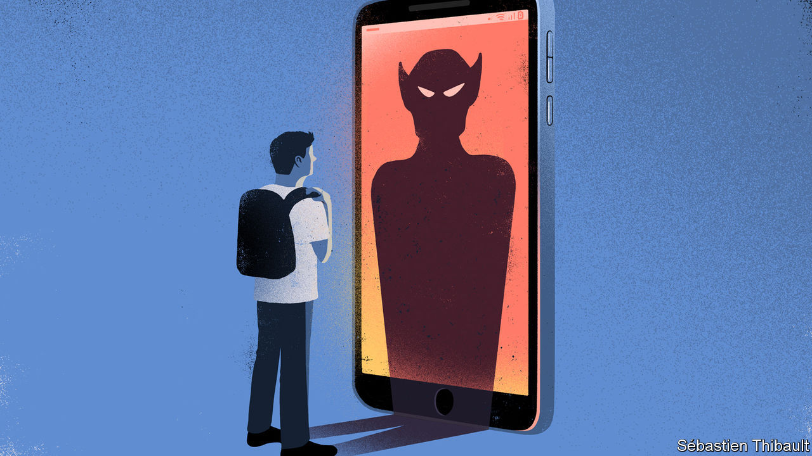

## The bully in the black mirror

# Why more young Americans are cyber-bullying themselves

> As adolescents’ social lives have migrated online, so too has a digital manifestation of self-harm

> Jan 11th 2020

ON A FRIDAY night in 2016, Natalie Natividad, a 15-year-old in Hebbronville, Texas, took a fatal overdose of pills after enduring months of cyber-bullying. Most of the alleged taunts—that she was ugly, that she should kill herself—came on After School, an app that allows classmates to discuss one another anonymously. Her suicide prompted an investigation. The app’s operators tracked which accounts had sent the abuse, while officials interviewed teachers and students. “We just want some justice,” said Natalie’s sister shortly after the death. “Whoever is bullying, I hope that they stop.”

There were no bullies to find. The inquiry revealed that Natalie had secretly sent the abusive messages to herself. Such anonymous “digital self-harm”, as researchers call it, is increasingly common. A study in 2019 found that nearly 9% of American adolescents have done it, up from around 6% in a previous study from 2016, according to an author of both studies, Sameer Hinduja, director of the Cyberbullying Research Centre and professor of criminology at Florida Atlantic University. Despite these numbers—and the fact that teenagers in 2020 spend much of their lives online—“People are uniformly shocked to learn that this problem exists,” says Justin Patchin, another director of the centre and professor of criminal justice at the University of Wisconsin-Eau Claire.

Why do it? Ana, a 20-year-old from Alabama, says she wanted to see if someone would stick up for her. At 14, she anonymously posted insults about her appearance to Ask.fm, a public question-and-answer site. Then she waited for other people to defend her. Her motivations, to express self-loathing and to get a reaction, are some of the most common among children who abuse themselves online.

About a third say digital self-harm achieved what they had hoped for. Riel, a university student in Georgia, says it was a useful way to counter other online abuse. As a 15-year-old, he created funny tweets that got him more followers but also more hate mail. Strangers started sending him homophobic taunts. At first, Riel deleted the messages, but that made him feel anxious. So he decided to imitate his tormentors, anonymously posting hateful comments about himself online. Others sent him kind responses, which he says “helped overshadow the actual negative, and sometimes vulgar” insults he had received.

Several aspects of Riel’s background made him more likely to hurt himself in cyberspace. He had previously been a victim of cyber-bullying by others, which makes people nearly 12 times more likely to cyber-bully themselves. He is not heterosexual and he is male, traits which respectively make people 2.75 times and 1.3 times more likely to digitally self-harm. Unlike girls, boys disproportionately told researchers they self-cyber-bully to be funny.

Even so, Elizabeth Englander, director of the Massachusetts Aggression Reduction Centre, presumes there could be a deeper reason. Boys may have “fewer legitimate ways to get attention and sympathy”, she says. Whatever the profile of children who insult themselves online, doing so “betrays mental-health and well-being issues”, warns Mr Hinduja. Depression and drug use are also predictors. And like physical self-harm, the online version is linked to suicidal thoughts, though it is not yet clear which comes first.

Much about digital self-harm is still poorly understood. Even the reason for its recent increase has mystified researchers. Mr Hinduja speculates that the rise correlates with increasing emotional instability and deteriorating emotional fulfilment among adolescents. That is reflected in a host of other online trends. Some young people turn to a less direct version—seeking out existing self-destructive content, such as blogs that glorify eating disorders or physical self-harm—rather than producing abusive content. Others hint that they want a response by “sadfishing”, or posting emotional confessions on social media in the hope that friends will comfort them.

As a technological matter, identifying digital self-harm is relatively easy. Usually this involves finding the computer or account that created the harmful material. The harder part is what to do after that, says Mr Patchin. Social-media platforms might consider directing known self-cyber-bullies to counselling services. Tumblr, a blogging website, already posts helpline numbers next to anorexia-related search results. Teachers and parents could treat digital self-harm as an indication of other underlying problems. The worst response, according to Ms Englander, would be to dismiss evidence of bullying because it might be faked. “Any time a kid claims they’re being bullied, they’re struggling with something,” she says. For many, the source of that something is not an external tormentor, but one within. ■