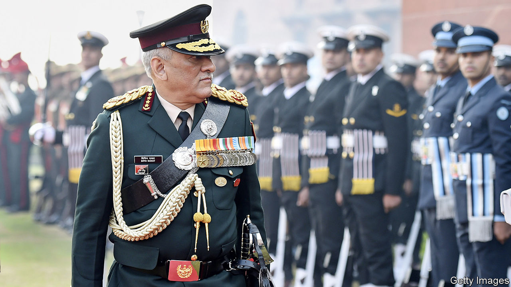

## A major modern general

# India’s armed forces get their biggest shake-up in decades

> For the first time a single officer will be in charge of them all

> Jan 18th 2020

WHEN JAWAHARLAL NEHRU became the prime minister of India at independence in 1947, one of his first acts was to evict the country’s commander-in-chief, General Sir Rob Lockhart, from Flagstaff House, among the grandest mansions in Delhi. In a pointed gesture of civilian supremacy, Mr Nehru then moved in himself. A few years later he abolished the post of commander-in-chief entirely. The three coequal chiefs of the army, navy and air force have battled it out ever since, often quite heatedly.

That changed on January 1st when Bipin Rawat, the army chief (pictured), was handed a new uniform, a plush house and a newly minted job: Chief of Defence Staff (CDS). The creation of such a post had been mooted for decades, especially after the army and air force squabbled during a war against Pakistan in 1999. But there was resistance from civilians, who feared that a CDS might accrue too much authority, and from the air force, which saw it as a power grab by the already-dominant army.

Narendra Modi, the prime minister, swept those concerns aside. He has the largest parliamentary majority since 1984, a taste for grand gestures, and military threats on two fronts. Last year a terrorist attack in Kashmir resulted in an exchange of air strikes with Pakistan; relations have been fraught since. To the east, China’s defence budget is now triple India’s. New roads and railways into Tibet allow the People’s Liberation Army (PLA) to move troops to its disputed border with India quickly, while Indian forces are trapped in narrow valleys below. And reforms to the PLA mean that a single general would be in charge of all Chinese forces at the border, whereas the Indian command would be split between officers from different services.

The new CDS will not solve all these problems. Unlike his British counterpart, General Rawat will not in fact exercise any military command at all. He instead chairs a committee of the three service chiefs, who will still be able to go over his head to the defence minister. But he will have an office of over 60 people and influence over promotions and postings, giving him powerful levers to force the services to work together on everything from logistics to training—improving what military types call “jointness”.

More important, he has also been told to prepare the armed forces for theatre commands on the American or Chinese model. Under such a system, all forces in a given area, whatever their service, are under the command of a single officer. That idea has previously been anathema to the air force, in particular, which recoils from the idea that an army general might dictate how warplanes should be used.

The Indian armed forces are “at the cusp of a transformation”, says Anit Mukherjee, author of “The Absent Dialogue: Politicians, Bureaucrats and the Military in India”. But he warns that bureaucratic skirmishing from civilians and the services has neutered such efforts in the past. India’s lone joint command, in the Andaman and Nicobar Islands, is a largely failed experiment in inter-service harmony.

General Rawat’s promotion also raises questions about civil-military relations. Mr Modi has been accused of politicising the armed forces. In 2014, when he first became prime minister, he gave a ministerial post to V.K. Singh, a former army chief who had clashed with the previous government. During last year’s election campaign, Mr Modi’s Bharatiya Janata Party (BJP) displayed military images on campaign posters and publicised an event at which seven army veterans, including five retired generals, joined the party as the defence minister looked on approvingly. Another BJP leader, Yogi Adityanath, chief minister of Uttar Pradesh, described the Indian armed forces as “Modi’s army”. These episodes prompted over 150 senior veterans, including three former army chiefs, to write to the president to express their “alarm and disquiet”.

As army chief, General Rawat did little to allay these concerns. He “has often ventured into political and foreign-policy territory with his media statements, making many observers uncomfortable”, notes Sushant Singh, a former army officer who is now deputy editor of the Indian Express. In December, just days before becoming CDS, General Rawat provoked anger by criticising students protesting against a controversial citizenship bill.

His successor as army chief, General M.M. Naravane, struck a very different note in his first public remarks on January 12th. “As the army, we swear allegiance to the constitution of India,” he said. “Justice, liberty, equality and fraternity...should guide us.” The fact that those values were drawn from the constitution’s preamble, which has been read aloud at protests across the country, was not lost on anyone. ■

## URL

https://www.economist.com/asia/2020/01/18/indias-armed-forces-get-their-biggest-shake-up-in-decades
