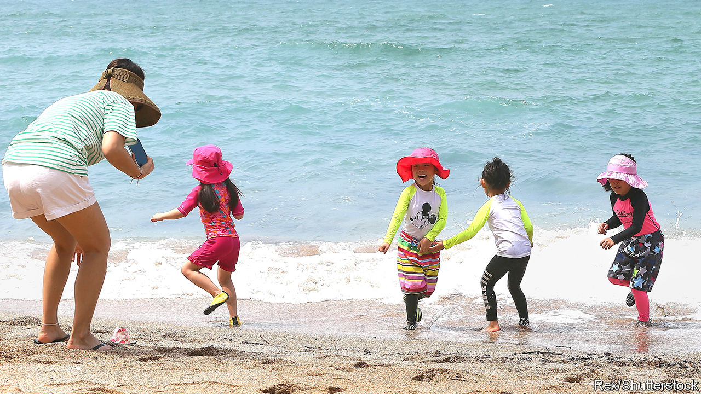

## Going south

# South Korea’s president curbs the power of prosecutors

> But is he doing it for the right reasons?

> Jan 16th 2020SEOUL

JEJU, AN ISLAND off South Korea’s southern coast, is known for its hiking trails, temperate climate and the tough old women who dive off its cliffs for abalone, a delicacy popular with the glitterati in Seoul, the faraway capital. It is also popular with political leaders in search of a spot to sideline troublemakers. The rulers of the Joseon dynasty, for instance, used to send insubordinate aristocrats there to stop them from meddling in politics.

This week Park Chan-ho found himself reassigned to Jeju. Mr Park’s previous job was at the Supreme Prosecutor’s Office in Seoul, where he had been investigating allegations that the government had interfered in mayoral elections in the southern city of Ulsan in 2018. His colleague Han Dong-hoon, who had been leading an investigation into alleged nepotism and financial irregularities in the affairs of Cho Kuk, a former justice minister who resigned in the autumn, was moved to Busan, another traditional place of banishment.

The job moves, which were technically promotions, were part of an extensive reshuffle ordered by Mr Cho’s successor. Moon Jae-in, the president, denies that they are intended to punish the prosecutors or hinder investigations of his political allies. Mr Moon says that such personnel changes are common and that the probes the two men worked on could proceed unhindered with new prosecutors in charge. That may be true, but the reshuffle also fits in with Mr Moon’s quest to reduce the enormous power of prosecutors, one of his main pledges when he took office.

This week the second of two bills to reform prosecutions passed the National Assembly, after months of opposition protests and fisticuffs in the parliamentary chamber. Once the new laws take effect in the summer, prosecutors will lose some of their extensive powers to the police. A new agency comparable to Britain’s Serious Fraud Office will take over corruption investigations involving high-level officials and important business types.

Few doubt that the reforms are necessary. Most South Koreans do not trust prosecutors to do their jobs fairly. They think they are too soft on well-connected crooks and too harsh on people considered a threat to themselves or their political allies. This is especially worrying because the prosecution service has such sweeping authority. It has the exclusive right to issue indictments, and wide-ranging discretionary powers to start and end investigations, including command of its own investigative force (a job done by the police in most countries). It is also a tight-knit community, with many members drawn from the same schools and universities and moving easily between the prosecution, the justice ministry and the presidential palace. “The prosecution service is the only institution in South Korea that has so far escaped democratisation,” says Hannes Mosler of Berlin’s Free University. “It is essentially unchanged compared with the days of military dictatorship.” “Prosecutors have too much power and they have too often abused that power,” agrees Lim Ji-bong of Sogang University in Seoul.

By filling the top jobs at the prosecution service with political loyalists, Mr Moon this week followed a well-tested strategy that governments have used to try to harness that power and to insulate themselves from it. But though prosecutors have often lent a discreet helping hand to the government for part of a president’s term, most presidents have eventually found themselves at the receiving end of their appointees’ investigative powers. Lee Myung-bak and Park Geun-hye, Mr Moon’s predecessors, know this only too well. Under Mr Lee, a group of television producers had to fight a four-year libel suit because the agriculture minister objected to a programme they made about the risks of American beef imports. Under Ms Park, prosecutors barred a Japanese reporter from leaving the country while investigating him for defamation for a piece that speculated on Ms Park’s whereabouts during the tragic sinking of a ferry full of schoolchildren, when she inexplicably disappeared from public view. Both cases were eventually thrown out by higher courts. Both ex-presidents are now serving long prison sentences for corruption and abuse of power.

It is too early to tell whether Mr Moon’s reforms will break that cycle and turn the prosecution service into an agency that invites fewer attempts at political interference, including by Mr Moon himself. Mr Mosler reckons the new laws go some way towards curbing the agency’s excessive power. But they may also create new temptations for abusing it. Critics doubt, for instance, that there are sufficient safeguards to prevent the president from exerting undue influence over the new anti-corruption unit. Ending the predictable routine of first exploiting and then battling prosecutors will take a change of the political culture as well as the law. ■