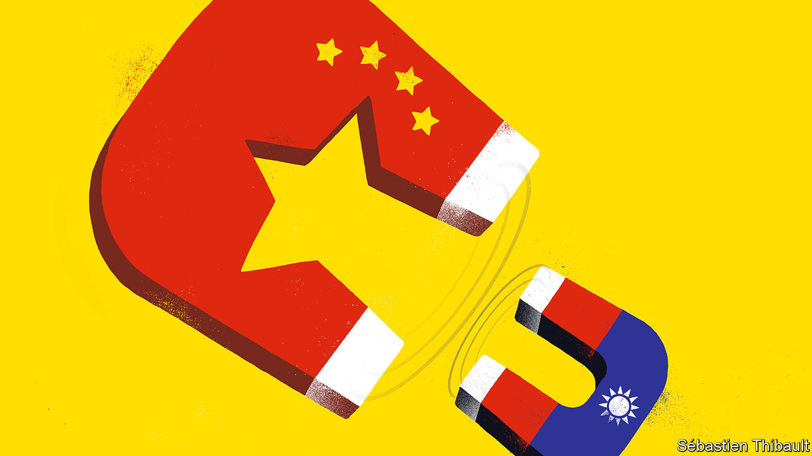

## Banyan

# What next for Taiwan after Tsai Ing-wen’s emphatic victory?

> There is a clear consensus against China’s advocacy of “one country, two systems”

> Jan 16th 2020

LAST AUTUMN, as China prepared to celebrate the 70th anniversary of the founding of the People’s Republic, a slogan of President Xi Jinping’s was strung up all over Beijing: “Don’t forget the original intention. Stick to the mission.” The mission was about national revival. As the Chinese Communist Party sees it, that involves restoring Taiwan to its rightful place as an undisputed part of the motherland.

And now Taiwan, which went to the polls on January 11th, has just responded—with a huge raspberry. The president, Tsai Ing-wen of the China-wary Democratic Progressive Party (DPP), was re-elected to another four-year term. Ms Tsai, soft-spoken and scandal-free, won in a landslide against her populist, often brash opponent, Han Kuo-yu of the China-friendly Kuomintang (KMT). For good measure, the DPP bucked predictions and hung on to control of the Legislative Yuan, the country’s parliament.

A year ago, following a DPP drubbing in municipal elections, it was not even clear that Ms Tsai would win her party’s nomination. Her dramatic turnaround is thanks to Mr Xi and his minion in Hong Kong, Carrie Lam. In a speech about Taiwan in early 2019, China’s dictator made clear that “one country, two systems”, the formula used to rule Hong Kong, was the model for Taiwan. When Ms Tsai claimed that Taiwanese rejected the model, even under the permanent threat of force, her approval ratings began to climb. They went higher still when Ms Lam, Hong Kong’s chief executive, pushed for a law allowing extradition to mainland China. That sparked a popular revolt over broken promises of autonomy and popular representation, allowing Ms Tsai to point out that since one country, two systems appeared dead in Hong Kong, it was absurd to consider it the prototype for Taiwan. Her country, meanwhile, has become an inspiration for Hong Kongers. Thousands of them flew to Taipei to follow the election and celebrate the outcome.

For now Ms Tsai’s star is high. Her diplomacy has been cannier than Mr Xi’s. She has quietly strengthened ties with Australia, Europe and Japan. Above all, she has bolstered support in America, Taiwan’s ultimate guarantor of security, by insisting that Taiwan will not destabilise things with fiery assertions of independence even as she refuses to acknowledge the goal of unification. Ties have rarely been better. Her reward: the sale last year of dozens of F-16 fighter jets.

Taiwan is also a rare winner from America’s trade war with China. The two giants’ tech divorce has given impetus to Ms Tsai’s attempts to “reshore” some of the Taiwanese tech industry’s huge investments in mainland China, to escape the threat of American tariffs. After years of sub-par growth, Taiwan’s economy is forecast to be one of East Asia’s better performers this year.

Yet things will surely get harder for Taiwan if America insists on a complete technological divorce from China. Taiwanese firms would be caught painfully in the middle. TSMC, the world’s biggest contract chipmaker, which provides components for American fighter jets, gets a fifth of its revenue from Chinese firms such as Huawei, a telecoms giant. Meanwhile, as exports to America grow, so Taiwan risks coming into President Donald Trump’s “America First” sights. Taiwan bans American pork because of a controversial feed additive promoting leanness. Some of the shine could quickly come off Ms Tsai’s victory.

Yet, for now, it is China and its traditional bases of support in Taiwan that are in a pickle. Chinese attempts to influence the election, from threats to disinformation campaigns, have backfired. Worse, after its electoral drubbing the KMT may launch into a debilitating civil war. Younger members blame the old guard for clinging too closely to the idea of reunification. They even want the party to abandon the “1992 consensus”, a diplomatic fudge hammered out between China and an earlier KMT government. It holds that there is only one China, even if both sides agree to disagree about what that means in practice.

Up-and-coming types now argue that the KMT pays a price for being seen as pro-China when there is, as one former legislator puts it, “a global anti-China wave”. Eric Huang, a lecturer and prominent member of the KMT’s younger generation, argues that it is time for the party to “put US-Taiwan relations ahead of relations across the Taiwan Strait”. Such a radical move would appal Mr Xi and those around him. Yet, as in Hong Kong, he appears to have no Plan B.