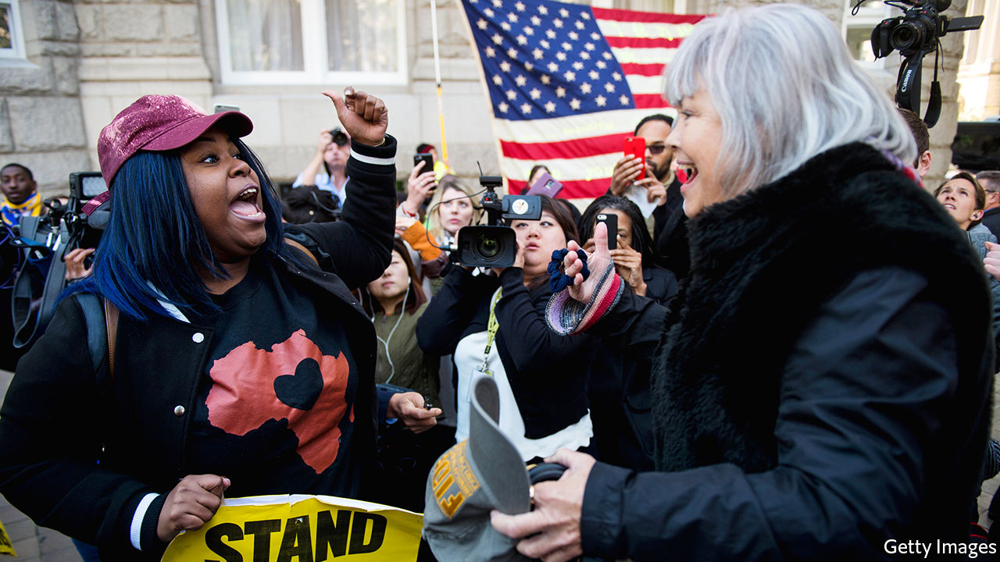

## Original sin

# How to fix the design flaws in American democracy

> Lee Drutman spies a way out of the “doom loop” of partisan dysfunction

> Jan 18th 2020

Breaking the Two-Party Doom Loop. By Lee Drutman. Oxford University Press; 272 pages; $27.95 and £18.99.

PERHAPS THE only point of universal agreement in American politics is that it is in a bad way. Impeachment of a sitting president—among the most solemn tasks a Congress can take up—has predictably disintegrated into partisan cacophony. Legislators seldom pass laws. Supreme Court vacancies trigger all-consuming contests over the soul of the nation. Ask about the cause, however, and the accord dissolves in a mess of accusations: against socialist Democrats, racist Republicans, censorious Silicon Valley or nativist Fox News.

But what if the problem is instead inherent in American democracy itself—in design flaws that encourage Manichaean polarisation and inhibit repairs? That is the convincing thesis offered by Lee Drutman, a political scientist, for present-day levels of partisanship that rival those preceding the civil war. When the country’s founding fathers unthinkingly imported the British system of first-past-the-post elections, which tends to produce two large parties since third-party votes often seem wasted, they “greased the slide into Red America versus Blue America”.

It seems odd to suggest that this 230-year-old arrangement is responsible for a deterioration in the past few decades. But, Mr Drutman argues, for much of that time the flaw was merely latent. Though Democrats and Republicans have dominated politics since the days of Abraham Lincoln, two other, shadow parties used to exist: conservative Democrats in the South and liberal Republicans in the cities. Both species are now almost extinct—killed off in culture wars over race and identity that began in the 1960s. Since then, the natural bifurcating tendency of American democracy has become dangerously pronounced.

Winner-takes-all politics means voters have limited choices. When one or other big party predominates—as is now the case in most state and local races—there is no real choice at all. Meanwhile, closed primaries allow ideological outliers, such as Donald Trump, to take over national parties. Politicians follow the incentives this system creates—towards fiercer partisanship and an increasing willingness to bend the rules and trample norms by, among other things, gerrymandering districts and refusing to vote on a Supreme Court nominee. These days, 97% of votes in Congress are entirely partisan. Control of only one state legislature (Minnesota’s) is split between the parties. The capacity for self-correction looks limited. Mr Drutman’s “doom loop” seems to be self-perpetuating.

The remedies he advocates are more far-reaching than the usual bromides about “putting country above party” or bipartisan hobnobbing in Washington. Instead, he aims to break the duopolistic stranglehold and stimulate the emergence of new parties. The mechanism for achieving that is simple: America, he says, could blunt the drift to the extremes by instituting ranked-choice voting. Because they would covet second preferences as well as top ones, candidates would be warier of the sort of negative campaigning that can repel moderates. Already the state of Maine and several American cities have such systems. Another idea is to elect multiple representatives from enlarged districts—leading to mild proportional representation and making gerrymandering much harder. Not only should this produce more moderate candidates for Congress; it might mean that four to six distinct parties would have to govern in coalition, and thus relearn the lost art of compromise.

Unlike those reforms, fixing the oddest quirk of the American political system—the election of the president via a lopsided electoral college—would require amending the constitution. Though this seems impossible now, large-scale electoral reform has happened before, in America and elsewhere. Until the 17th Amendment went into effect in 1919, following protests by the Populist Party, Americans did not directly elect their senators. Frustrated citizens in New Zealand rejected the first-past-the-post system in the early 1990s, adopting a ranked-choice method instead.

At times, Mr Drutman rhapsodises about multiparty democracy as if it were a panacea for all America’s ills. It would, he thinks, combat not only polarisation, but also low turnout, inequality and demagoguery. Yet the force of his argument, rigorous and limpidly expressed, is almost irresistible. He emerges as one of the keenest observers of America’s political pathologies—if only because he questions what others take for granted. Tracing the arc of the doom loop, he also spies a way out. ■

[Sign up to receive Checks and Balance](https://www.economist.com//checksandbalance/), our new weekly newsletter on American politics