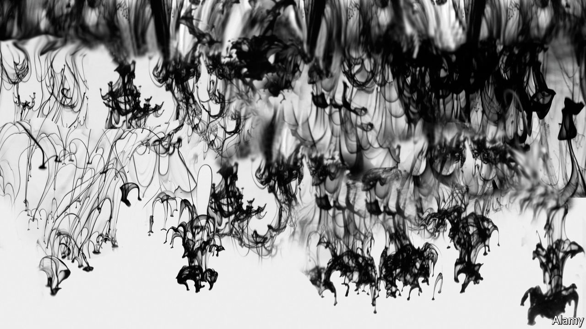

## Beneath the waves

# Loneliness and longing in Beijing

> “Braised Pork”, a debut novel by An Yu, follows a young widow’s uncanny quest

> Jan 16th 2020

Braised Pork. By An Yu. Harvill Secker; 240 pages; £13.99. To be published in America in April by Grove Press; $25.

IN LITERATURE, AS in other fields, China’s opening to the world has helped blur the boundaries between homegrown culture and diaspora life. Rather than decide irrevocably between East and West, younger figures such as the author and film-maker Xiaolu Guo—who writes in both Chinese and English—may move between continents and mine material from every place they land. “Braised Pork” is the debut of a Beijing-raised, Paris-based writer who has also studied in New York. It reads, however, not as a slice of expat—or exile—fiction, but as a contemporary Chinese novel that happens to have been written in English.

As other contemporary Chinese authors have before her, An Yu (born in 1992) evokes the loneliness of a young woman in a newly affluent society that has discarded not only “feudal ways of thinking” but the spiritual ballast of the past. Widowed at an early age, Wu Jia Jia, her unmoored heroine, embarks on a dreamlike search for an inner realm of meaning that eludes her among the shopping malls and wine bars of upscale Beijing.

Jia Jia finds her wealthy older husband Chen Hang—who married her to possess “the finest, most tasteful accessory”—drowned in the bath, bizarrely crouched in an attitude of prayer. Ms Yu studs her story with hallucinatory images and episodes that interrupt its otherwise realistic flow. The uncanny drawing her husband left of a fish with a human head triggers Jia Jia’s quest. A painter, she starts to depict marine scenes that suck her into a “world of water” where everyday identity disintegrates. Both frightening and consoling, this oceanic kingdom promises the “balance between mystery and simplicity” that she craves in art and life.

Other characters—her new bartender boyfriend, his scholarly parents, her own father and aunt—drift through a narrative in which memory has broken into fragments and “The past seemed to have become merely what remained.” Jia Jia’s fond recollections of braised pork, a favourite family dish, hint at her longing for a vanished intimacy. Her widow’s journey follows images of the tantalising “fish man” to Tibet, which, as often in Chinese writing, is imagined as a heartland of esoteric wisdom. There, “at the edge of the world”, an old sculptor divulges secrets of a watery domain “where there are no barriers”. In Tibet, Jia Jia glimpses the fate of her long-dead mother, another lonely seeker.

Ms Yu chooses not to pin down the significance of her aquatic dreamscape. In the contradictory manner of occult images, it may represent both limitless freedom and an escape from the big-city curse of isolation. Her novel has a cool, poised elegance that only adds to its enigmatic allure. All mysteries aside, it also suggests that the fallout from China’s “one-child policy” still moulds the emotional terrain of many younger artists. ■

## URL

https://www.economist.com/books-and-arts/2020/01/16/loneliness-and-longing-in-beijing
