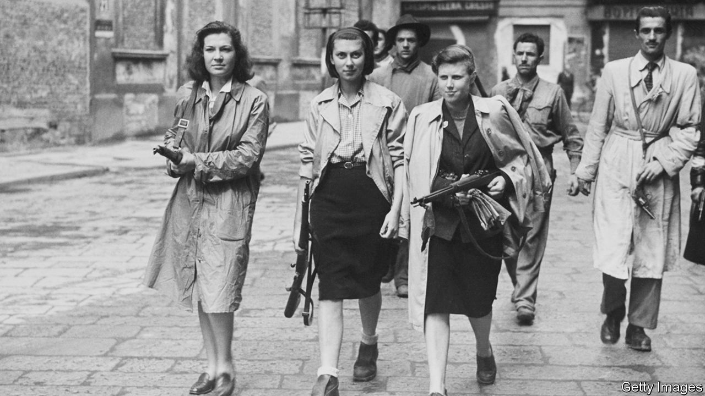

## The second world war

# The heroic women partisans of Turin

> They fought for Italy’s freedom, and for their rights

> Jan 16th 2020

A House in the Mountains. By Caroline Moorehead. Harper; 415 pages; $29.99. Chatto & Windus; £20.

THEY CAME, Caroline Moorehead writes, in red sweaters and red scarves. Some were old, others virtually children. They sang resistance songs and knelt among the tombstones as the coffins of their friends passed by. Even after fascists came to arrest them, others returned and tidied the flowers on the graves. Over 2,000 women honoured three of their comrades, murdered by thugs in Turin. One victim, Rosa Ghizzone, was pregnant when she was shot. 

The defiance at the graveyard, and the preceding horror, is a single vignette from a heroic, horrific struggle. Between Italy’s capitulation to the Allies in September 1943 and the arrival of American troops 19 months later, the people of Turin engaged in a brutal civil war. In scenes repeated across northern Italy, fascist loyalists and their German backers grappled with people like Ghizzone—partisans and others who were desperate for a future free from Nazism. Like Ghizzone, about 80,000 would not live to see it. 

In “A House in the Mountains”, the moving finale of a quartet of books on resistance to fascism, Ms Moorehead focuses on four other female partisans: Ada, Bianca, Silvia and Frida. Each, in her way, exemplified women’s central role in the fight for liberty. Ada Gobetti, the eldest, was an organiser. She hosted meetings and hiked across the Alps to see supporters in France. A comrade said she had “the physical and moral strength of 10,000 fighters”. Frida Malan was a staffetta, a young woman who did everything from carrying messages to arranging getaways. She and her friends rushed around on bicycles, hiding banned leaflets under salad and celery sticks. 

As Ms Moorehead makes clear, this work was not only about national liberation. Her heroines knew they had a chance to grab equal rights for women. That, too, was never easy. Quite apart from fascist ideology—which cast them as docile wives and mothers—they faced chauvinism from male colleagues. After meeting Gobetti, one mocked the “revolutionary ideas our Ada has put in her head”. For their part the Allies, who were pushing up the peninsula after landing in the south, often patronised the Italians as too apathetic to be really useful. They feared communist sympathies among the resistance. 

Meanwhile Italian fascist militiamen, grenades strapped to their belts, looked for suspects to torture. The Germans were at least as bad. In one massacre, a lieutenant drank a bottle of cognac before shooting 54 prisoners. Ms Moorehead conveys the terror with understated power; she is equally good at conjuring the blurred morality of civil conflict. Malan escaped a firing squad because a fascist soldier took pity—her brother had once saved his fiancée from execution by the resistance.

Many partisans fled to the mountains north of Turin, and Ms Moorehead evokes the valleys and wild flowers in technicolour detail. This was a place where peasants thought raw snails could combat rickets, and bread was hung from ceilings to harden, then broken with hammers and softened in milk. The partisans delighted in all this: amid round-ups and reprisals, Ms Moorehead writes, Gobetti noticed “meadows dotted with yellow and violet and the briars covered in white flowers”. The mountains helped these remarkable women retain their humanity, even as they battled for their country and their rights. ■

## URL

https://www.economist.com/books-and-arts/2020/01/16/the-heroic-women-partisans-of-turin
