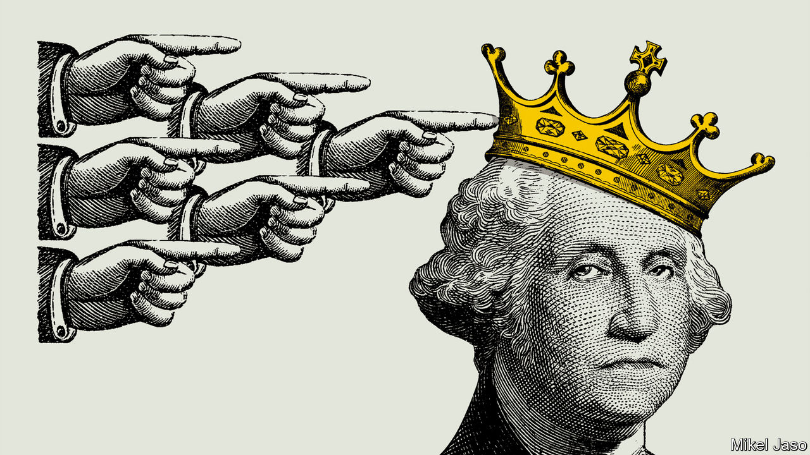
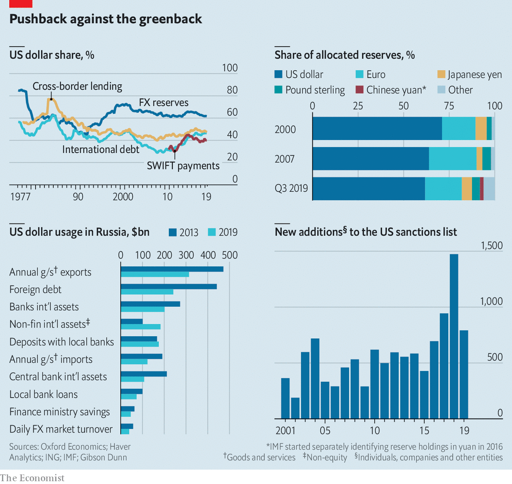
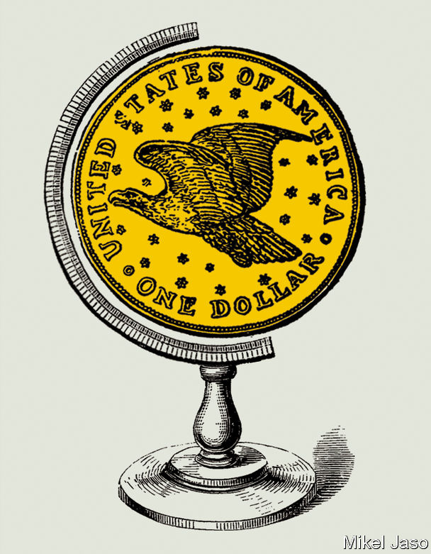

## Dethroning the dollar

# America’s aggressive use of sanctions endangers the dollar’s reign

> Its rivals and allies are both looking at other options

> Jan 18th 2020

EVER SINCE the dollar cemented its role as the world’s dominant currency in the 1950s, it has been clear that America’s position as the sole financial superpower gives it extraordinary influence over other countries’ economic destinies. But it is only under President Donald Trump that America has used its powers routinely and to their full extent, by engaging in financial warfare. The results have been awe-inspiring and shocking. They have in turn prompted other countries to seek to break free of American financial hegemony.

In 2018 America’s Treasury put legal measures in place that prevented Rusal, a strategically important Russian aluminium firm, from freely accessing the dollar-based financial system—with devastating effect. Overnight it was unable to deal with many counterparties. Western clearing houses refused to settle its debt securities. The price of its bonds collapsed (the restrictions were later lifted). America now has over 30 active financial- and trade-sanctions programmes. On January 10th it announced measures that the treasury secretary, Steven Mnuchin, said would “cut off billions of dollars of support to the Iranian regime”. The State Department, meanwhile, said that Iraq could lose access to its government account at the Federal Reserve Bank of New York. That would restrict Iraq’s use of oil revenues, causing a cash crunch and flattening its economy.

America is uniquely well positioned to use financial warfare in the service of foreign policy. The dollar is used globally as a unit of account, store of value and medium of exchange. At least half of cross-border trade invoices are in dollars. That is five times America’s share of world goods imports, and three times its share of exports. The dollar is the preferred currency of central banks and capital markets, accounting for close to two-thirds of global securities issuance and foreign-exchange reserves.

The world’s financial rhythm is American: when interest rates move or risk appetite on Wall Street shifts, global markets respond. The world’s financial plumbing has Uncle Sam’s imprint on it, too. Most international transactions are ultimately cleared in dollars through New York by American “correspondent” banks. America has a tight grip on the main cross-border messaging system used by banks, SWIFT, whose members ping each other 30m times a day. Another part of the US-centric network is CHIPS, a clearing house that processes $1.5trn-worth of payments daily. America uses these systems to monitor activity. Denied access to this infrastructure, an organisation becomes isolated and, usually, financially crippled. Individuals and institutions across the planet are thus subject to American jurisdiction—and vulnerable to punishment.

America began to flex its financial muscles after the terrorist attacks of September 11th 2001. It imposed huge fines on foreign banks for money-laundering and sanctions-busting; in 2014 a $9bn penalty against BNP Paribas shook the French establishment. Mr Trump has taken the weaponisation of finance to a new level (see chart). He has used sanctions to throttle Iran, North Korea, Russia, Turkey (briefly), Venezuela and others. His arsenal also includes tariffs and legal assaults on companies, most strikingly Huawei, which Mr Trump accuses of spying for China. “Secondary” sanctions target other countries’ companies that trade with blacklisted states. After America pulled out of a nuclear deal with Iran in 2018, European firms fled Iran, even as the EU encouraged them to stay. SWIFT quickly fell into line when America threatened action if it did not cut off Iranian banks after the reimposition of sanctions in 2018.

Using the dollar to extend the reach of American law and policy fits Mr Trump’s “America first” credo. Other countries view it as an abuse of power. That includes adversaries such as China and Russia; Russia’s president, Vladimir Putin, talks of the dollar being used as a “political weapon”. And it includes allies, such as Britain and France, who worry that Mr Trump risks undermining America’s role as guarantor of orderliness in global commerce. It may eventually lead to the demise of America’s financial hegemony, as other countries seek to dethrone its mighty currency.

The new age of international monetary experimentation features the de-dollarisation of assets, trade workarounds using local currencies and swaps, and new bank-to-bank payment mechanisms and digital currencies. In June the Chinese and Russian presidents said they would expand settlement of bilateral trade in their own currencies. On the sidelines of a recent summit, leaders from Iran, Malaysia, Turkey and Qatar proposed using cryptocurrencies, national currencies, gold and barter for trade. Such activity marks an “inflection point”, says Tom Keatinge of RUSI, a think-tank. Countries that used merely to gripe about America’s financial might are now pushing back.

Russia has gone furthest. It has designated expendable entities to engage in commerce with countries America considers rogue, in order to avoid putting important banks and firms at risk. State-backed Promsvyazbank PJSC is used for trade in arms so as to shield bigger banks like Sberbank and VTB from the threat of sanctions.

Russia has also been busy de-dollarising parts of its financial system. Since 2013 its central bank has cut the dollar share of its foreign-exchange reserves from over 40% to 24%. Since 2018 the bank’s holdings of American Treasury debt have fallen from nearly $100bn to under $10bn. Russia’s finance ministry recently announced plans to lower the dollar share of its $125bn sovereign-wealth fund. “We aren’t aiming to ditch the dollar,” Mr Putin has said. “The dollar is ditching us.”

Elvira Nabiullina, Russia’s central-bank governor, says the move was partly motivated by American sanctions (which were imposed after Russia’s annexation of Crimea in 2014), but also by a desire to diversify currency risk. “I see a global shift in mood,” she says. “We are gradually moving towards a more multi-currency international monetary system.” Ms Nabiullina echoes Mark Carney, the governor of the Bank of England, who said in August that the dollar-centric system “won’t hold”.

Russia’s debt is being de-dollarised, too. New issuance is often in roubles or euros, and the government is exploring selling yuan-denominated bonds. Russian companies have shrunk their foreign debts by $260bn since 2014; of that, $200bn was dollar-denominated. Conversely, Russian firms and households retain a fondness for dollars when it comes to holding international assets: they have $80bn more than they did in 2014. Dmitry Dolgin of ING, a bank, finds this “puzzling”, but suspects it could be that the interest rates on dollar assets, higher than on euro equivalents, outweigh the perceived risk from sanctions.

ING expects 62% of Russia’s goods and services exports to have been settled in dollars in 2019, down from 80% in 2013. Its trade with China was almost all in dollars in 2013; now less than half is. Trade with India, much of it in the sanctions-sensitive defence sector, shifted from almost all dollars to almost all roubles over that period. One reason for this shift, say Russian officials, is that it speeds trade up, since dollar payments can be delayed for weeks as financial intermediaries run sanctions checks.

Energy and commodities firms are among Russia’s most active de-dollarisers. The greenback is the global benchmark currency for oil trading, and escaping its grip is hard. “The key thing to understand is that risk management, the entire derivatives complex, is in dollars,” explains the boss of a global energy firm. “So if you want to have risk management—as an oil trader, buyer or producer—you have to have contact with the dollar system.”

Nonetheless Rosneft, a state-backed producer that accounts for over 40% of Russia’s crude output, has denominated its tender contracts in euros. Surgutneftegas, another producer, still prices in dollars but has added a clause to contracts saying they can be switched to euros at its request—“a back-up plan in case Trump throws shit at the fan”, says a trader. Last March Gazprom priced a natural-gas shipment to western Europe in roubles for the first time. The cost of switching out of dollars is modest, says an executive at a global oil-trading firm: “an extra person in the finance department and a bit more currency risk.”

Will China follow the trail blazed by Russia? Mr Trump has exposed China’s profound vulnerability to the dollar-centric financial system. America’s ability to blacklist or hobble Chinese tech firms, such as Huawei, ultimately rests on punishing suppliers and other counterparties who do business with them through the dollar-based banking and payments system. An American legal case against a senior Huawei executive, who is fighting extradition from Canada, reportedly relies in part on evidence from an American-appointed overseer at HSBC, an Asia-centric bank run from London. In October America sanctioned eight cutting-edge Chinese tech firms for alleged human-rights abuses in Xinjiang province. The administration has threatened to block listings by Chinese firms in New York and restrict purchases by American investors of Chinese shares.

China’s first attempt to bypass the dollar was bungled. After the financial crisis in 2007-09 it promoted the international use of the yuan and pressed for it to become part of the IMF’s “Special Drawing Rights”, in effect receiving the fund’s imprimatur as a reserve currency. China set up currency swap deals with foreign central banks (it has done over 35). There was heady talk of the yuan challenging the dollar for the top spot by 2020. Then came a stockmarket panic in 2015 and the government clumsily tightened capital controls. The yuan’s share of global payment by value has stayed at about 2% for several years. Zhou Xiaochuan, a former governor of China’s central bank, has said that yuan internationalisation, which he promoted while in office, was “a premature baby”.

America’s display of financial firepower and new technologies are changing the calculus again. China has some of the building blocks to become more autonomous. It has its own domestic payments and settlement infrastructure, called CIPS. Launched in 2015, it has so far complemented SWIFT (which it uses for interbank messaging). It is tiny, processing less in 2018 than SWIFT does each day. But it simplifies cross-border payments in yuan, giving banks lots of nodes for settlements. Reports suggest that China, India and others may be exploring a jointly run SWIFT alternative.

Parts of the world’s consumer-finance system are coming under China’s sway thanks to its digital-platform firms, which have globalised faster than its conventional banks. Payments through Alibaba (and its affiliate Ant Financial) are accepted by merchants in 56 countries. The Alipay logo is, in some places, as common as Visa’s. In capital markets, in 2018 China introduced a yuan-denominated crude-oil futures contract on a Shanghai exchange. Known as the “petroyuan”, it is seen by some as a potential rival to the dollar in pricing oil. China has encouraged important firms listed in America to list their shares closer to home as well. On November 26th Alibaba, China’s most valuable company, which in 2014 floated in New York rather than in Hong Kong or Shanghai, completed a $13.4bn additional listing in Hong Kong (the funds were raised in Hong Kong dollars). “As a result of the continuous innovation and changes to the Hong Kong capital market, we are able to realise what we regrettably missed out on five years ago,” said Daniel Zhang, Alibaba’s chief executive.

China’s central bank is reported to be working on a new digital currency, though details are sparse. Some speculate that it wants to get a head-start on America in building whatever international system emerges for managing payments in central bank-issued digital currencies. It discussed creating a common cryptocurrency with other BRICS countries (Brazil, Russia, India and South Africa) at a recent summit. China may end up doing Bitcoin with an authoritarian twist: instead of anonymity it may want all data to be trackable and centrally stored.

That America’s geopolitical rivals want to escape the dollar’s dominance is no surprise. Perhaps more striking is that its allies are flirting with it, too. In her manifesto for 2019-24, Ursula von der Leyen, the new president of the European Commission, said: “I want to strengthen the international role of the euro.” Jean-Claude Juncker, her predecessor, has called the dollar’s dominance in European energy trade an “aberration” (when just 2% of imports come from America). The commission is working on a new action plan, part of which involves encouraging EU countries to eliminate “undue reference” to the dollar in payments and trade invoicing, according to a staffer.

So far the EU’s main initiative has involved Iran. It has tried to create a way for its banks and firms to trade with it, while shielding them from America’s wrath. But Instex, a clearing house created for this purpose by Britain, France and Germany, with the commission’s support, is crude and limited. It is essentially a barter mechanism and does not cover oil sales (it is limited to non-sanctioned humanitarian trade). It was structured to allow firms to engage in commerce without resort to the dollar or SWIFT. But they have stayed away for fear of incurring secondary sanctions.

The stuttering performance of Instex reflects the sheer scope of America’s reach. As Adam M. Smith, a sanctions expert at Gibson Dunn, a law firm, points out, America can claim jurisdiction if a transaction has any American “nexus”, even if it is not denominated in dollars. This includes transactions that rely on banks under American jurisdiction, or where a foreign counterparty relies on American nationals to approve, facilitate or process the transaction, or where one party uses a back-end payment, accounting or email system that is stored on servers in America.

Despite this, some European officials remain optimistic. On November 29th six more EU states said they planned to join Instex. “It’s a ten-to-twenty-year thing, and hopefully not only covering Iran. You can’t undo decades of policy in a year,” says a French official. And, if Europe manages to reform the inner workings of the euro, its financial reach will expand. “We need to complete the project first: banking union, fiscal integration, genuine capital-markets union, and so on,” another French official says. European powers are likely to play a leading role in central-bank efforts to create a global electronic currency. Last year Mr Carney floated the idea of a network of central-bank digital monies that could serve as a global invoicing currency. If it happens America may not be invited.

The true test of any reserve currency is a financial crisis. Eswar Prasad of Cornell University, the author of “The Dollar Trap”, notes that the greenback benefits during times of turmoil. The 2007-09 crisis, which originated in America, paradoxically strengthened its status as a safe haven. When global trade, saving, borrowing and reserves are largely in one currency, these strengths are mutually reinforcing. No other capital market comes close to America’s for depth and liquidity, a key factor when choosing a currency for commerce.

Yet financial supremacy depends on a heady mix of economic clout, incumbency and legitimacy. And the martial approach that America has adopted threatens the dollar’s dominance, reckons Jeffrey Frankel of Harvard University. A former American treasury secretary agrees. In 2016, while still in office, Jack Lew told an audience in Washington: “It is a mistake to think that [sanctions] are low-cost. And if they make the business environment too complicated, or unpredictable, or if they excessively interfere with the flow of funds worldwide, financial transactions may begin to move outside of the United States entirely—which could threaten the central role of the US financial system globally, not to mention the effectiveness of our sanctions in the future.” As the Trump administration continues to use sanctions aggressively, efforts to circumvent them will accelerate. America does not have a monopoly on financial ingenuity.■

## URL

https://www.economist.com/briefing/2020/01/18/americas-aggressive-use-of-sanctions-endangers-the-dollars-reign
