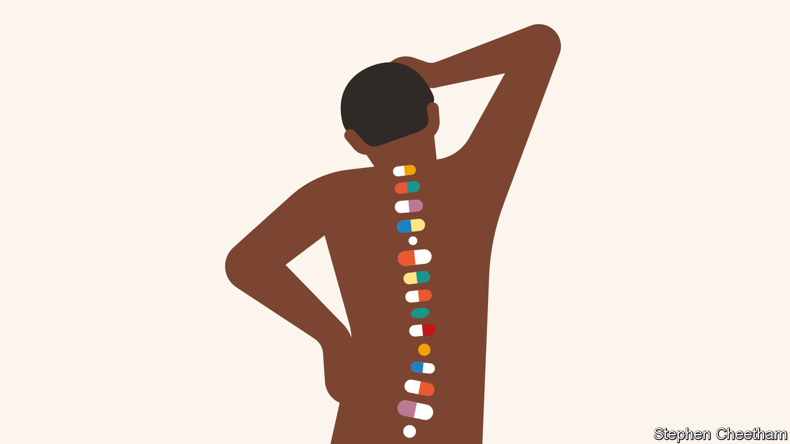
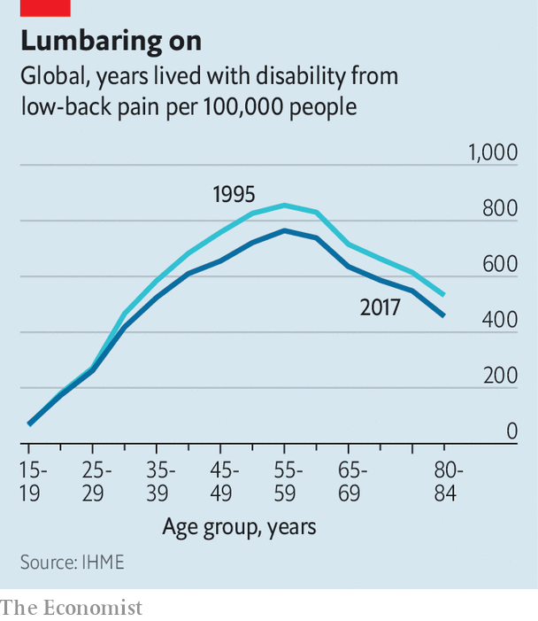
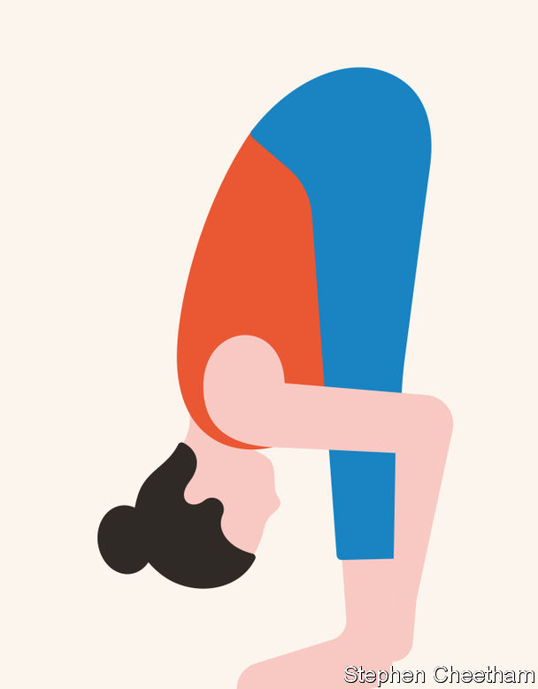

## The burden of back pain

# Back pain is a massive problem which is badly treated

> Why are better approaches to helping sufferers so slow to spread?

> Jan 18th 2020

PETE MOORE was 43 when he woke up one autumn morning with back pain so excruciating that he struggled to dress himself. His doctor in Romford, an English town, referred him to hospital for an MRI scan; this showed that some of the spongelike discs that separate the spine’s vertebrae were bulging out of the slots into which they customarily fit. Such “slipped” discs can be caused by an injury; but they are also the sort of thing which can just happen with increasing age.

Mr Moore received a prescription for opioids to help him cope with the pain; but the pain persisted, and he found himself becoming loopy. Unable to work or do much else, Mr Moore, who had been a painter, sank into depression. Three years into his ordeal, he says, he was “thinking of ending it all”.

Back pain does not, in and of itself, kill people. But it makes a huge number of lives a misery. In most countries for which there are reliable figures, whether rich or poor, back pain is the top cause of disability, measured by the aggregate number of years lived in poor health. That burden is decreasing (see chart) but only very slowly.

The costs, however, have been rising quite quickly—and are enormous. In 2013, according to one study, $88bn was spent on medical treatments for back and neck pain in America, not far short of the $115bn spent on cancer (more recent figures have not been analysed in a comparable way). A great deal of this money seems, sadly, to do little good.

Doctors used to think that back pain was almost entirely the result of mechanical damage to tissue beyond the capacity of X-rays to detect. The advent of MRI scans showed this was not true. A definitive physical cause—such as a fracture, a tumour, pressure on a nerve, infection or arthritis—is found in 5-15% of people with back pain. The rest is all labelled as “non-specific”, and there is increasing evidence that it is not mechanical in origin.

Back pain, like all pain, is experienced in the brain not the body; nerves coming in tell the brain that something is amiss, and the brain projects an appropriate sensation of pain. Researchers who specialise in pain increasingly believe that, in most cases, chronic pain means that the system has become damaged in some way that keeps it switched on. “It’s like a fire alarm that goes off after the fire has been extinguished,” says Lucie Knight, a psychologist at a pain clinic in St Thomas’ Hospital, in London. Back pain may also be related to other aspects of a person’s life not going well.

Taking this view seriously throws into doubt a great deal of the medical treatment of back pain—much of which, in effect, seeks to silence the maddening sound of the fire alarm by putting out a fire that isn’t there. But it does not offer an obvious medical alternative. Some pain medicines, such as paracetamol, do not work at all for back pain. Opioids, for all their reputed analgesic potency, offer back-pain relief little if any better than options such as ibuprofen. Their continued use often makes pain worse rather than better, and is highly likely to cause addiction.

Drugs that worked better and did less harm would be a boon. But they have proved hard to develop. The mechanisms in the nervous system and brain which generate pain are complex, and can doubtless go wrong in a variety of ways, says Steve McMahon of King’s College London. He thinks that the development of drugs for chronic pain has a poor record because the people they are tried on have a range of different problems.

Evidence of ineffectiveness has not stopped doctors from writing prescriptions for the drugs they have. The prevalence of chronic back pain provided a huge expanse of fertile ground for the deceptive marketing and poor prescription behind America’s opioid epidemic (see [Bartleby](https://www.economist.com//business/2020/01/16/the-wider-effects-of-americas-opioid-epidemic)). In many countries doctors also frequently prescribe painkillers called gabapentinoids, despite strong evidence from trials that, as far as treating back pain goes, they offer no benefits.

There are also a lot of treatments for the back itself. Spines are injected with cement-like mixtures or fitted with various types of medical hardware. Vertebrae are fused together, discs excised or tampered with in various ways. Yet—unsurprisingly, if it is largely the pain mechanism which is the problem—there is a growing body of evidence that the benefits all this offers to most patients are limited or non-existent.

Even just looking at the back causes problems. Only 1-5% of people with back pain have a problem that requires urgent treatment, such as an infection or a tumour; in such cases the pain will tend to be accompanied by other symptoms too, such as weight loss, fever or incontinence. In America and western Europe guidelines say that it is only when such red flags are present that a patient presenting with back pain should promptly be given an x-ray or an MRI scan. Yet general practitioners and hospitals routinely ignore this, sending 40-60% of people with back pain to be scanned—far more than they did 20 years ago. According to Jan Hartvigsen of the University of Southern Denmark there is a broad consensus that about 80% of such scans are useless.

That might be fine if the scans were sometimes helpful and never harmful. But few bodies are completely normal, and learning of your particular “abnormalities” in a medical setting and while suffering is alarming even if a healthy back might look just as odd. Disc “degeneration” is seen in roughly half of young and middle-aged adults with back pain, but also in a third of those with no pain at all. Some 40% of people with back pain have disc protrusion, a form of “slipped” disc; but so do nearly 20% of people who are pain-free.

Both patients and doctors, though, tend to think that if they can see something they should do something. Some sufferers catastrophise the news into the idea that they have a broken, fragile back and start avoiding normal physical activity—not least, says Ms Knight of St Thomas’, because doctors often fail to explain to them that abnormalities are, in fact, quite normal, and that degeneration can basically be wear and tear. The stiffness and weakening of the muscles this inactivity brings often makes things worse. And doctors may take abnormalities as a cue for further medical attention. Many studies have confirmed that patients who receive unwarranted imaging in the first few weeks of back pain are more likely to have surgery and unnecessary follow-up tests than similar patients spared the scans—but that they enjoy no benefits in terms of pain reduction or lessened disability.

In 2011 Cigna, an American insurance company, ran a follow-up study on patients who had undergone procedures in which vertebrae are stitched together with implanted bolts and braces. “Spinal fusion” of this type is a frequently used surgical response to back pain that is associated with the degeneration of spinal discs; in 2015 there were roughly 85,000 such surgeries in America. The company found that two years after treatment 87% of customers were still in pain severe enough for medication or some other treatment; 15% had more surgery.

It all sounds depressing. It need not be so. There are ways of dealing with back pain that waste much less money and leave patients less distressed and with a greater sense of their own agency.

Mr Moore, the patient with whom this story began, tried to come to terms with his disabling pain by starting a support group for fellow sufferers. A psychologist from St Thomas’, which has the biggest pain clinic in Europe, came to talk to them about “graded exercise” and the importance of pacing themselves when going out and about. “Nobody had told me I could do these things,” says Mr Moore. In 1996, three years after back pain had come to dominate his existence, a two-week residential programme at the pain clinic taught him what it teaches people today: exercise daily; accept flare-ups as temporary setbacks; don’t get fixated on the pain. Learning to keep going this way “saved my life”, Mr Moore says.

The programme, explains Ms Knight, aims not to reduce pain so much as to add to life. People naturally struggle against the pain, which means they are burdened with the pain and the struggle too. “If you can drop the struggle,” says Ms Knight, “then you have your hands free to do more.” Patients are taught how to gradually overcome their fears of exercise and daily activities that can cause some pain. The goals that they start with can be as simple as calling a friend and meeting for a coffee, or attending a wedding. In a typical class of ten people, Ms Knight says, one or two decide that the approach is not what they want, and may drop out. Most of them take away at least some skills which add to their quality of life. One or two, like Mr Moore, find the programme life-changing.

Various countries have tried to encourage people with back pain to stay active, with promising effects. One such campaign, in Australia, is reckoned to have led to a 15% reduction in the number of doctor visits for back pain and a 20% decrease in related medical costs. Such campaigns appear to work best when they provide practical advice on how to stay active and at work despite the pain, and when as well as speaking to the afflicted they enroll employers, clinicians and unions as partners.

Activity is not a panacea, and if leading an active life with pain is better than withdrawing from the world, it is still not ideal. But interventions like this seem to offer people more succour than highly medicalised approaches. Unfortunately, medical schools, patient expectations and the policies of insurers and governments all sustain the latter.

All around the world, family doctors are woefully undertrained to treat common, unglamorous conditions such as bad backs. In most medical curricula musculoskeletal conditions, like back pain, are a minor feature. Back pain is “not sexy” for medical students, says Chris Maher of the University of Sydney. Even if they are going to be family doctors they still want to hear about cures for cancer and impressive forms of surgery, rather than humdrum stuff like back pain or preventing falls in older people.

Spinal surgeons, for their part, often take a dim view of evidence that what they do may be ineffective. Surgical training is based on an apprenticeship model. “You learn from a master, a great guru, and you do what they taught you. You don’t learn from a paper in the British Medical Journal,” says Andrew Carr, who heads the department of orthopaedic surgery at Oxford University. Surgeons generally consider an operation successful if the incision is small, things heal nicely and there are no complications, says Maurits van Tulder from Vrije University in Amsterdam. If they ever hear back from patients, that is usually from those for whom the operation worked—which leads surgeons to believe that it works most of the time.

Though research on surgical outcomes is becoming a lot more widespread, it is still hard to convince surgeons that what they have been doing for most of their careers is ineffective, says Dr Carr. It is also hard to convince patients that, when it comes to treatment, less may be more. Told that the best thing they can do about back pain is exercise their body and their patience, they often think they are being fobbed off; a deluge of online marketing for ineffective treatments does not help. Some harangue their doctors for scans or injections, or find a new more biddable one. For a busy doctor, says Rachelle Buchbinder of Monash University in Australia, “it’s easier to prescribe an x-ray than explain why you don’t need one.”

Once pain becomes chronic, persuading sufferers that the cause is not a fixable physical defect becomes much harder. Graeme Wilkes, a British doctor, says that he might spend an hour telling a patient that the things seen on his MRI may not be the reasons for his back pain, and that a spinal injection is unlikely to help. “The reason they’ve got back pain is that they have financial problems, marital problems, disabled children, they are not sleeping at night—not those changes in their MRI scan,” says Dr Wilkes. “And they go home and someone says ‘Oh, that’s absolute rubbish that you can’t get an injection, because my mate at work had it and he was much better afterwards. Don’t listen to them, go back to your GP and get referred’.”

But the biggest reason why so many people with back pain get the wrong treatments is that governments and insurance plans pay for them. In America, Australia and the Netherlands health plans pay for back operations that cost $25,000-100,000 apiece. American plans often support the alternative therapy offered by chiropractors. There is some evidence that this may do some good in back pain, but the research is patchy and any benefits small and short-lived. Yet the same plans typically offer little support for physiotherapy to the same end. If a therapy has been accepted by an insurance company, or a government scheme like America’s Medicare, it is very hard to get it removed, even if evidence for effectiveness persistently fails to turn up. “Once they are in, it is hard to take them out,” says Dan Cherkin from the Kaiser Permanente Washington Health Research Institute. The manufacturers of medical devices are very good at lobbying to get them covered as treatments. They are also “incredibly effective” in marketing their wares to doctors, says Richard Deyo of Oregon Health and Science University.

Back pain is big business for many surgeons, doctors and chiropractors. “If we stop doing low-value care, some entire professions have to change fundamentally what they do,” says Lorimer Moseley of the University of South Australia after enumerating a long list of ineffective treatments. In some systems cupidity encourages such things. In America, where procedures are more lucrative than talking to patients, an unscrupulous doctor might prefer to spend a 15-minute appointment giving a patient an injection rather than some education, just as a harried one might.

Other countries have had some success with an approach called “Choosing Wisely”, in which doctors explain to patients the evidence on the effectiveness of various treatment options and decide together what is best given each patient’s personal goals (which could range from simply wanting to be able to play with their grandchildren to cycling or running). In Britain there has been a determined move towards triage which assigns back-pain patients to more or less intensive treatment depending on the complexity of their problems. In Australia some emergency rooms have started sending some back-pain patients brought in by ambulance straight to physiotherapists, which avoids a significant amount of hospitalisation.

But when professional associations in America urged doctors to take up the Choosing Wisely model their campaign made almost no difference to back-pain treatment—perhaps because doctors were under no obligation to change, says Dr Deyo. Nor has a change in the advice provided by the American College of Physicians had any great effect as yet. In 2017 the college stopped recommending medication as an initial response to back pain, suggesting instead acupuncture, yoga, tai-chi and psychological therapies aimed at reducing stress, all of which have been shown to reduce pain-related disability. Insurers have taken note, with some now covering some or more of these alternatives. That will make it easier for doctors moved to change their practice to do so.

Another approach might be to nudge doctors incrementally, rather than to change their practices once and for all. Tweaking the interface of the electronic systems doctors use to order MRIs so that it takes them longer to place an order has been shown to reduce the number of unnecessary scans. Adding a pop-up reminder explaining why imaging is frequently unnecessary has also shown effects.

Disability-benefit systems matter a lot, too. In many countries benefit systems give people signed off with back pain few incentives to improve, and their erstwhile employers no incentive to encourage them back rather than find someone else. In the Netherlands, though, this has changed. Medical assessment for disability benefits does not kick in for two years after a patient reports sick, and during this time employers must pay the sick employee 70-100% of their wages. Employers and employees are also required by law to agree a return-to-work plan. After the country switched to this system, in 2006, the total number of sick days for back pain fell by a third. The return-to-work rate after a three-to-four-month sick leave due to back pain is now 62% in the Netherlands. In neighbouring Germany it is only 22%.

Drivers for such change are hard to come by in part because, as Dr Maher says, back pain is largely invisible. People do not die from it and there are no “back-pain survivors” to spearhead lapel-ribbon campaigns for change. Few national medical plans even mention back pain. Sufferers are often viewed as impostors, or told that it is all in their heads. Though other aspects of a patient’s life do impede recovery from back pain, many people cannot easily take control over the context of their life, still less the content of their heads. The lack of a lobby accounts in part for the absence of more impressive projects to move beyond medical devices and drugs.

In 2018 Dr Buchbinder was one of the authors of a series of studies on back pain published in the Lancet which they pitched to the journal in the hope that summarising the debacle in rich countries would warn developing countries not to follow suit. But when the researchers began to compile the data, she says, they discovered that in poor countries the horse had already bolted. In India, Brazil, China, Nepal, Iran and other developing countries doctors are already prescribing drugs, injections and X-rays for simple back pain. In some urban areas of India and Africa opioids can be easily bought from the roadside chemists where many poor people go first for aches and pains.

Mr Moore, for his part, has not taken pain medication since 1997. To keep his pain at a manageable level, he starts his day with stretching at home for half an hour, followed by an hour and a half at the gym. And he leads a full life.■

Correction (January 16th 2020): An earlier version of this article stated incorrectly that Mr Moore’s doctor was in Peterborough and that he was given steroid injections.

## URL

https://www.economist.com/briefing/2020/01/18/back-pain-is-a-massive-problem-which-is-badly-treated
