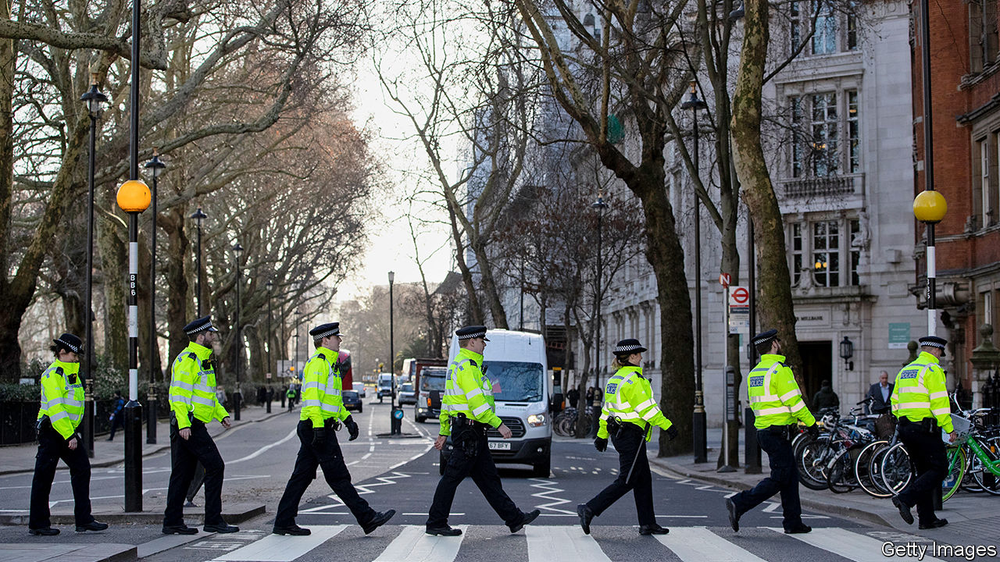

## What’s going wrong here?

# Britain’s 20,000 new cops won’t get the justice ministry celebrating

> Courts and prisons have coped with cuts thanks to falling prosecution rates

> Jan 16th 2020

COPS SPEND much of their time driving around on routine patrols or rummaging through files at the nick. But a series of gritty job adverts for London’s Metropolitan Police instead emphasise the thrill of the chase. Policemen bash down doors and clip handcuffs on ruffians. Blue lights strobe and officers don riot gear. “Do something real,” the voice-over implores. As if they were squaddies going off to fight, their training ends with a passing-out parade.

The 43 police forces in England and Wales have been starved of new blood for a decade. As successive governments cut spending, forces froze recruitment; the number of cops fell by 14%. But rising rates of violent crime forced a rethink. Boris Johnson spent last year’s election campaign promising to hire 20,000 new officers. Chief constables are chipper.

Yet the prime minister’s benevolence might cause him an unexpected headache. The rest of the criminal-justice system suffered even deeper pruning than the police. The Crown Prosecution Service, for instance, had its budget cut by about a third. The number of prison officers fell by 26% between 2010 and 2014, before a new recruitment campaign. It helped, though, that the number of suspects charged by the police also fell, from about 700,000 in 2013 to fewer than 500,000 last year. Courts and prisons struggled, but at least they had fewer suspects to try and lags to house.

That is now likely to change. In the long run, more bobbies might depress crime rates, but in the short term they are likely to charge more suspects. As police numbers have declined, so the number of people being charged and prosecuted has fallen, even though violent crime has risen. An increase in police numbers will presumably have the opposite effect.

The knock-on consequences could be hard to manage. Courts, and eventually prisons, will be busier. “All you’re doing is putting pressure at the start of the pipeline,” says Sir Tom Winsor, chief inspector of constabulary. This is why one ex-cabinet minister reckons the recruitment drive is “the worst thing that could happen” for the rest of the criminal-justice system.

England’s tatty criminal courts do not look ready for the influx. Despite the fall in the number of prosecutions, waiting times are growing, thanks to court closures and the complexity of wading through heaps of evidence from mobile phones. On average, offenders are being sentenced in crown courts 524 days after committing their offence, a rise of about a third since 2010.

Prisons are even less prepared. The remaining warders are having a tough time keeping order. Last year, the prisons watchdog found “too many” jails were “plagued by drugs, violence [and] appalling living conditions”. The number of assaults by prisoners on staff and other inmates has more than doubled in the past five years, as has the number attempting to harm themselves. On January 9th a terrorist attack took place inside a prison, when a convicted jihadist is alleged to have attacked a guard. All of this has happened while prisoner numbers have been falling; they are down by 6% from their peak in 2011. If charging rates had not dropped, “the prison system would have broken,” says the ex-minister. Mr Johnson’s pledge to beef up sentences for violent prisoners and terrorists will only add to the strain.

Mr Johnson might simply bung the courts and prisons some more cash. He has promised a commission to improve the effectiveness of the system; it seems sure to recommend more investment. But that would take time: cuts are quicker than finding and training recruits to replace lost expertise. In the meantime, more cops may not mean more justice. ■

## URL

https://www.economist.com/britain/2020/01/16/britains-20000-new-cops-wont-get-the-justice-ministry-celebrating
