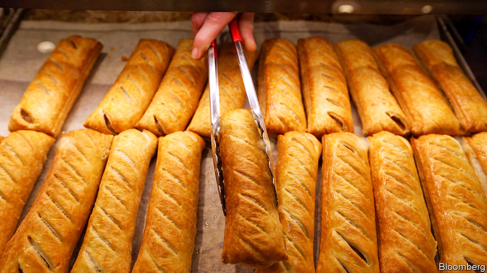

## Tax and benefits

# Greggs and the vegan sausage roll bonus

> Why bakers are taxed more than bankers

> Jan 18th 2020

BONUS SEASON is usually associated more with bankers than bakers, but this year Greggs, a high-street purveyor of bread, buns and the like, gave its staff a special one-off payment of £7m ($9m). It has been a good year for the chain, which saw like-for-like sales rise by over 9% partially driven by the high-profile launch of its new vegan sausage roll; and the management decided that, as well as rewarding shareholders, the company would give employees an extra £300 in their January pay packet.

But the impact of the company’s generosity on those pay packets will be much reduced by the taxman. Greggs’ employees will face implicit marginal tax rates of up to 75%. A banker receiving £1m would, by contrast, be taxed at 47% (the top tax rate plus national insurance).

The quirks of Britain’s tax-and-benefits system explain the disparity. Most of Greggs’ 23,000 workers earn between £7.50 and £9 an hour and many work part-time. To make ends meet many of them rely on government help through universal credit, a new benefit which is being rolled out across Britain, and which low-paid people as well as the unemployed can claim.

Universal credit was supposed to show the Conservative Party’s compassionate side. It was hoped that it would both be easier to administer than the previous mishmash of six separate payments and provide a greater incentive to work. But between 2010 and 2015, as austerity bit, it was repeatedly pared. The result is a fairly miserly benefit that imposes startlingly high implicit tax rates on low-paid workers.

For a Greggs worker earning around £13,000 a year—less than half the national average—income tax at 20% and national-insurance contributions at 12% will swallow up £96, taking the bonus down to £204. That will then be subject to the universal credit taper rate of 63%, reducing their monthly benefit top-up by £128.52. In effect the bonus will be taxed at a marginal rate of 75%, and the worker will end up seeing £75 of the £300.

In recent years the government has made a big noise about raising the personal allowance, on which no income tax is charged, from £6,475 in 2010 to £12,500 in the current tax year. But “taking the lowest paid out of tax”, as the Tories like to put it, is harder than it seems. A Greggs worker on, say, £10,000 will indeed pay no income tax on their bonus, but after national-insurance deductions and the universal-credit taper they will still be facing an implicit marginal tax rate of around 67% on their £300. Depending on where they live, the bonus might also lead to reductions in council-tax benefit, further increasing the implicit tax rate.

The government is rightly keen that poorer people should work rather than sponge off the welfare system. An implicit marginal tax rate of 75% does not encourage them to do so.

## URL

https://www.economist.com/britain/2020/01/18/greggs-and-the-vegan-sausage-roll-bonus
