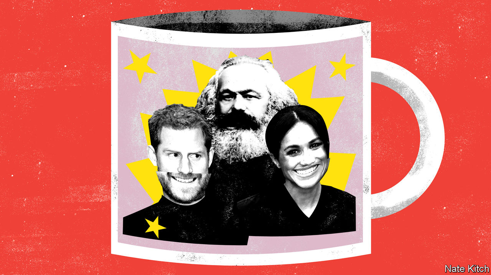

## Bagehot

# Harry, Meghan and Marx

> Brand Sussex represents the biggest threat to the monarchy so far

> Jan 16th 2020

MARX PREDICTED that capitalism would destroy every remnant of feudalism. It would tear asunder “the motley feudal ties that bound man to his ‘natural superiors’”, in the words of “The Communist Manifesto”. It would drown ecstasies of religious fervour and chivalric enthusiasm in the “icy water of egotistical calculation”. And it would subject every national institution to the revolutionary logic of the global market.

So far the British monarchy, one of the last vestiges of the country’s feudal system, has proved a splendid refutation of Marxism. The Crown has survived both the high-noon of Victorian capitalism and the revival of market orthodoxy after 1979. In “The English Constitution”, Walter Bagehot explained why: far from undermining capitalism, the monarchy, in its British form, reinforced it, acting as glue in a society divided into antagonistic classes and distracting the masses from the real sources of power. It injected pageantry, romance, mystery and drama into the lives of British people, mitigating the dreary business of being a cog in the wheels of capitalism.

But the Duke and Duchess of Sussex may be about to prove Marx right. They represent the most profound danger to the monarchy’s settlement with modernity since Bagehot wielded his pen. Previous threats have been mere individuals—Edward VIII, Princess Diana and, most recently, Prince Andrew. The current one is an entire economic system. In stepping down as “senior royals” while pronouncing that they “value the freedom to make a professional income” the Duke and Duchess threaten to unleash the spirit of capitalism on the very core of the monarchy.

This is not the first time the Windsors have experimented with capitalism. Princess Diana referred to the royal family as “the firm” because it was so businesslike in its approach to monarchy. Prince Charles sells over £200m ($260m) a year worth of organic food under his Duchy brand. But until now the firm has treated capitalism as a servant of feudalism. Prince Charles gives the profits from his Duchy brand to charity, and misses no opportunity to preach the superior values of the “old world” to this venal age, denouncing intensive farming methods and modern architecture, while telling off business people for putting profit before principle.

The Sussexes are doing something new. They are embracing capitalism in its rawest, most modern form: global rather than national, virtual rather than solid, driven, by its ineluctable logic, constantly to produce new fads and fashions.

This type of capitalism is the inverse of feudalism. In a feudal society you are bound to your followers by mutual bonds of obligation. In 21st-century capitalism you accumulate followers in order to monetise them. In a feudal society you are bound to plots of land: Harry is the Duke of Sussex while his elder brother is the Duke of Cambridge. In a 21st-century-capitalist society you are propelled around the world in pursuit of the latest marketing opportunity. It is only fitting that the principal agent of the current debacle, Meghan Markle, is the product of an entertainment business that has done more than any other industry to fulfil Marx’s prediction that “all that is sacred” would be “profaned” and “all that is solid” would “melt into air”.

The Sussexes are determined to turn themselves into a global brand. Their first move after they announced that they were stepping down from many of their royal duties was to unveil the name of their brand, Sussex Royal, which sounds a bit like a potato but will soon start to glitter with Hollywood stardust. They started working on their new website in September, according to coding logs, and trademarked the Sussex Royal logo, for use on hundreds of items ranging from socks to counselling services, in December. They have hired a branding agency called Article whose clients include the children’s channel Nickelodeon, the fashion house Diane von Furstenberg and the Toronto Maple Leafs ice-hockey team. They are exploring the possibilities of forging a relationship with Disney, an entertainment company that knows a thing or two about monetising princes and princesses.

Various branding experts have pronounced that Harry and Meghan have “a ready-made brand” that could earn them as much as £500m in their first year. InfluencerMarketingHub, a website, points out that, with 10m Instagram followers, they could expect $34,000 for a sponsored post. SEMrush, a Boston-based marketing analytics firm, says that Ms Markle’s “search volume” is nearly three times Beyoncé’s.

Already Harry and Meghan are rewriting the rules of royalty, so that they can behave as celebrities rather than as public servants. They are planning to abandon the system of royal reporting, whereby royals put up with journalists chosen by the papers, who share their material with the rest of the press. Harry and Meghan intend to back out of that, in favour of choosing their preferred media toadies—though since it appears that they want to continue to receive money from Prince Charles, the older generation has a certain amount of leverage. Negotiations are under way. The Palace held a “crisis summit” on January 13th to try to work out a peace treaty between the Crown and the Sussexes. Ms Markle, who is in Canada, did not attend, leaving Harry to defend the Sussexes’ corner against his grandmother, father and brother.

Branding experts purr that Harry and Meghan have an interest in preserving the integrity of their brand. But the logic of 21st-century capitalism is against a peaceful settlement. They will need more than Prince Harry’s inheritance, which is estimated at £20m-30m, to keep up with the global super-rich. Ensuring that their brand remains hot and providing their “distribution channels” with “content” will require them to extract more and more value from the monarchy—perhaps including revelations about racism and sexism at the heart of the royal family. The daylight that Walter Bagehot said should not be let in upon the magic of monarchy is as nothing to the glare of 21st-century capitalism. ■