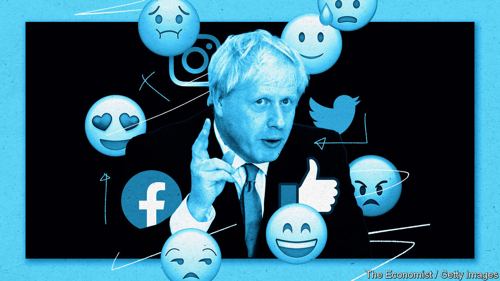

## Soft target

# How the Conservatives won the social media campaign

> The Tories’ strategy embraced inefficiency

> Jan 18th 2020

“I NOTICED IN the recent campaign that the world of digital advertising has changed very fast since I was last involved in 2016,” mused Dominic Cummings, the prime minister’s chief adviser, in an unconventional job advert posted on his blog this month. Journalists, he said, looked at the wrong things “and thought Labour was doing better than us [but] the ecosystem evolves rapidly”.

Having just won his boss a stonking 87-seat majority, Mr Cummings may have been unable to resist a little gloat. But he is right in that Labour was thought to have mastered social media, whereas the Conservative Party was seen as a laggard. In 2017 Labour spent a third as much on Facebook advertising as the Tories but gained twice as much “engagement” in the forms of likes, shares and comments.

Yet in 2019 it was the Tories that proved most adept at wrangling the social-media beast. Despite having only 60% as many followers on Facebook, Instagram, Twitter and YouTube (the main digital battlegrounds), the Conservative Party managed 10% more engagements, including positive ones, according to data from We Are Social, a consultancy. In part that is because the Tory message—“Get Brexit done!”—worked well, but the party also made better use of online advertising. The scandal surrounding Cambridge Analytica, a marketing agency found to have misused Facebook data to target voters, gave rise to the belief that micro-targeting was the key to winning elections. In the 2019 election the Tories turned that assumption on its head.

The party took a two-pronged approach, says Sam Jeffers of WhoTargetsMe, which analyses online ad-targeting activity. The first was to repeat a simple message to the widest possible audience. To that end the party bought two full-day “takeovers” on YouTube, which meant that anybody visiting the video site or using its app would see the Conservative message. That is the digital equivalent of broadcast advertising.

The second prong was targeted advertising, but along broad categories such as constituency, rather than narrow ones such as interest or income. Many non-Tory voters would have seen its ads.

The Labour Party on the other hand was much more precise in its online advertising. It used its own and third-party data to create audience profiles and served ads to people its strategists reckoned would vote for Jeremy Corbyn. The Liberal Democrats also targeted their message carefully, aiming at people interested in Lib-Demmy subjects such as “Barack Obama” or “The Economist”, says Tristan Hotham, a researcher at the University of Bath.

Publicly available data from Facebook’s ad library support these conclusions. On average the Conservatives spent £13.58 for 1,000 views, a common industry measure, on Facebook and Instagram. Labour spent nearly twice as much. “There is a diminishing return because the more layers of targeting you put on the advertising, the more expensive the ad is,” says Benedict Pringle, who runs politicsadvertising.co.uk, a blog. Media buyers have long held that half the money they spend on advertising is wasted—the trouble is figuring out which half. The promise of digital advertising was to cut that waste by allowing precise targeting. Yet the Conservative campaign suggests that a little bit of inefficiency may be no bad thing.■

## URL

https://www.economist.com/britain/2020/01/18/how-the-conservatives-won-the-social-media-campaign
