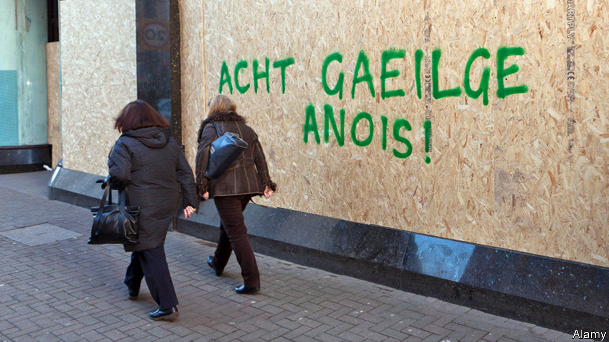

## Northern Ireland

# How Ulster Scots and the Irish language got Northern Ireland’s government back

> Language is replacing religion as a marker of sectarian affiliation

> Jan 18th 2020

BACK IN ACTION after a lapse of three years, Northern Ireland’s shaky government rests on a compromise so ingenious that it would impress a medieval theologian trained to argue over angels and pinheads. But the latest political bargain, dreamed up by mandarins in London and Dublin, pertains not to religion but to language. It neatly finesses the most emotive recent dispute between the Democratic Unionist Party (DUP), backed by most Protestants, and Sinn Fein, the party which gets most votes from people of Catholic background. The dispute is over official support for Irish and Ulster-Scots, a form of speech which has become identified with the Protestant cause.

The new salience of languages in daily use among only a small minority of people is a reflection of how much Northern Ireland has changed in 50 years of inter-communal contention. Religious fault-lines haven’t gone away: thanks to the de facto segregation of education and housing, Protestants and Catholics live separately and learn separately.

But even in Northern Ireland, religion is on the decline. According to a poll in 2017 by ARK, a social-policy research group, 30% of people went to church at least once a week, compared with 44% in 1998. Sinn Fein suffers only a small electoral cost from pursuing policies over abortion and gay rights that clash with Catholic teaching. DUP leaders hew to a social-conservative line closer to the group’s ultra-Protestant roots but not all their supporters agree.

While DUP voters are divided over gay marriage, which became legal this week, they are virtually unanimous in their suspicion of the Irish language, according to Jonathan Tonge, a politics professor at Liverpool University who monitors opinion in Northern Ireland. This, he maintains, shows how “old theological divides have disappeared and languages have achieved totemic significance.”

The DUP had said it could accept legal support for Irish only as part of a broader measure which also boosted the language and heritage of its own Protestant supporters; Sinn Fein insisted there must be a stand-alone Irish Language Act, upholding the right to receive public services, speak in court and parliament and interact with officialdom in the Celtic tongue.

Under the compromise, there will be one commissioner tasked with enhancing “the use of the Irish language by public authorities” and another whose job is to “enhance and develop the language, arts and literature associated with the Ulster-Scots and Ulster-British tradition”. With Jesuitical subtlety, it was agreed that change would be introduced in a series of separate amendments to the Northern Ireland Act of 1998, which implements the region’s peace settlement. So the DUP can say the nationalists have failed to get a new law, while Sinn Fein can claim that help for Irish is not being treated as equivalent to the promotion of Ulster Scots.

Hardly anybody in Northern Ireland actually uses these languages regularly. The last census, in 2011, found that more people gave Lithuanian as their main language (0.36%) than Irish (0.24%). But using a more generous yardstick, a government survey in 2018 found that 15% of the population claimed some Irish.

Still, the language has proved a convenient marker for young, secular Republicans whose grievances are social and economic rather than religious and who link their cause to feminism and gay rights. The campaign is based on “intersectionality”, insists Conchur O’Muadaigh, a youth organiser, using a term that refers to multiple and interdependent types of disadvantage.

The boost for Ulster Scots, similarly, will be cheered by the good number of people in the northern strip of Ireland (by no means all of whom are Protestant) who grew up speaking broadish Scots at home but felt they had to talk posh in public. Now they don’t have to any more—or, as they would prefer to put it, they dinnae hae tae ony mair. ■