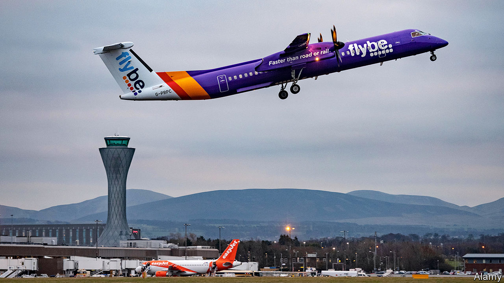

## Airlines

# Keeping Flybe aloft

> The bail-out of a struggling airline sends out a troubling message

> Jan 16th 2020

“GOBSMACKING”, is how a competitor described the government’s announcement on January 14th that it would bail out Flybe, a struggling airline. It’s not just competitors, but also taxpayers, who might be worried by this decision.

Flybe was grounded by a strategy of concentrating on less busy and less profitable routes, which turned out to be, unsurprisingly, unprofitable. The firm was acquired last year by a consortium including Virgin Atlantic, for just £2.8m ($3.6m). Despite that, a year later the firm was once again at death’s door.

Rather than let it crash, the government has allowed it to defer payment of its bill for Air Passenger Duty (APD)—a tax paid by flyers and collected by airlines—for an unspecified period, boosting its cashflow by up to around £100m. Willie Walsh, the chief executive of International Airlines Group (IAG), which owns British Airways, called this “a blatant misuse of public funds”. IAG has complained to the European Commission that the deal might breach state-aid rules.

While trade unions have been quick to welcome the government’s support, IAG’s anger is widely shared among its peers. Airlines complain that APD is charged at a much higher rate in Britain than elsewhere in Europe. A cut now seems likely in the budget in March, which would benefit the whole sector but do little to mitigate the anger at Flybe’s special treatment.

The government argues that the deal is not about protecting a single airline. It was, after all, prepared to let the much larger Thomas Cook fail in summer 2019. The decision, it says, is about a commitment to keeping distant places connected to the rest of Britain—“levelling up”, in the lingo of the Johnsonian Treasury. Flybe is the main operator at many smaller and more isolated airports. According to Cirium, a travel-data company, Flybe operates 95% of all scheduled services from Southampton and almost 80% from Belfast City airport and Exeter. The government says that its collapse would have put these airports at risk. When Thomas Cook failed, its slots at Gatwick and several other major airports were quickly snapped up. Demand for slots at Exeter or Southampton may not be so brisk; and in any case the short-term disruption would have been high.

Boris Johnson reportedly described himself as a “Brexity Hezza” at a recent cabinet meeting, invoking the memory of Michael Heseltine, a Tory minister of the 1980s and 1990s known for his enthusiasm for economic intervention in deprived areas. The government’s talk of “levelling up” growth across the regions and the expected coming splurge on infrastructure certainly point to a Heseltinian flavour to Mr Johnson’s domestic agenda.

The Flybe bail-out, however, is reminiscent not of the 1980s and 1990s but of the 1970s, when the government regularly propped up failing companies with soft loans. During the election campaign Mr Johnson argued that leaving the European Union would give Britain the freedom to establish its own, more lenient, set of rules on state aid. If the Flybe case is an illustration of what they might look like, then it is a worrying one. ■

## URL

https://www.economist.com/britain/2020/01/16/keeping-flybe-aloft
