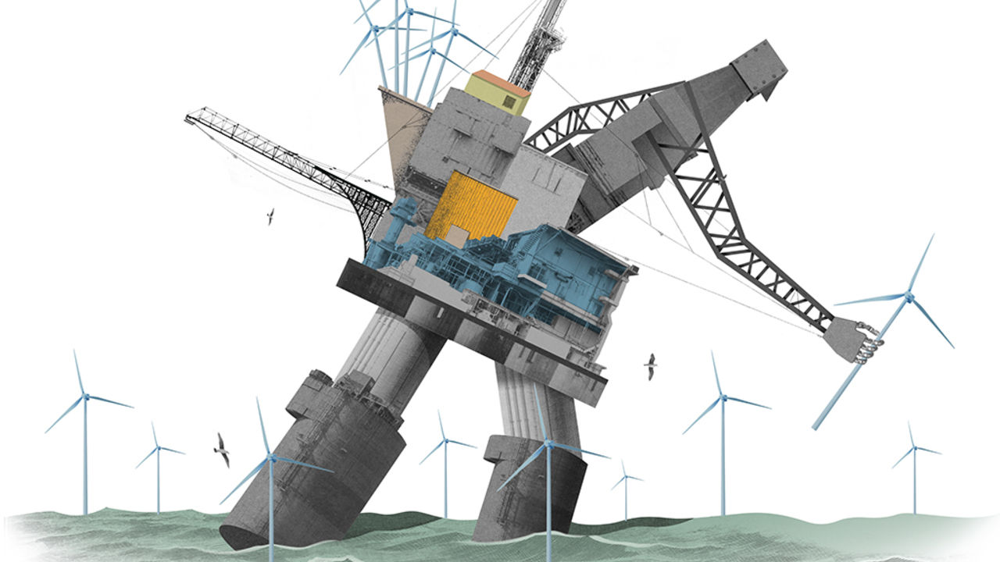

## Schumpeter

# Big Oil has a do-or-die decade ahead because of climate change

> The 2020s are poised to be to energy firms what the 2010s were to utilities—disruptive

> Jan 18th 2020

AS REVOLUTIONARY SLOGANS go, it hardly had the resonance of ¡No pasarán! But when Repsol, a Spanish oil company, said in December it would reduce the net carbon footprint of everything it produces to zero within 30 years, it marked the most powerful pledge so far by a big oil firm to cast off some of the vestiges of a fossil past in favour of a windy and sunny future.

Many will scoff. Oil companies are, after all, widely regarded as the villains of the climate crisis. Repsol is a relatively puny producer; its vow may simply be a gambit to woo investors keen on “sustainability”. Yet it deserves a pat on the back. Without the oil industry’s balance-sheets and project-management skills, it is hard to imagine the world building anything like enough wind farms, solar parks and other forms of clean energy to stop catastrophic global warming. The question is no longer “whether” Big Oil has a big role to play in averting the climate crisis. It is “when”.

Ask oil executives about timing, though, and most hum and haw. They face a dilemma. Though the world needs them to throw their weight behind clean energy, their oil-and-gas businesses have traditionally generated higher returns. Yet forecasting returns is complex—and becoming more so. As well as project risk, it involves assessing the attitude of investors, governments and consumers towards climate uncertainties. To cynics, all the climate-friendly noises amount to little in practice, since few people are ready to make carbon-cutting sacrifices that would force oil firms’ hand. But noises are sometimes followed by action. Should they be this time, the 2020s may be do-or-die for the oil industry.

In energy, a lot can happen in ten years. The 2010s saw oil markets transformed by American shale. In Europe renewable energy prompted something almost as wrenching for a different sort of energy firm—utilities. Faced with an existential threat from wind and solar, fossil-fuel power producers such as Germany’s E.ON and RWE tore themselves apart, redesigned their businesses, and emerged cleaner and stronger. Southern European firms like Spain’s Iberdrola and Italy’s Enel took renewables worldwide. Last year total shareholder returns from the reinvigorated European utilities left the oil-and-gas industry in the dust.

Big Oil looks like the European utilities of a decade ago: potentially in for a seismic shock, and in denial. Some giants, like ExxonMobil and Chevron in America, continue to bet most heavily on oil, believing demand for petrol will remain strong for the foreseeable future. Others, among them Europe’s supermajors, Royal Dutch Shell, Total and BP, increasingly favour natural gas, and see low-carbon (though not necessarily zero-carbon) power generation as a way to prop up their business model as more cars and other things begin to run on electricity.

A few dabble in renewable energy, especially in Europe. But of a whopping $80bn or so of capital expenditure by Europe’s seven biggest listed energy firms last year, only 7.4%—less than $1bn each on average—went to clean energy. In order to meet the goals of the Paris agreement to keep global warming below 2°C, the ratio of dirty energy to the clean sort will need to be turned upside down. On January 14th UBS, a bank, calculated that capital spending on renewable energy, power grids and batteries will need to rise globally to $1.2trn a year on average from now until 2050, more than double the $500bn spent each year on oil and gas. To help fund that, it reckons that oil-and-gas companies will need to divert $10trn of investments away from fossil fuels over the same period.

That sounds unthinkable. For now, oil executives show no appetite for such a radical change of direction. If anything, they are working their oil-and-gas assets harder, to skim the profits and hand them to shareholders while they still can. Oil, they say, generates double-digit returns on capital employed. Clean energy, mere single digits.

They may be overstating the case. First, as the Boston Consulting Group points out, no big industry performed worse for shareholders in the second half of the 2010s than oil and gas. Second, the Oxford Institute for Energy Studies (OIES), a think-tank, says climate-concerned investors are already pushing up oil companies’ cost of capital for long-term projects, crimping returns. Third, with their vast balance-sheets, and skill in building and managing complex endeavours over decades, they could dramatically scale up offshore wind and similar businesses, bolstering profitability.

Furthermore, Big Oil has ways to make other high-risk, high-reward bets on clean energy. One is through venture capital. The OIES calculates that of 200 recent investments by the oil majors, 70 have been in clean-energy ventures, such as electric-vehicle charging networks. They have generally been small for now. But BP reportedly plans to build five $1bn-plus “unicorns” over the next five years with an aim of providing more energy with lower emissions. Another way is to back research and development in potentially groundbreaking technologies such as high-altitude wind energy, whose generating efficiency promises equally lofty profits.

Even as the majors diversify, supplying oil and gas will be the bedrock of their business for decades. Larry Fink, boss of BlackRock, the world’s largest asset manager, acknowledged this in a letter to global chief executives on January 14th, even as he predicted that climate change would cause a significant shift in capital toward sustainable investing (see [article](https://www.economist.com//finance-and-economics/2020/01/16/blackrock-says-it-wants-to-do-more-for-the-climate)).

Yet excuses for prevarication are growing thinner. As Peter Parry of Bain, a consultancy, puts it, it has become “something of a myth” that oil is a high-return industry. As national climate commitments grow more stringent, governments may go on the warpath. UBS argues that it may be necessary for governments to “ban” the $10trn of oil-and-gas investments to reach net zero emissions by 2050. It is not only Repsol that feels which way the breeze is blowing. It need not be an ill wind. ■

## URL

https://www.economist.com/business/2020/01/18/big-oil-has-a-do-or-die-decade-ahead-because-of-climate-change
