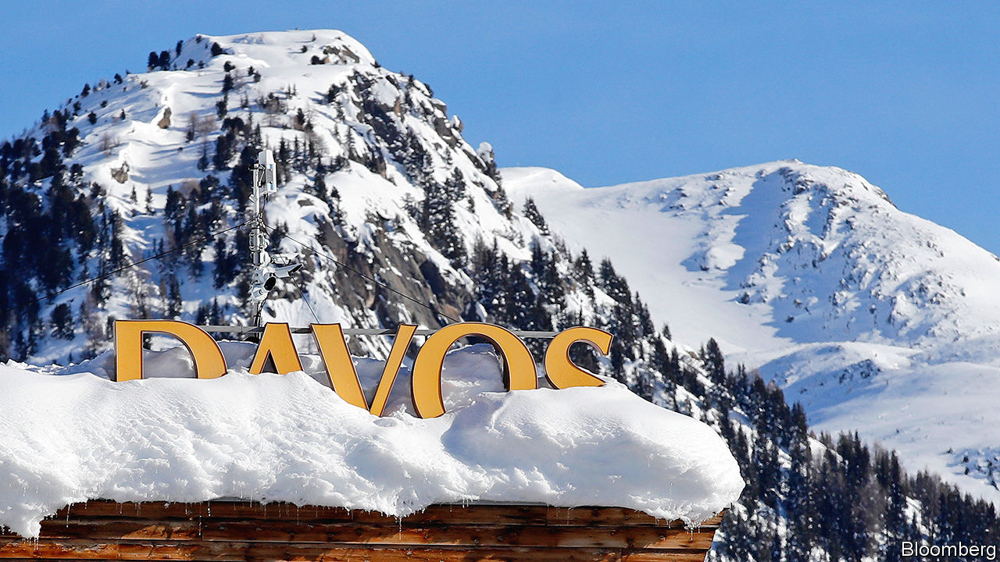
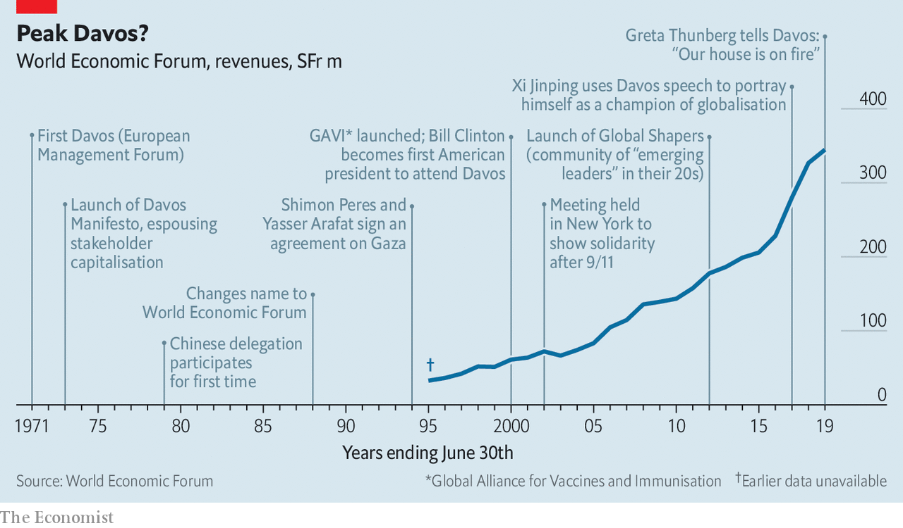

## A tour of the Magic Mountain

# Can the World Economic Forum keep its mojo?

> The organisation behind Davos faces a conflicted identity, increased competition and uncertain succession

> Jan 18th 2020GENEVA

IN 1971 A precocious German academic—at 32 years old, the holder of five degrees in engineering and economics—hosted a conference. The setting was the newly opened congress centre in the Swiss resort of Davos, best known for its tuberculosis sanatoriums and as the backdrop for Thomas Mann’s “The Magic Mountain”. Klaus Schwab wanted to use the symposium to make European businesses think more about stakeholders beyond those who own their shares, and to expose them to American management methods. The fees paid by the 450 who came generated a profit of SFr25,000 ($75,000 in today’s money), which Mr Schwab used to endow the European Management Forum.

Renamed the World Economic Forum (WEF) in 1987, its signature annual event has become the ultimate A-list bash for plutocrats. It attracts nearly 3,000 business folk, politicians, take-me-seriously celebrities and journalists hoping to taste the zeitgeist. Visitors, some unable to get passes to the main venue, crowd panels and parties in hotels or on the “fringe”, a growing unofficial Davos on the town’s main drag. (The Economist sends journalists to the Forum and our parent company receives revenue from organising events for clients in Davos during the meeting.)

At 81, Mr Schwab remains the ringmaster, and on January 21st he will open the 50th annual gathering. Amid all the über-networking, another raft of “multi-stakeholder” initiatives will be launched, including a “one trillion trees” reforestation project. Star turns will include President Donald Trump, back after skipping 2019, and Greta Thunberg, who will be joined by a pack of other teenage activists, invited to help the conference “look to the future”. None of the WEF’s imitators, which put on Davos-wannabe events from Aspen to Boao, has matched the WEF in its ability to bring together public- and private-sector power-brokers, says Sir Martin Sorrell, former boss of WPP, an advertising giant, who now runs S4 Capital, a media firm.

Mr Schwab likes to say the WEF is “committed to improving the state of the world”. Not everyone sees it that way. To many NGOs its commitment is to globalist elites, peddling an agenda that exacerbates inequality. Anti-WEF rallies are being held across Switzerland this week and next.

More surprising, critics can be found on Mr Schwab’s side of the barriers. “He vacillates between genuinely wanting to bring global peace and prosperity, and simply wanting to be close to money and power,” says a Davos regular. The same can be said of his creation. In interviews with The Economist Davos devotees and WEF collaborators praised its convening clout, in the Alps and through its pioneering network of regional summits, including a “Summer Davos” in China. But they noted that world-changing ambition can lose out to a fear of upsetting the corporate and political leaders whose presence makes Davos a hit. The WEF’s evolution from convener of policymakers to shaper of policy is raising eyebrows. And almost all those interviewed wondered if the WEF’s allure will persist when Mr Schwab no longer leads it.

The WEF has plenty to commend it. Mr Schwab’s genius, says an ex-colleague, is to have developed it into “a sort of UN for public-private discourse and co-operation, an alternative forum in a world of broken global governance”. Mr Schwab points to GAVI, a global vaccination alliance launched at Davos 20 years ago, as an example of a successful public-private partnership to which the WEF “played midwife”.

Politicians like Davos because CEOs are there. Tony Blair came to pitch Britain to business and Binyamin Netanyahu to plug Israel as a tech hub. It is a lower-stakes setting to forge intergovernmental deals. After UN climate talks collapsed in 2009, leaders relaxed in Davos and laid the foundations for what became the Paris agreement, says Adrienne Sörbom, co-author of a book about the WEF.

Bosses, for their part, relish rubbing shoulders with world leaders and being in the room for historic set-pieces—like Nelson Mandela’s address in 1992, before his election as South Africa’s president—or in the building for historic compromises, such as that on Gaza reached by Israeli and Palestinian leaders in 1994.

Everyone loves the WEF’s networking efficiency. Those who come can get a lot done in a few days, saving thousands of air miles. Conveniently, Davos is not too hard to get to but remote enough that once there, you are stuck: no dipping in for an hour, then scooting across London or New York for lunch with your lawyer.

This has proved a winning formula financially, too. The WEF is a non-profit foundation. Some 42% of its revenue, which has grown steadily to SFr345m ($356m) in the last financial year, goes on its 800 employees, including those at its campus by Lake Geneva. It enjoys a special status, similar to that conferred on the Red Cross, which means that the Swiss state picks up part of its security costs (which are considerable, given its clientele). Much of the rest is spent on “activities”, including Davos. The remainder goes either into the foundation’s capital or its strategic reserves, which are just shy of SFr300m. Beyond that, disclosure is scant: the WEF’s public filings in Geneva’s corporate registry contain little except skeletal extracts of board minutes and announcements of director appointments and resignations.

In its early years the WEF held a 50% stake in an events firm that put on Davos. This stake was later sold. At times newspaper reports have questioned mixing potential profit-making with charitable status. An official Swiss examination of the WEF found no impropriety. The WEF and Mr Schwab say he has never received any financial benefit related to the Forum, other than his salary. Since 1995 Davos has been produced by PublicisLive, part of Publicis Groupe. The French giant’s ex-boss (and now supervisory-board chairman), Maurice Lévy, is a former WEF board member. The contract is “the jewel in the crown” of Publicis’s events business, says a former insider. WPP had long coveted the assignment, which covers shaping the programme, building sets, overseeing accommodation and the like. But, says Sir Martin, “we never got near it.” The contract’s value is not disclosed. The former insider says margins have at times passed 30%. Publicis says the contract does not allow net margins to “surpass a very modest threshold”. The current contract ends in 2022, when, the WEF says, it will go out to tender.

The money for all this comes largely from annual fees from “members”, paying SFr25,000 a year, and three tiers of “partners”, mostly big companies, starting at SFr120,000. For SFr600,000 apiece the 120 or so top-tier (“strategic”) partners get, among other perks, up to five Davos passes and a better shot at slots on panels.

Cash from firms lets the WEF invite academics, activists and other less monied types to Davos free of charge—but elicits criticisms of punch-pulling. Mark Malloch-Brown, former deputy head of the UN (and, briefly, of the WEF), says it has been hobbled by anxiety not to offend corporate partners: “It sees itself as a catalyst, but in reality it is often more cautious than the UN,” when it comes to policy reform. The WEF says “plenty” of its initiatives challenge short-term corporate interests.

Mr Schwab has taken flak for going soft on politicians, too. When Mr Trump first swept into Davos in 2018, his host praised his “strong” leadership. Given Mr Schwab’s professed concern over climate change, “You would think he might have found a way to call out the guy who trashed the Paris agreement,” says a former WEF executive.

Mr Schwab insists the WEF has found the right balance between being a friend to elites and a firebrand, and has always encouraged “dissident voices”. Ralph Nader, a consumer-rights activist, addressed Davos in 1976. The WEF increased the number of NGO invitees after the first big wave of anti-globalisation protests in the early 2000s.

Another concern is over the WEF’s remit. Keen to be more than a meeting place, it began to launch its own year-round initiatives. It now has around 100 of these. The “fourth industrial revolution”, WEF-speak for digitisation’s impact on society, boasts its own campus in San Francisco. Mr Schwab has long held out hope of winning a Nobel prize for his work on this concept and stakeholder capitalism, to add to his honorary British knighthood, 17 honorary doctorates and a pile of national medals.

Mr Schwab says that most of the initiatives have been successful. Few, though, are regarded as leading-edge. Peter Bakker, president of the World Business Council for Sustainable Development, and former boss of TNT, a logistics group, says the WEF is not where big ideas are cooked up, so much as a venue to “mainstream and amplify” existing ones. One expert calls some of the WEF’s research “ersatz thinking”. The WEF points to its Global Gender Gap Report as an example of groundbreaking research.

A few past collaborators claim that in straining to prove its relevance, the WEF has occasionally hijacked other people’s ventures. One who got a taste of this accuses it of “using its convening power to insinuate itself into the group and take the lead” without the necessary skills. He cites the Water Resources Group (WRG), a project launched in Davos to improve water management in poor places, which, he says, lost oomph after the WEF took charge. Some NGOs now think twice before teaming up with it.

The WEF rejects this characterisation. It says it was invited into the WRG and that a Harvard report in 2017 described it as a case study for public-private collaboration. But a recent strategy shift could be read as an admission that running initiatives is not its forte. From now on the WEF will, says Mr Schwab, focus on “connecting dots” between other people’s projects or act as a broker. Dominic Waughray of the WEF’s Centre for Global Public Goods points to health and environment projects where it has already done this. For one on plastic pollution, the WEF brought Coca-Cola and Nestlé into a state-led initiative promoted by Britain and Canada.

As it nears its half-century, the WEF faces three challenges. The first is competition. It once stood pretty much alone. Now it has to hustle for corporate attention with the likes of TED, the Milken Institute and Bloomberg’s formidable events arm, which puts on the New Economy Forum in China. In time, they could rival Davos’s lustre.

This is especially likely—the second challenge—if the WEF is perceived as a remnant of a bygone era. Mr Schwab points out that it was an early champion of stakeholder capitalism, which is in the ascendant. That may be so. But in many eyes Davos is the apotheosis of global capitalism, which is on the back foot.

Then there is what Mr Schwab’s CEO chums call key-man risk. He is feisty (if lugubrious) and shows no sign of bowing out. But he cannot go on for ever. He once said: “The Forum has been...built around one person, which can be a problem.” Several deputies have been groomed, only to leave or be pushed out. José María Figueres, an ex-president of Costa Rica, quit as WEF’s chief executive in 2004 after failing to disclose consulting fees. Mr Schwab says a “contingency” plan is in place, but offers no details; some continue to speculate that his son Olivier, the WEF’s head of operations, might one day play a bigger role. Keeping corporate and political bosses coming may get harder after the professor hangs up his skis—even if he leaves the world’s mightiest Rolodex behind.■