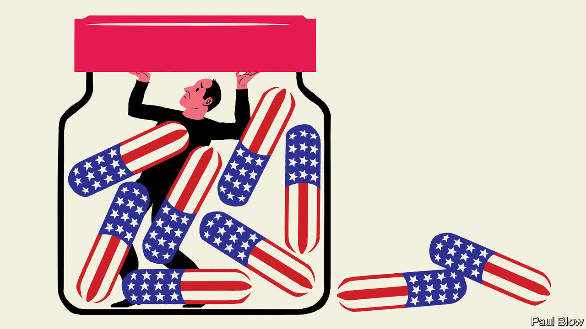

## Bartleby

# The wider effects of America’s opioid epidemic

> The drugs don’t work

> Jan 16th 2020

THE IMPACT of the opioid epidemic in America is staggering. Work by Anne Case and Angus Deaton of Princeton University has indicated that overprescription of pain-relieving drugs was a big factor in the increase in mortality among middle-aged whites that has occurred since 2000. The Council of Economic Advisers has estimated that, in 2018, the costs of opioid addiction (including the value of lives lost) were $696bn, or 3.4% of GDP.

Slowly but surely, more details are emerging. In 2017 Alan Krueger, also of Princeton, showed* that labour-force participation had fallen in American counties where more opioid pain medication had been prescribed. Now a new paper** by three academics from the University of North Carolina explores the impact of the epidemic on firms and business investment.

As with Krueger’s research, the focus is on the labour market. The authors examine the change in the rate of opioid prescriptions in individual counties between 2002-06 and 2006-10, and compare it with changes in employment five years later (between 2007-11 and 2011-15).

The delay is an attempt to get round the problem of separating correlation and causation. People who are unemployed may opt for the solace of opioids. But the authors reasonably assume that “opioid prescriptions written by doctors are independent of economic conditions five years later.” Furthermore, some doctors are much more likely to prescribe pain medication than others. Patients of doctors who prescribe more opioids are 5.8% less likely to be employed five years later.

What the academics find is that higher prescription rates are associated not just with a decline in employment but in the sales growth of firms sited in the worst affected areas. Sales are 1.7% lower for firms in the 75th percentile opioid counties than those in the 25th percentile. Businesses struggle, the authors suggest, because they cannot find the right workers. In addition, companies respond to the shortage of workers by investing more in information technology, substituting capital for labour.

Clearly, myriad factors affect growth rates, employment, investment and opioid use. The researchers therefore try to exclude alternative explanations for their findings. They check whether the results are robust by dropping some counties, such as those with the worst economic performance and those associated with “pill mills”—clinics identified by the Drug Enforcement Administration as having excessive prescription rates. To ensure results are not distorted by the types of firm being examined, they test the sample excluding manufacturing companies and firms with high exposure to Chinese imports. The impact of opioids on employment remains the same.

When it comes to employees, the authors include only workers aged between 18 and 60 (to exclude those about to retire) and those who have not previously been prescribed opioids. And they also examine emergency-room prescriptions—visits to the ER involve urgent cases and doctors are randomly assigned, reducing the chance that the results are driven by intentional drug-seeking behaviour. Increases in ER prescriptions are also associated with falls in employment and slower firm growth.

The clear negative impact of opioid abuse has significant implications. First, it shows the difficulties faced by economists when forecasting variables such as labour-force participation rates. Anyone constructing a model in the late 1990s could not reasonably have anticipated the opioid epidemic.

Second, the epidemic presents a strong argument for government intervention. It arose from a market failure: doctors were free to prescribe opioids and patients were free to take them. Neither group seems to have anticipated the addictive effects.

The authorities have reacted, with 25 states passing laws to regulate opioids use, starting with Massachusetts in 2016. Since 2017 the increase in deaths from opioid abuse seems to have halted. The academics also find some evidence of positive share-price gains for companies based in those states that passed regulations. Business doesn’t just need skilled employees; it needs workers who are free from addiction.

* “Where Have All the Workers Gone? An Inquiry into the Decline of the US Labor Force Participation Rate”** “The Impact of the Opioid Crisis on Firm Value and Investment”, by Paige Ouimet, Elena Simintzi and Kailei Ye