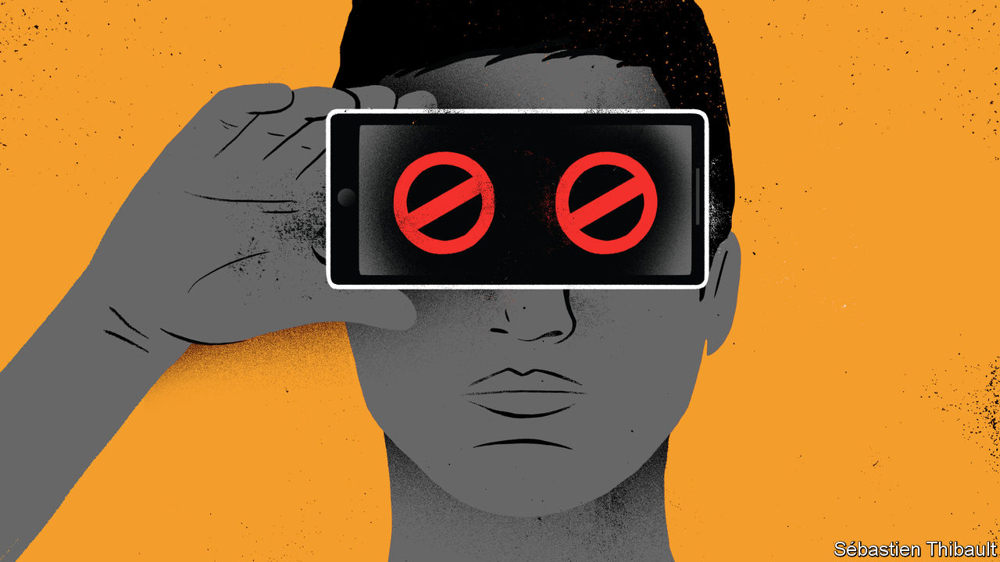

## The year of the rat-fink

# Some people in China help the party police the internet

> Citizen censors focus on smut, misleading ads and political gossip

> Jan 18th 2020

THE INTERNET is the “spiritual home” of hundreds of millions of Chinese people. So China’s leader, Xi Jinping, described it in 2016. He said he expected citizens to help keep the place tidy. Many have taken up the challenge. In December netizens reported 12.2m pieces of “inappropriate” content to the authorities—four times as many as in the same month of 2015. The surge does not indicate that the internet in China is becoming more unruly. Rather, censorship is becoming more bottom-up.

Officials have been mobilising people to join the fight in this “drawn-out war”, as a magazine editor called it in a speech in September to Shanghai’s first group of city-appointed volunteer censors. “Internet governance requires that every netizen take part,” an official told the gathering. It was arranged by the city’s cyber-administration during its first “propaganda month” promoting citizen censorship. The 140 people there swore to report any online “disorder”.

Some netizens, it seems, are as enthusiastic about the task as online scolds in the West are about denouncing heresy on Twitter. Rongbin Han of the University of Georgia says this suggests that the “popular image of a shadowy state versus a resistant citizenry is oversimplified.” Oversight of cyberspace has become highly decentralised. Private internet firms have long played a big role in censoring content they and their users produce. Increasingly, ordinary citizens are joining in.

Officials want them to look out for “harmful” content relating to several broad categories. The party’s priorities are, in order: “political”, “terrorist” and “pornographic”. Of the material reported by the public, data released by the Cyberspace Administration of China (CAC), the central government’s internet watchdog, suggest that most is either political or pornographic. In March 2017, pornography was the biggest category of citizen-flagged content (47%). Politics came second (27%). Official figures from June that year show the order reversed, with political content comprising 42% and smut 38%.

No examples are given of offensive items. But officials define the political type very broadly, as including anything deemed to threaten China’s “national security or interests” such as “political rumour”. No tittle-tattle about Mr Xi and his colleagues, in other words.

Since June 2017 the CAC has stopped providing a breakdown of reported content by type in its monthly reports. But some provincial governments still do. In Tibet, for instance, 45% of content reported to the regional cyber-administration in December was political and only 19% pornographic. An additional 16% of it involved “Tibet-related conventions”. This term is not defined but probably covers material challenging the party’s way of running Tibetan affairs. Local officials say that preventing the spread of “counter-propaganda” from the Dalai Lama is a priority.

Why do citizens play along? Some people are genuinely worried about vulgarity, pseudoscience and the peddling of unsafe products. An official survey last year of more than 200,000 netizens found that dishonest advertising, rumour and pornography were the most frequently encountered types of problematic content. But some netizens are simply anxious to impress. In 2015 the Communist Youth League began requiring each university to organise a group of volunteer censors. Would-be members of the league, or the party, have an incentive to sign up. Weibo, a Twitter-like service, has a team of 2,000 volunteer “supervisors” (in addition to its army of in-house censors). They can earn rewards for reporting harmful material. In October they found 3.8m examples.

The party’s efforts may be working. In 2019 Freedom House, an American think-tank, lowered China’s internet-freedom score to “10% free”, down from 15% when Mr Xi took power in 2012. Controls keep tightening. Information-technology rules, which took effect on December 1st, oblige new subscribers to mobile-phone services not only to prove their identities, as has long been required, but also to have their faces scanned. That, presumably, will make it easier for police to catch the people who post the bad stuff online. ■