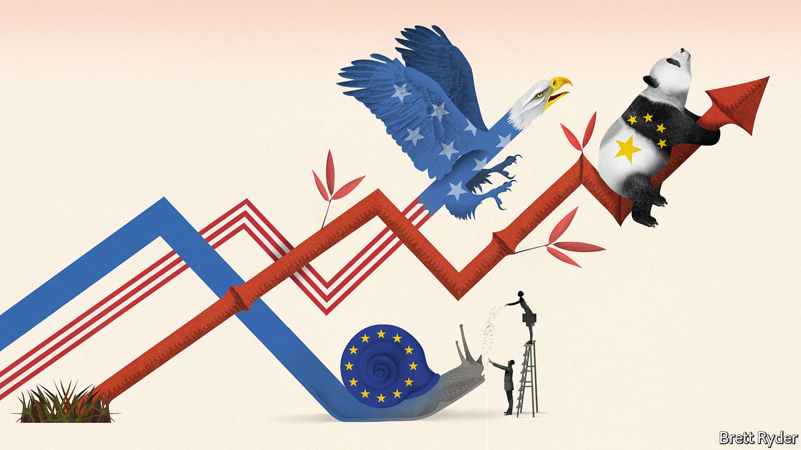

## L’industrie, c’est eux

# Europe is rediscovering its penchant for statist intervention

> As China and America prop up national champions, a new dirigisme is brewing in Europe

> Jan 16th 2020PARIS, BERLIN AND BRUSSELS

DESPITE ITS reputation as a place where politicians like to meddle in all aspects of the economy, Europe is often standoffish when it comes to championing industry. Some politicians, notably in Paris, do think of themselves as behind-the-scenes business titans. But the default EU position is for trade and investment to be open, exposing firms to global competition. Robust antitrust enforcement hobbles potential monopolists. Most important, “state-aid” rules enforced from Brussels prevent national governments mollycoddling favoured firms with tax breaks or subsidies, unlike nearly everywhere else.

Until now. A consensus has emerged in Europe that the open approach is not working. The continent, it is argued, has missed the boat on tech, which is dominated by America. China has protected and promoted its firms to the point where they can take on European rivals. Exciting breakthroughs in fields from quantum computing to next-generation cars seem to be happening everywhere else. Could policy tools used by its rivals nudge European industry back into the big leagues?

Many hope so. The upshot is a new approach, one that would have been unthinkable a few years back. On one hand, Europe is pursuing a watered-down protectionism reminiscent of President Donald Trump’s America First method. On the other hand, it is espousing statist policies invented in 17th-century France—and updated in contemporary China—which seek to pick winners and throw taxpayers’ money at them.

Start with the growing protectionist tinge. European firms are still to face competition—but on new terms. A hotch-potch of policies, some of them in gestation for years, seeks to put limits on unencumbered free trade. Their aim is to level a playing field which Europeans perceive has been tilted by others in their favour. “We need to be less naive,” has become a refrain in policymaking circles.

What draws the policies together is their intention to punish firms from countries not playing by what Europe thinks ought to be global norms. Ursula von der Leyen, the new European Commission president, has promised to enact a carbon border tax, to penalise imports from countries with looser environmental regulation than Europe. And if European firms are not allowed to get state aid from their own governments, some are advocating restrictions on the European operations of foreign firms (ie, China’s) that receive state support.

European firms would also get a leg-up when bidding for public contracts at home. New rules will, in effect, penalise firms from countries that fail to give reciprocal access to European companies—most notably China. Guidelines to screen foreign investments will soon come into force, matching a long-standing (and tougher) American scheme. Those will shield some European firms from takeovers that politicians deem undesirable.

Beyond hobbling foreign firms, Europe is also finding new ways to support its own. Last month the commission approved a request by seven governments, including France and Germany, to spend €3.2bn on a public-private partnership for building batteries. What would once have been a clear case of state aid was, in fact, greeted with enthusiasm in Brussels. European governments are intending to kick-start the creation of up to 25 battery plants, to service the automotive sector better.

Several more such “Important Projects of Common European Interest” have been approved or are in the works; commission experts have indicated which “strategic value chains” are likely to be looked on favourably for future state largesse. Predictably, European officials are talking about the need for an “Airbus of batteries”, another for 5G telephony, artificial intelligence and so on.

Unlike previous EU projects that funded scientific research, money is now being invested alongside companies. Officials insist they are not a way to prop up unviable companies, merely to spread risk that companies cannot shoulder on their own. Many schemes are designed to help meet ambitious climate-change targets (Europe wants to be carbon-neutral by 2050).

Some industrialists are hoping for a further boost: the relaxation of antitrust rules. Margrethe Vestager, recently reappointed as competition supremo, last month indicated a review of the merger-approval process. Her blocking in February 2019 of a planned merger of the railway arms of Siemens and Alstom, two industrial groups, riled their respective governments in Germany and France. Few think the proposed antitrust changes will be so radical as to make a difference to the biggest tie-ups. But there are hints the commission could be a touch more amenable in future.

Why the shift? Beyond the perceived loss of ground to China and America and the assumption that is because Europe is too laissez-faire, politicians sense a continent-wide disenchantment with markets in the aftermath of the financial crisis—and thus more tolerance for political intervention. Britain’s forthcoming exit from the EU has also marginalised a voice that would once have looked askance at dirigiste ploys.

But the main reason is a change in approach in Germany. France has always lobbied in favour of public grands projets and looser competition rules. For just as long, Germany has lobbied for its ordoliberal approach, which dictates that the state establishes rules for the market economy and then lets firms do their thing (Ludwig Erhard, who oversaw West Germany’s economic miracle in the 1950s as economy minister, compared the involvement of the state in the economy to a football referee).

This has stung Germany of late: Chinese firms that used to buy machines from the Mittelstand are now competing with it. A domestic solar industry based on German technology was crushed by Chinese subsidies and lower standards. Now it fears that being left behind on artificial intelligence and batteries will hobble the prospects of its car champions.

The dirigiste swing is far from settled policy in Berlin. The torchbearer for the new approach is Peter Altmaier, the economy minister. Last year he went even further than France, for example suggesting a public fund that could be used to acquire stakes in certain companies at risk of foreign takeover. The plan was panned even within his own party—it is said that the minister drafted much of the proposal himself, so unimpressed were his aides by the idea. It has since been rolled back.

But the German shift, even if incomplete, has swung the pendulum in France’s direction. How far will become clearer in March, when Mrs von der Leyen is to unveil a new “industrial strategy” for Europe. Politicians devising blueprints for business has a decidedly five-year-plan-ish ring to it. But bringing some order to how Europe thinks about industry is overdue. Past exercises in this vein have been usually excuses to recycle bromides about the importance of skills, supply chains and small businesses. Expect a more substantial shift in policy this time. ■

## URL

https://www.economist.com/europe/2020/01/16/europe-is-rediscovering-its-penchant-for-statist-intervention
