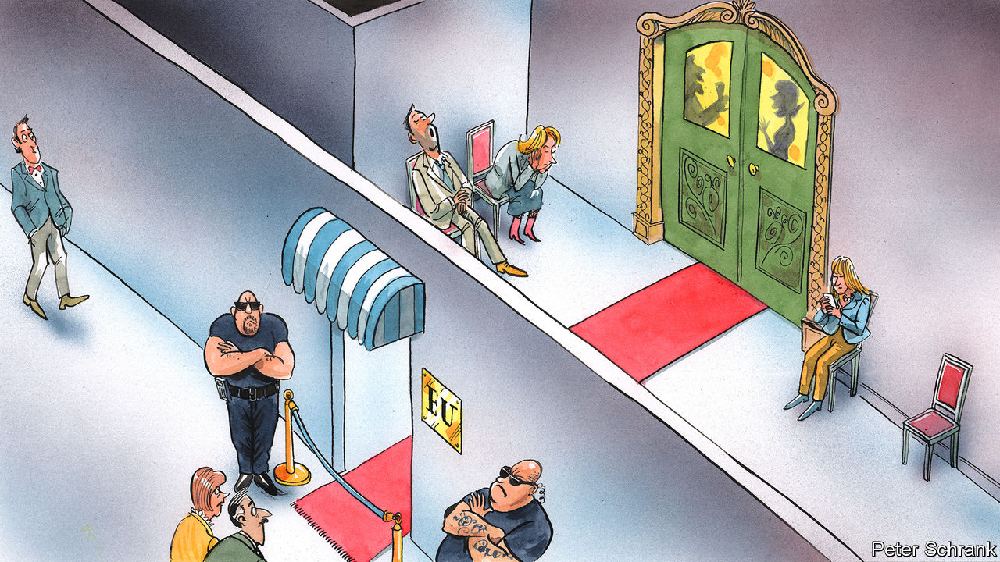

## Charlemagne

# For Europe, geopolitics starts at home

> Talks over admitting Albania and North Macedonia to the EU have been bungled

> Jan 18th 2020

ENLARGEMENT HAS always been a fraught topic for the EU. In the 1960s Charles de Gaulle made Harold Macmillan weep when the French president thwarted Britain’s attempts to join what was then the Common Market. (“I wanted to put my hand on his shoulder and say to him, as in the Edith Piaf song, ‘ne pleurez pas, milord’,” recalled de Gaulle.) The “big bang” accession of 2004, when ten countries largely from central and eastern Europe joined, was supposed to be a unification of Europe. But it led to new fractures between east and west. Diplomats become undiplomatic about Romania and Bulgaria, which joined in 2007, grumbling that their enthusiasm for corruption dimmed only slowly after they joined the club. The proposed accession of Albania and North Macedonia is proving once again that enlargement can be enraging.

Emmanuel Macron, the French president, blocked their path last year—with the support of the Netherlands and Denmark when it came to Albania—demanding that the EU must instead first overhaul its rules on joining the bloc. That was a “historic mistake” in the words of Jean-Claude Juncker, the outgoing European Commission president. Now the attempts to sweep up the damage from Mr Macron’s hand-grenade have begun in earnest. The commission, under new management and determined to pursue a “geopolitical” strategy, will by the end of the month unveil reforms to the accession process designed to placate the French president and his allies. A summit some time in the spring will clear up the mess and agree on new accession rules. By May it will be all smiles in Zagreb, where the 27 EU members meet their neighbours from the western Balkans for another conference. Or so goes the plan.

What compromise Brussels cobbles together will have ramifications far beyond the fate of two small Balkan nations. Between them, the duo have a population roughly equal to Slovakia’s and the GDP of Cyprus. Yet the EU’s response will show whether the bloc is capable of becoming a coherent geopolitical actor, something which its leaders—especially in the core national capitals—are desperate to achieve. If Brussels fails to act strategically in its own backyard, how can it do so globally?

Mr Macron and co were right to criticise the EU’s enlargement process. A feeling lurks among some member-states that the process is a slippery slope. Countries unready for membership, such as Romania and Bulgaria, were levered in under pressure from national capitals. France is calling for “reversibility”, whereby prospective members can have privileges revoked if they fall behind on their pledges—an idea the commission likes. Although Albania and North Macedonia have taken huge strides, reports into their progress contain eye-bulging caveats about corruption and press freedom, which the commission has waved away. “It’s politics versus reality,” huffs one sceptical diplomat. Most countries, however, are calling on opponents to turn a blind eye, like revellers in a provincial nightclub trying to persuade a bouncer to let in their mates even though they are wearing trainers.

Albania and North Macedonia are more likely to end up in the cloakroom than on the dance floor. Starting accession negotiations is very different from completing them, and there is little prospect of fully-fledged membership soon. Indeed the EU accession programme has evolved into a holding pen for awkward neighbours, rather than a genuine path to joining. Whereas some countries see this as a feature, France sees this as a bug, with accession used at the expense of other foreign-policy tools. The membership process with Serbia began a decade ago. Turkey’s started in 1987. Most EU leaders are happy to spin the line to voters that accession exists in name only for some countries.

Enlargement is a geopolitical issue for the EU, not just a domestic one. The perils of botching accession policy are best seen in Turkey, which has drifted out of Europe’s sphere of influence. Now, on topics such as Syria and migration, Ankara has more control over Europe’s destiny than Brussels and little willingness to listen to officials who misled it. A meeting in Moscow this month between Russia and Turkey to discuss a ceasefire in Libya was a potent image of Europe’s failure to boss its own backyard.

Brussels needs to come up with a ladder for opponents of enlargement to climb down. A compromise regularly floated but opposed vociferously by Germany, among others, would be to allow North Macedonia under the velvet rope into the EU’s waiting room, while keeping Albania firmly out. Such a sacrifice might placate opponents of enlargement in the short term, but the implicit message that a majority-Muslim state is unwelcome in the EU is one that would shape the bloc for far longer. Albania would join Kosovo, Bosnia and Turkey in the club of spurned Muslim countries.

The EU’s influence in the region is at stake. North Macedonia changed its name. Albania has made good on pledges to crack down on bent judges. Accession talks were the quid pro quo. Failing to live up to promises will strengthen regional rivals, such as Russia and Turkey, or prompt countries to embrace distant potential friends, such as China. “They never say the EU is crap, they say: ‘It’s great, but they are lying to you’,” notes an EU official. In the case of Albania and North Macedonia, they were right.

The EU has a chance to undo the damage. Whether Mr Macron and allies back down is another matter. Spending years wrangling over the rules of joining the club would only weaken it. North Macedonia heads to the polls in April. The government’s pitch to voters has been that it is making progress in its EU talks. Come the summit in Zagreb, a less Europe-friendly government may be in power in Skopje. European leaders such as Mr Macron want the bloc to start punching its weight on the international stage. Solving the enlargement debate would be a sign that the EU is prepared to put geopolitics first. But Europeans who yearn for such an outcome will doubtless have to wait—like the citizens of North Macedonia. ■