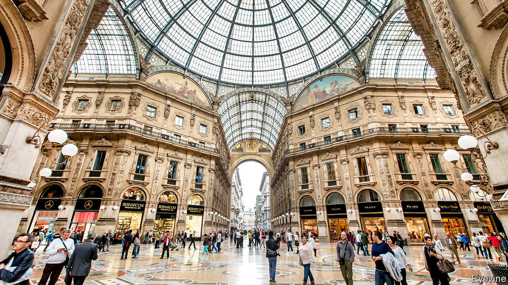

## The angel of the north

# Italy’s second city shows up the rest of the country

> Once dismissed for its dullness, Milan is booming

> Jan 18th 2020MILAN

MARIATERESA GIUSSANI lives in Seregno, 28km (17 miles) outside Milan, and drives to work in the central fashion district where the company she owns, which markets school uniforms, has its offices. “Ten years ago I would leave at 7.15am to avoid the traffic,” she says. “Now, I have to be out by 6.15am. If I leave ten minutes later, it’s nose-to-tail all the way.”

Ms Giussani’s altered morning schedule is among the myriad side effects of a boom that has set Milan apart from the rest of Italy, still struggling to recover from the financial crisis of a decade ago, and at best plodding along on the edge of recession.

“The city is on an enormous upswing,” says James Bradburne, the Canadian-born director of Milan’s most renowned art museum, the Pinacoteca di Brera. Between 2014 and 2018, according to the regional bosses’ federation, Assolombarda, Milan’s output grew by 9.7%—more than twice the national rate. Property prices have leapt. Stories abound of out-of-towners paying €400 ($446) a week to rent a single room, residents offered 50% more than they paid for properties bought four years earlier and luxury-goods firms paying €1m a year or more for an outlet in the Galleria Vittorio Emanuele II, which links La Scala theatre to the cathedral square.

Central Milan exudes a mix of ostentatious wealth and sophisticated design. And not just the centre: Porta Genova, a once-rundown quarter, today hosts an accountancy multinational, Deloitte; a fashion house, Armani; and a museum of world cultures in a converted factory with a restaurant that boasts three Michelin stars. New skyscrapers dot the skyline and the prosperity they reflect has coincided with a cultural revival. Mr Bradburne has revitalised the Brera with an innovative range of programmes, aimed at everyone from children to Alzheimer’s sufferers.

What happened? Most Milanese cite the catalytic effects of hosting the 2015 World Expo. Giuseppe Sala, a businessman, was put in charge of the project and is widely credited with its success. Now the city’s centre-left mayor, he modestly attributes much of Milan’s progress to property developments launched under a centre-right predecessor, Gabriele Albertini. But, he says, Expo did play an important role: it restored to the Milanese a sense of pride in their city, long dismissed as grey, architecturally and figuratively. “And it showed off its strong points to the world.” Tourism has exploded. The annual number of visitors to Milan has soared from 6m to more than 10m since the Expo.

The mayor acknowledges that what some are calling the Milanese miracle has generated problems. The biggest, he thinks, is environmental. He has banned the most polluting vehicles from 70% of the city, offered incentives for the replacement of boilers and plans to make the city’s entire bus fleet electric. The boom has also created a division between flashily rich districts and poor ones: Pope Francis pointedly made his first stop in Milan a deprived area with a big immigrant population. Mr Sala says investors have already committed a further €12bn-13bn to property development in the city, and that much of it will go to the periphery and to providing reasonably priced accommodation.

Milan’s next appearance on the world stage will be as co-host of the 2026 Winter Olympics along with ritzy Cortina d’Ampezzo. It seems unlikely that glitz will gave way to grit any time soon. If only the rest of Italy could do anything like as well. ■